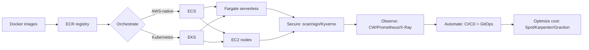

# AWS Containers Mastery — ECR · ECS · Fargate · EKS
### The Complete Real-Time Project Guide | Console + CLI | Zero Knowledge → Production Ready
#### Updated for 2026 Best Practices · Merged & Consolidated Master Edition

> **Mentor's note (read this first):** This single guide combines three earlier documents into one. It assumes **zero prior knowledge**. Every topic gives you:
> 1. A plain-English **explanation** ("what & why")
> 2. **Console steps** (click-by-click in the AWS web UI)
> 3. **CLI steps** (copy-paste commands)
> 4. A **real-time project tip** so you know how teams actually do it
>
> Work top to bottom the first time. Later, use the Table of Contents to jump to what you need.

---

## 📑 Table of Contents

| # | Part | What you learn |
|---|------|----------------|
| 0 | [Prerequisites & Setup](#part-0--prerequisites--setup) | Install tools, configure AWS, services map |
| 1 | [Docker Fundamentals](#part-1--docker-fundamentals) | Build production-grade images |
| 2 | [Amazon ECR](#part-2--amazon-ecr-elastic-container-registry) | Store, scan, secure images |
| 3 | [AWS Fargate Deep Dive](#part-3--aws-fargate-deep-dive) | Serverless containers (ECS + EKS) |
| 4 | [Amazon ECS](#part-4--amazon-ecs-elastic-container-service) | Orchestrate containers, the AWS-native way |
| 5 | [Amazon EKS](#part-5--amazon-eks-elastic-kubernetes-service) | Run Kubernetes on AWS |
| 6 | [Security](#part-6--security) | Scan, sign, harden, enforce policy |
| 7 | [Observability](#part-7--observability) | Logs, metrics, tracing |
| 8 | [CI/CD & GitOps](#part-8--cicd--gitops) | Automate build → deploy · IaC · governance |
| 9 | [Cost Optimization](#part-9--cost-optimization) | Spend less, safely |
| 10 | [Real-Time Reference Architectures & Capstones](#part-10--real-time-reference-architectures--capstones) | End-to-end projects |
| 11 | [Troubleshooting Cheat Sheet](#part-11--troubleshooting-cheat-sheet) | Fix common errors fast |
| 12 | [Cleanup / Teardown](#part-12--cleanup--teardown) | Avoid surprise bills |
| A | [Appendix — Command Quick Reference](#appendix--command-quick-reference) | Copy-paste cheatsheet |

---

# PART 0 — Prerequisites & Setup

> **Goal:** Get every tool installed and your AWS account ready. Do this once.

## 0.1 — Core Concepts Glossary (memorize these)

| Term | Plain-English Meaning |
|------|-----------------------|
| **Image** | A frozen snapshot of your app + everything it needs to run (like a ZIP that knows how to start itself). |
| **Container** | A running copy of an image — an isolated Linux process. |
| **Registry** | Storage for images. **ECR** is AWS's registry (a private Docker Hub). |
| **Orchestrator** | Software that runs/manages many containers at scale. **ECS** and **EKS** are AWS's orchestrators. |
| **Task (ECS) / Pod (EKS)** | The smallest unit that runs one or more containers. |
| **Cluster** | The pool of compute (or serverless capacity) that runs tasks/pods. |
| **Fargate** | **Serverless** compute — AWS runs the servers; you never patch or manage EC2. Works with **both** ECS and EKS. |
| **Task Definition (ECS)** | The blueprint: which image, CPU, memory, ports, env vars, roles. |
| **Deployment (EKS)** | Kubernetes object that keeps N identical pods running and handles rolling updates. |
| **IAM Role** | A set of AWS permissions attached to a service, task, or pod. |
| **IRSA / Pod Identity** | Lets EKS pods assume an IAM role — no stored credentials. |
| **ALB / NLB** | Application / Network Load Balancer — distributes traffic across tasks/pods. |
| **SBOM** | Software Bill of Materials — inventory of every component in an image. |
| **GitOps** | Git is the single source of truth; the cluster auto-syncs to it. |

## 0.2 — The AWS Services We Will Use (the full map)

| Category | Service | Role in this guide |
|----------|---------|--------------------|
| **Registry** | **Amazon ECR** | Store & scan container images |
| **Orchestration** | **Amazon ECS** | AWS-native container orchestrator |
| **Orchestration** | **Amazon EKS** | Managed Kubernetes |
| **Compute** | **AWS Fargate** | Serverless compute for ECS & EKS |
| **Compute** | **Amazon EC2** | Worker nodes (EC2 launch type / managed node groups) |
| **Networking** | **VPC, Subnets, Security Groups** | Network isolation |
| **Networking** | **Elastic Load Balancing (ALB/NLB)** | Traffic distribution |
| **Networking** | **VPC Endpoints (PrivateLink)** | Private image pulls |
| **Networking** | **Route 53 / AWS Cloud Map** | DNS & service discovery |
| **Identity** | **IAM** (roles, OIDC, IRSA, Pod Identity) | Permissions |
| **Secrets** | **AWS Secrets Manager / SSM Parameter Store** | Store credentials |
| **Storage** | **Amazon EBS / EFS / S3** | Persistent & shared storage |
| **Security** | **Amazon Inspector, GuardDuty, KMS, AWS Signer** | Scanning, threat detection, encryption, signing |
| **Observability** | **CloudWatch (Logs, Container Insights), X-Ray** | Logs, metrics, tracing |
| **CI/CD** | **CodeBuild, CodeDeploy, CodePipeline, GitHub Actions** | Build & deploy automation |
| **Events** | **Amazon EventBridge** | Scheduled tasks / cron |
| **Autoscaling** | **Application Auto Scaling, Karpenter, Cluster Autoscaler** | Scale tasks/pods/nodes |

## 0.3 — Install the Tools

```bash
# ── AWS CLI v2 ───────────────────────────────────────────────────────────
curl "https://awscli.amazonaws.com/awscli-exe-linux-x86_64.zip" -o "awscliv2.zip"
unzip awscliv2.zip && sudo ./aws/install
aws --version

# ── Docker Engine + Buildx ───────────────────────────────────────────────
sudo apt-get update && sudo apt-get install -y docker.io     # Ubuntu/Debian
sudo usermod -aG docker $USER && newgrp docker               # run docker without sudo
docker version
# Windows/macOS: install Docker Desktop, or Finch/Podman in enterprise environments

# ── kubectl (Kubernetes CLI — for EKS) ───────────────────────────────────
curl -LO "https://dl.k8s.io/release/$(curl -sL https://dl.k8s.io/release/stable.txt)/bin/linux/amd64/kubectl"
chmod +x kubectl && sudo mv kubectl /usr/local/bin/
kubectl version --client

# ── eksctl (easiest way to create EKS clusters) ──────────────────────────
curl --silent --location \
  "https://github.com/eksctl-io/eksctl/releases/latest/download/eksctl_Linux_amd64.tar.gz" \
  | tar xz -C /tmp && sudo mv /tmp/eksctl /usr/local/bin/
eksctl version

# ── Helm (Kubernetes package manager) ────────────────────────────────────
curl https://raw.githubusercontent.com/helm/helm/main/scripts/get-helm-3 | bash
helm version

# ── Security tooling (used in Part 6) ────────────────────────────────────
curl -sfL https://raw.githubusercontent.com/aquasecurity/trivy/main/contrib/install.sh | sh -s -- -b /usr/local/bin   # Trivy (CVE scanner)
curl -Lo cosign https://github.com/sigstore/cosign/releases/latest/download/cosign-linux-amd64 \
  && chmod +x cosign && sudo mv cosign /usr/local/bin/          # Cosign (image signing)
curl -sSfL https://raw.githubusercontent.com/anchore/syft/main/install.sh | sh -s -- -b /usr/local/bin    # Syft (SBOM)
curl -sSfL https://raw.githubusercontent.com/anchore/grype/main/install.sh | sh -s -- -b /usr/local/bin   # Grype (SBOM scan)
```

## 0.4 — Configure the AWS CLI

```bash
aws configure
# AWS Access Key ID:     <your-key>
# AWS Secret Access Key: <your-secret>
# Default region name:   ap-south-1     # Mumbai — change to your region
# Default output format: json

# Verify who you are
aws sts get-caller-identity

# Convenience variables — USED THROUGHOUT THIS GUIDE. Set them in every new shell.
export ACCOUNT_ID=$(aws sts get-caller-identity --query Account --output text)
export REGION=ap-south-1
export ECR_URI="${ACCOUNT_ID}.dkr.ecr.${REGION}.amazonaws.com"
echo "Account: $ACCOUNT_ID | Region: $REGION | ECR: $ECR_URI"
```

> **Real-time tip:** In real projects you rarely use long-lived access keys. CI/CD uses **OIDC federation** (Part 8) and EC2/ECS/EKS use **IAM roles** — no keys stored anywhere.

---

# PART 1 — Docker Fundamentals

> **Why first?** ECR stores images, ECS/EKS run them. If your image is bad, everything downstream is bad. Master the image, master the platform.

## Topic 1.1 — Container Concepts & a Production Dockerfile

### Explanation
A **container** packages your app with all dependencies into one portable unit. Containers share the host OS kernel but are isolated using Linux **namespaces** (process/network/filesystem isolation) and **cgroups** (CPU/memory limits). They start in milliseconds and run identically on a laptop, in CI, and in production.

**Key Dockerfile instructions:**

| Instruction | Purpose |
|------------|---------|
| `FROM` | Base image (starting point) |
| `WORKDIR` | Working directory inside the image |
| `COPY` | Copy files from build context into image (prefer over `ADD`) |
| `RUN` | Run a command at build time (creates a layer) |
| `ENV` | Set environment variables |
| `EXPOSE` | Document the listening port |
| `USER` | Run as non-root (always in production) |
| `CMD` / `ENTRYPOINT` | Default command when the container starts |

### Hands-On (CLI)

```bash
mkdir -p ~/lab-docker && cd ~/lab-docker

cat > app.py <<'EOF'
from http.server import HTTPServer, BaseHTTPRequestHandler
import os
class Handler(BaseHTTPRequestHandler):
    def do_GET(self):
        self.send_response(200); self.end_headers()
        self.wfile.write(f"Hello from {os.getenv('APP_ENV','dev')}!\n".encode())
if __name__ == "__main__":
    HTTPServer(("0.0.0.0", 8080), Handler).serve_forever()
EOF

cat > Dockerfile <<'EOF'
FROM python:3.12-alpine
# Security: create and run as a non-root user
RUN addgroup -S appgroup && adduser -S appuser -G appgroup
WORKDIR /app
COPY app.py .
USER appuser
EXPOSE 8080
CMD ["python", "app.py"]
EOF

docker build -t hello-app:v1.0 .
docker run -d -p 8080:8080 -e APP_ENV=production --name hello hello-app:v1.0
curl http://localhost:8080         # → Hello from production!
docker exec hello whoami           # → appuser (confirms non-root)
docker stop hello && docker rm hello
```

> **Console note:** Docker image building is a local/CLI activity. You only *view* the result in ECR's console after pushing (Part 2).

## Topic 1.2 — Multi-Stage Builds (smaller, safer images)

### Explanation
A **multi-stage build** uses multiple `FROM` stages. Build tools, compilers and dev dependencies stay in early stages; only the minimal runtime artifact ships. Result: a Node app drops from ~1.2 GB → ~150 MB; a Go binary from ~800 MB → ~10 MB. Fewer packages = fewer CVEs = smaller ECR bill.

```bash
cd ~/lab-docker
cat > Dockerfile.multistage <<'EOF'
# ── Stage 1: Build ──
FROM node:20-alpine AS builder
WORKDIR /app
COPY package*.json ./
RUN npm ci --only=production       # deterministic, reproducible

# ── Stage 2: Test (CI only, never ships) ──
FROM builder AS tester
RUN npm test

# ── Stage 3: Production (minimal) ──
FROM node:20-alpine AS production
RUN addgroup -S appgroup && adduser -S appuser -G appgroup
WORKDIR /app
USER appuser
COPY --from=builder --chown=appuser:appgroup /app/node_modules ./node_modules
COPY --chown=appuser:appgroup server.js .
EXPOSE 3000
CMD ["node", "server.js"]
EOF

docker build -f Dockerfile.multistage --target production -t node-app:v1.0 .
```

## Topic 1.3 — Multi-Architecture Builds (AMD64 + ARM64 / Graviton)

### Explanation
AWS **Graviton (ARM64)** instances are ~20% cheaper at equal performance. A **multi-arch image** bundles both `amd64` and `arm64` variants under one tag; AWS pulls the right one automatically. This is expected for production images in 2026.

```bash
docker buildx create --name multiarch --driver docker-container --use
docker buildx inspect --bootstrap

aws ecr create-repository --repository-name multi-arch-app --region $REGION 2>/dev/null || true
aws ecr get-login-password --region $REGION | docker login --username AWS --password-stdin $ECR_URI

docker buildx build \
  --platform linux/amd64,linux/arm64 \
  --tag $ECR_URI/multi-arch-app:v1.0 \
  --push ~/lab-docker/

docker buildx imagetools inspect $ECR_URI/multi-arch-app:v1.0   # shows both platforms
```

## Topic 1.4 — Layer Caching for Fast CI Builds

### Explanation
Docker reuses cached layers if neither the instruction nor any earlier layer changed. **Order layers least-changing → most-changing**: copy `requirements.txt`/`package.json` and install deps *before* copying source code, so a code change doesn't reinstall dependencies.

```bash
cat > ~/lab-docker/Dockerfile.cached <<'EOF'
FROM python:3.12-alpine
WORKDIR /app
RUN apk add --no-cache gcc musl-dev                 # rarely changes
COPY requirements.txt .                             # changes when deps change
RUN --mount=type=cache,target=/root/.cache/pip pip install -r requirements.txt
COPY . .                                            # changes every commit
RUN addgroup -S app && adduser -S appuser -G app
USER appuser
CMD ["python", "app.py"]
EOF
printf "flask==3.0.0\ngunicorn==21.2.0\n" > ~/lab-docker/requirements.txt
docker build -f ~/lab-docker/Dockerfile.cached -t cached-app:v1 ~/lab-docker/
```

## Topic 1.5 — Dockerfile Security Best Practices

| Practice | Why it matters |
|---------|----------------|
| Non-root `USER` | Root in a container ≈ root on host if it escapes |
| Minimal base (`-alpine`, `distroless`) | Fewer packages = fewer CVEs |
| Pin base by digest (`FROM nginx@sha256:...`) | Prevents upstream tag changes |
| Multi-stage builds | Build tools never reach production |
| `.dockerignore` | Keeps `.git`, secrets, `node_modules` out of the build |
| No secrets in `ENV`/`RUN` | `docker history` reveals them |
| `COPY` not `ADD` | `ADD` has surprising URL/tar behavior |
| `readOnlyRootFilesystem` | Pair with pod/task security context |

```bash
cat > ~/lab-docker/.dockerignore <<'EOF'
.git
.github
*.md
__pycache__
*.pyc
.env
node_modules
EOF
trivy image --severity HIGH,CRITICAL hello-app:v1.0    # scan for CVEs (see Part 6)
docker history hello-app:v1.0                          # confirm no secrets baked in
```

> **Real-time tip:** Add `trivy image --exit-code 1 --severity CRITICAL` to CI so a build *fails* if a critical CVE is found ("shift-left" security).

## Topic 1.6 — Distroless & BuildKit Secrets

### Explanation
**Distroless** images (`gcr.io/distroless/*`) contain only your app + runtime — no shell, no package manager — the smallest attack surface. **BuildKit secret mounts** let you use a secret (e.g. a private registry token) during build *without* baking it into a layer (`docker history` won't reveal it).

```bash
# Distroless final stage (Go example)
cat > Dockerfile.distroless <<'EOF'
FROM golang:1.22-alpine AS build
WORKDIR /src
COPY . .
RUN CGO_ENABLED=0 go build -o /app .

FROM gcr.io/distroless/static-debian12:nonroot   # no shell, runs as nonroot
COPY --from=build /app /app
USER nonroot:nonroot
ENTRYPOINT ["/app"]
EOF

# BuildKit secret mount (token never stored in the image)
DOCKER_BUILDKIT=1 docker build \
  --secret id=npmtoken,src=$HOME/.npmtoken \
  -t myapp:secret .
# In the Dockerfile:  RUN --mount=type=secret,id=npmtoken NPM_TOKEN=$(cat /run/secrets/npmtoken) npm ci
```
> **Real-time tip:** Distroless has no `/bin/sh`, so `kubectl exec`/`ECS Exec` shells won't work — debug with an ephemeral debug container (`kubectl debug`) instead.

## Topic 1.7 — Local Development with Docker Compose

### Explanation
**Docker Compose** runs your multi-container app locally (app + DB + cache) so you develop against the same images you ship. It is *not* used in production on AWS — ECS/EKS replace it there — but it speeds the inner dev loop.

```bash
cat > compose.yaml <<'EOF'
services:
  app:
    build: .
    ports: ["8080:8080"]
    environment: {APP_ENV: local, DB_HOST: db}
    depends_on: [db]
  db:
    image: postgres:16-alpine
    environment: {POSTGRES_PASSWORD: localpass}
    ports: ["5432:5432"]
EOF
docker compose up --build       # start the whole stack
docker compose down -v           # stop and remove volumes
```
> **Tip:** `docker compose` config maps closely to an ECS task definition (multiple containers) and to a Kubernetes Pod/Deployment — a useful mental bridge.

---

# PART 2 — Amazon ECR (Elastic Container Registry)

> **What is ECR?** AWS's managed, OCI-compliant, private container registry — a private Docker Hub inside your AWS account, integrated with IAM, KMS, scanning, lifecycle, replication and signing.

## Topic 2.1 — Create a Repository

### Console
1. AWS Console → search **ECR** → **Elastic Container Registry**
2. **Create repository**
3. Set: **Visibility:** Private · **Name:** `my-app` · **Tag immutability:** Disabled (enable later for prod) · **Scan on push:** Disabled for now
4. **Create repository**
5. Copy the **URI**: `<account-id>.dkr.ecr.<region>.amazonaws.com/my-app`

### CLI
```bash
aws ecr create-repository --repository-name my-app --region $REGION
aws ecr describe-repositories
aws ecr describe-repositories \
  --query "repositories[?repositoryName=='my-app'].repositoryUri" --output text
```

> **Real-time tip:** Use hierarchical names like `payments/api`, `payments/worker` — it simplifies IAM and lifecycle policies. Create repos via Terraform/CDK so lifecycle policies are never forgotten.

## Topic 2.2 — Authenticate Docker to ECR

### Console
> Authentication is CLI-only. The console does not manage Docker credentials.

### CLI
```bash
# Token is valid for 12 hours
aws ecr get-login-password --region $REGION \
  | docker login --username AWS --password-stdin $ECR_URI
# → Login Succeeded
```

> **Real-time tip:** On EC2/ECS/EKS with the right IAM role, the SDK rotates credentials automatically — no manual login. In CI/CD use OIDC (Part 8).

## Topic 2.3 — Build, Tag, and Push an Image

### Console
> Build/push is CLI/Docker. After pushing, open ECR → your repo → **Images** tab to see tag, digest, size, push date.

### CLI
```bash
WORKSHOP_URI=$(aws ecr describe-repositories --repository-names my-app \
  --query "repositories[0].repositoryUri" --output text)

docker build -t my-app ~/lab-docker/
docker tag my-app:latest $WORKSHOP_URI:v1.0
docker tag my-app:latest $WORKSHOP_URI:latest
docker push $WORKSHOP_URI:v1.0
docker push $WORKSHOP_URI:latest

aws ecr list-images --repository-name my-app
docker pull $WORKSHOP_URI:v1.0            # pull back to verify
```

## Topic 2.4 — Lifecycle Policies (auto-delete old images)

### Explanation
ECR charges ~$0.10/GB/month. Without lifecycle policies, untagged images pile up silently. Rules run in **priority order** (lower number = higher priority).

### Console
1. ECR → repository → **Lifecycle policies** → **Edit** → **Add rule**
2. Rule 1: Priority 1 · Untagged · Since pushed 7 days · Expire
3. Rule 2: Priority 2 · Tagged (prefix `v`) · Count more than 10 · Expire
4. **Save**

### CLI
```bash
cat > lifecycle-policy.json <<'EOF'
{
  "rules": [
    { "rulePriority": 1, "description": "Remove untagged after 7 days",
      "selection": {"tagStatus":"untagged","countType":"sinceImagePushed","countUnit":"days","countNumber":7},
      "action": {"type":"expire"} },
    { "rulePriority": 2, "description": "Keep only 10 tagged images",
      "selection": {"tagStatus":"tagged","tagPrefixList":["v"],"countType":"imageCountMoreThan","countNumber":10},
      "action": {"type":"expire"} }
  ]
}
EOF
aws ecr put-lifecycle-policy --repository-name my-app --lifecycle-policy-text file://lifecycle-policy.json
aws ecr get-lifecycle-policy-preview --repository-name my-app    # dry-run preview
```

## Topic 2.5 — Image Scanning (CVE detection)

### Explanation
- **Basic scanning** (free): OS packages only, on push or on demand.
- **Enhanced scanning (Amazon Inspector):** also scans language packages (npm, pip, Maven, Go) and **continuously re-scans** when new CVEs appear.

### Console
1. ECR → repository → **Edit** → enable **Scan on push**
2. Push an image → open it → **Vulnerabilities** tab (CRITICAL/HIGH/MEDIUM/LOW)
3. For enhanced: **Amazon Inspector** → enable ECR integration

### CLI
```bash
aws ecr put-image-scanning-configuration --repository-name my-app \
  --image-scanning-configuration scanOnPush=true

# Enhanced scanning at registry level (Inspector)
aws inspector2 enable --resource-types ECR --region $REGION 2>/dev/null || true
aws ecr put-registry-scanning-configuration --scan-type ENHANCED \
  --rules '[{"scanFrequency":"CONTINUOUS_SCAN","repositoryFilters":[{"filter":"*","filterType":"WILDCARD"}]}]' \
  --region $REGION

aws ecr start-image-scan --repository-name my-app --image-id imageTag=latest
aws ecr describe-image-scan-findings --repository-name my-app --image-id imageTag=latest \
  --query "imageScanFindings.findingSeverityCounts"
```

## Topic 2.6 — IAM Permissions & Cross-Account Access

### Console
1. IAM → Roles → Create role → AWS service → EC2/ECS
2. Attach **AmazonEC2ContainerRegistryReadOnly** (pull) or **...FullAccess** (push+pull)
3. Cross-account: ECR repo → **Permissions** → edit JSON policy

### CLI
```bash
cat > repo-policy.json <<'EOF'
{
  "Version": "2012-10-17",
  "Statement": [{
    "Sid": "AllowCrossAccountPull",
    "Effect": "Allow",
    "Principal": {"AWS": "arn:aws:iam::111122223333:root"},
    "Action": ["ecr:GetDownloadUrlForLayer","ecr:BatchGetImage","ecr:BatchCheckLayerAvailability"]
  }]
}
EOF
aws ecr set-repository-policy --repository-name my-app --policy-text file://repo-policy.json
```

## Topic 2.7 — Tag Immutability

### Explanation
**IMMUTABLE** prevents overwriting an existing tag. Once `v1.0` is pushed it can never be changed — critical for safe rollbacks. Re-pushing a tag raises `ImageTagAlreadyExistsException`.

### Console
ECR → repository → **Edit** → **Tag immutability: Enable** → Save

### CLI
```bash
aws ecr put-image-tag-mutability --repository-name my-app --image-tag-mutability IMMUTABLE
aws ecr create-repository --repository-name prod-app --image-tag-mutability IMMUTABLE
```
> **Real-time tip:** Use `IMMUTABLE` for production repos. Tag with semantic versions (`v1.2.3`) or the git SHA. Never rely on `latest` in production.

## Topic 2.8 — KMS Encryption

### Explanation
ECR encrypts at rest with AES-256 (AWS-managed key) by default. Use a **customer-managed KMS key (CMK)** for HIPAA/PCI/SOC2 — gives rotation control and CloudTrail audit. Must be set **at repo creation**.

### Console
ECR → **Create repository** → Encryption → **Customer-managed key** → pick KMS key (same region)

### CLI
```bash
KMS_KEY_ARN=$(aws kms create-key --description "ECR encryption key" --query KeyMetadata.Arn --output text)
aws ecr create-repository --repository-name secure-app \
  --encryption-configuration encryptionType=KMS,kmsKey=$KMS_KEY_ARN
aws ecr describe-repositories --repository-names secure-app \
  --query "repositories[0].encryptionConfiguration"
```

## Topic 2.9 — Pull Through Cache

### Explanation
Automatically caches images from Docker Hub / ECR Public / Quay / GitHub CR into your private ECR. Avoids Docker Hub rate limits (100 pulls/6h) and speeds builds.

### Console
ECR → **Pull through cache** → **Add rule** → choose upstream (Docker Hub) → prefix `dockerhub`

### CLI
```bash
aws ecr create-pull-through-cache-rule --ecr-repository-prefix dockerhub \
  --upstream-registry-url registry-1.docker.io --region $REGION
aws ecr create-pull-through-cache-rule --ecr-repository-prefix ecr-public \
  --upstream-registry-url public.ecr.aws

# Then pull via ECR:  docker pull $ECR_URI/dockerhub/nginx:alpine
aws ecr describe-pull-through-cache-rules
```

## Topic 2.10 — Image Signing (Cosign + AWS KMS)

### Explanation
Signing proves an image came from your trusted pipeline and was not tampered with. Admission controllers (Kyverno, Part 6) can **reject unsigned images** — blocking supply-chain attacks.

```bash
SIGN_KEY_ARN=$(aws kms create-key --description "Cosign signing key" \
  --key-spec ECC_NIST_P256 --key-usage SIGN_VERIFY \
  --query KeyMetadata.Arn --output text --region $REGION)
aws kms create-alias --alias-name alias/cosign-signing --target-key-id $SIGN_KEY_ARN --region $REGION

cosign sign   --key awskms:///alias/cosign-signing "$ECR_URI/prod-app:v1.0"
cosign verify --key awskms:///alias/cosign-signing "$ECR_URI/prod-app:v1.0"
```

## Topic 2.11 — SBOM Generation (compliance)

### Explanation
A **Software Bill of Materials** lists every component in an image. Mandated for US federal suppliers (EO 14028) and common in enterprise procurement. When a new CVE drops, you query SBOMs instead of re-scanning everything.

```bash
syft hello-app:v1.0 -o cyclonedx-json > /tmp/sbom.json     # generate SBOM
grype sbom:/tmp/sbom.json --severity high                  # scan SBOM for CVEs
```

## Topic 2.12 — Cross-Region Replication

### Explanation
Automatically copies images to other regions after push — for DR and lower pull latency in multi-region deployments. Asynchronous and registry-wide (optionally scoped by prefix).

```bash
aws ecr put-replication-configuration --region $REGION --replication-configuration '{
  "rules":[{"destinations":[{"region":"us-east-1","registryId":"'$ACCOUNT_ID'"}],
  "repositoryFilters":[{"filter":"prod-","filterType":"PREFIX_MATCH"}]}]}'
aws ecr describe-registry --region $REGION --query "replicationConfiguration"
```

## Topic 2.13 — VPC Endpoints for ECR (PrivateLink)

### Explanation
Without endpoints, nodes pull images over the internet/NAT. VPC endpoints keep traffic inside AWS — required for private clusters and saves NAT cost (~$0.045/GB).

| Service | Endpoint name | Type |
|---------|---------------|------|
| ECR API | `com.amazonaws.<region>.ecr.api` | Interface |
| ECR Docker | `com.amazonaws.<region>.ecr.dkr` | Interface |
| S3 (layers) | `com.amazonaws.<region>.s3` | Gateway (free) |
| CloudWatch Logs | `com.amazonaws.<region>.logs` | Interface |

### Console
VPC → **Endpoints** → **Create endpoint** → create the four above → select VPC + private subnets → SG allowing HTTPS 443.

### CLI
```bash
VPC_ID=$(aws ec2 describe-vpcs --filters "Name=isDefault,Values=true" --query "Vpcs[0].VpcId" --output text)
EP_SG=$(aws ec2 create-security-group --group-name vpce-sg --description "VPC Endpoint SG" \
  --vpc-id $VPC_ID --query GroupId --output text)
aws ec2 authorize-security-group-ingress --group-id $EP_SG --protocol tcp --port 443 --cidr 10.0.0.0/8
SUBNET_ID=$(aws ec2 describe-subnets --filters "Name=vpc-id,Values=$VPC_ID" --query "Subnets[0].SubnetId" --output text)

for SVC in ecr.api ecr.dkr; do
  aws ec2 create-vpc-endpoint --vpc-id $VPC_ID --vpc-endpoint-type Interface \
    --service-name com.amazonaws.$REGION.$SVC --subnet-ids $SUBNET_ID \
    --security-group-ids $EP_SG --private-dns-enabled
done

aws ec2 create-vpc-endpoint --vpc-id $VPC_ID --vpc-endpoint-type Gateway \
  --service-name com.amazonaws.$REGION.s3 \
  --route-table-ids $(aws ec2 describe-route-tables --filters "Name=vpc-id,Values=$VPC_ID" \
    --query "RouteTables[0].RouteTableId" --output text)
```

## Topic 2.14 — ECR Public Gallery & Public Repositories

### Explanation
**Private ECR** (everything above) requires IAM auth. **ECR Public** (`public.ecr.aws`) hosts images anyone can pull — used for open-source distribution. Public repos live only in `us-east-1` for the API but serve globally.

### Console
ECR → switch to **Public registry** (top-left) → **Create repository** → set namespace/alias, description, logo, usage notes.

### CLI
```bash
# Public ECR uses a separate endpoint and login
aws ecr-public get-login-password --region us-east-1 \
  | docker login --username AWS --password-stdin public.ecr.aws
aws ecr-public create-repository --repository-name my-oss-app --region us-east-1
docker tag my-app:latest public.ecr.aws/<your-alias>/my-oss-app:v1.0
docker push public.ecr.aws/<your-alias>/my-oss-app:v1.0
```

## Topic 2.15 — Batch Operations & Inspecting Images

```bash
# Delete a specific tag
aws ecr batch-delete-image --repository-name my-app --image-ids imageTag=v1.0
# Delete ALL untagged images in a repo
aws ecr batch-delete-image --repository-name my-app \
  --image-ids "$(aws ecr list-images --repository-name my-app \
     --filter tagStatus=UNTAGGED --query 'imageIds[*]' --output json)"
# Find an image's digest (use digests, not tags, in prod manifests)
aws ecr describe-images --repository-name my-app \
  --query "imageDetails[*].{Tags:imageTags,Digest:imageDigest,Pushed:imagePushedAt,MB:imageSizeInBytes}"
```
> **Real-time tip:** ECR is OCI-compliant, so it also stores **Helm charts** (Part 8.4) and other OCI artifacts (SBOMs, signatures), not just container images.

### ✅ Hands-on Exercise — ECR
- [ ] Create `workshop-app` (MUTABLE) and `prod-app` (IMMUTABLE) repos
- [ ] Build, tag (`v1.0`), push, and pull back an image
- [ ] Apply a lifecycle policy keeping the 3 newest tagged images
- [ ] Enable enhanced scanning and review severity counts
- [ ] Generate an SBOM and scan it with Grype
- [ ] Sign `prod-app:v1.0` with Cosign and verify it

---

# PART 3 — AWS Fargate Deep Dive

> **What is Fargate?** A **serverless compute engine** for containers. You do **not** create, patch, or scale EC2 servers. You just say "run this task/pod with this much CPU and memory," and AWS provisions isolated capacity, runs it, and bills per-second. Fargate works with **both ECS and EKS**.

## Topic 3.1 — Fargate vs EC2: When to Use Which

| | **Fargate (serverless)** | **EC2 (self-managed nodes)** |
|---|---|---|
| Server management | None — AWS handles it | You patch/scale instances |
| Pricing | Per vCPU-second + GB-second | Per instance-hour |
| Best for | Most workloads, variable/bursty traffic, teams without ops staff | GPU, custom AMIs, very high density, daemonsets, sustained predictable load |
| Startup | Seconds | Node must already be running |
| Isolation | Each task/pod = dedicated micro-VM | Shared kernel on the node |

> **Real-time guidance:** Start with Fargate. Move specific workloads to EC2 only when you hit a concrete need (GPU, special networking, cost at scale, DaemonSets).

## Topic 3.2 — Fargate Requirements & Sizing

- **Networking:** Fargate **requires `awsvpc` networking** — each task/pod gets its own elastic network interface (ENI) and private IP, with its own security group.
- **Valid CPU/memory combos (ECS Fargate):** CPU `256` (0.25 vCPU) → memory 0.5–2 GB; `512` → 1–4 GB; `1024` → 2–8 GB; `2048` → 4–16 GB; `4096` → 8–30 GB; up to `16384` (16 vCPU) / 120 GB.
- **Storage:** 20 GB ephemeral by default, configurable up to 200 GB; use EFS for persistence.
- **No privileged containers, no DaemonSets** (EKS Fargate), no `host` networking.

## Topic 3.3 — Fargate Spot (60–90% cheaper)

### Explanation
**FARGATE_SPOT** uses spare AWS capacity at a steep discount. AWS can reclaim it with a **120-second SIGTERM** warning. Perfect for stateless, fault-tolerant, or batch workloads.

### CLI (ECS capacity providers)
```bash
aws ecs put-cluster-capacity-providers \
  --cluster my-cluster \
  --capacity-providers FARGATE FARGATE_SPOT \
  --default-capacity-provider-strategy \
    capacityProvider=FARGATE_SPOT,weight=4 \
    capacityProvider=FARGATE,weight=1,base=1
# → ~80% on Spot, 20% on-demand; base=1 keeps at least 1 on-demand task always running
```
> **Real-time tip:** Handle `SIGTERM` gracefully in your app (finish in-flight work, then exit) so Spot reclaims don't drop requests.

## Topic 3.4 — Fargate on ECS vs Fargate on EKS

| | **Fargate on ECS** | **Fargate on EKS** |
|---|---|---|
| You define | Task definitions | Kubernetes pods (via Fargate **profiles**) |
| Selection | `--launch-type FARGATE` | Pods matching a **Fargate profile** (namespace + labels) |
| Networking | Task ENI | Pod ENI |
| Best for | AWS-native simplicity | Teams standardized on Kubernetes |

- **ECS Fargate** is covered in **Part 4** (task definitions, services, ALB).
- **EKS Fargate profiles** are covered in **Part 5.5**.

> **Quick mental model:** Fargate is the *engine*. ECS and EKS are two different *steering wheels* attached to it.

## Topic 3.5 — Platform Versions & Ephemeral Storage

### Explanation
Fargate runs on a **platform version** (the underlying runtime). ECS uses `LATEST` (Linux `1.4.0`+, Windows `1.0.0`+); pin it only for reproducibility. Each task gets **20 GB ephemeral storage** by default; you can request up to **200 GB** (`ephemeralStorage.sizeInGiB`). Storage is encrypted and wiped when the task stops — use **EFS** for persistence.

```bash
# Request larger ephemeral storage in a task definition
#   "ephemeralStorage": { "sizeInGiB": 100 }

# Pin a platform version when running a task
aws ecs run-task --cluster my-cluster --task-definition my-app-task \
  --launch-type FARGATE --platform-version 1.4.0 \
  --network-configuration "awsvpcConfiguration={subnets=[$SUBNET_ID],securityGroups=[$SG_ID],assignPublicIp=ENABLED}"
```

## Topic 3.6 — Fargate Limits & Gotchas (know before production)

| Limitation | Detail / workaround |
|------------|--------------------|
| No privileged containers | Can't run Docker-in-Docker; use Kaniko/Buildx in CI instead |
| No DaemonSets (EKS Fargate) | Run log/metric agents as a **sidecar** per pod instead |
| No GPU | Use EC2 launch type / managed nodes for GPU |
| No `host`/`bridge` networking | `awsvpc` only — plan ENI/IP capacity in subnets |
| Max 16 vCPU / 120 GB (ECS) · 4 vCPU / 30 GB (EKS) | Split into smaller tasks/pods |
| Image pull adds startup latency | Keep images small; use VPC endpoints + caching |

---

# PART 4 — Amazon ECS (Elastic Container Service)

> **What is ECS?** AWS's native container orchestrator. You define **what** to run (task definitions) and **how many** (services); ECS handles scheduling, placement, health checks, restarts, scaling, and deep AWS integration. No Kubernetes knowledge required.

## Topic 4.1 — ECS Architecture & the Two IAM Roles

```
Cluster
 └── Service          (keeps N tasks running, integrates with ALB, auto-scales)
      └── Task         (one running instance of a task definition)
           └── Container(s)   (your actual Docker containers)
```

| Component | Role |
|-----------|------|
| **Cluster** | Logical grouping of compute (Fargate and/or EC2) |
| **Task Definition** | Blueprint: image, CPU, memory, ports, env, roles, logs |
| **Task** | One running instance of a task definition |
| **Service** | Maintains desired task count; wires up ALB; rolling deploys |
| **Launch type** | `FARGATE` (serverless) or `EC2` (you manage nodes) |

**Two IAM roles people confuse:**
- **Task Execution Role** (`ecsTaskExecutionRole`) — used by the ECS agent to **pull the image and ship logs**. Attach `AmazonECSTaskExecutionRolePolicy`.
- **Task Role** — used by **your app code** inside the container to call AWS APIs (S3, DynamoDB, SQS). Grant least privilege.

### CLI — create both roles
```bash
aws iam create-role --role-name ecsTaskExecutionRole \
  --assume-role-policy-document '{"Version":"2012-10-17","Statement":[{"Effect":"Allow","Principal":{"Service":"ecs-tasks.amazonaws.com"},"Action":"sts:AssumeRole"}]}'
aws iam attach-role-policy --role-name ecsTaskExecutionRole \
  --policy-arn arn:aws:iam::aws:policy/service-role/AmazonECSTaskExecutionRolePolicy

aws iam create-role --role-name my-app-task-role \
  --assume-role-policy-document '{"Version":"2012-10-17","Statement":[{"Effect":"Allow","Principal":{"Service":"ecs-tasks.amazonaws.com"},"Action":"sts:AssumeRole"}]}'
aws iam attach-role-policy --role-name my-app-task-role \
  --policy-arn arn:aws:iam::aws:policy/AmazonS3ReadOnlyAccess
```

## Topic 4.2 — Create a Task Definition

### Console
1. ECS → **Task definitions** → **Create new task definition**
2. Launch type: **AWS Fargate**
3. Family `my-app-task` · CPU `0.5 vCPU` · Memory `1 GB` · Task execution role `ecsTaskExecutionRole`
4. Container: Name `my-app` · Image URI `$ECR_URI/my-app:latest` · Port `80` · Log driver `awslogs`, group `/ecs/my-app`
5. **Create**

### CLI
```bash
aws logs create-log-group --log-group-name /ecs/my-app 2>/dev/null || true

cat > task-def.json <<EOF
{
  "family": "my-app-task",
  "networkMode": "awsvpc",
  "requiresCompatibilities": ["FARGATE"],
  "cpu": "512",
  "memory": "1024",
  "executionRoleArn": "arn:aws:iam::${ACCOUNT_ID}:role/ecsTaskExecutionRole",
  "taskRoleArn": "arn:aws:iam::${ACCOUNT_ID}:role/my-app-task-role",
  "containerDefinitions": [{
    "name": "my-app",
    "image": "${ECR_URI}/my-app:latest",
    "portMappings": [{"containerPort": 80, "protocol": "tcp"}],
    "essential": true,
    "healthCheck": {"command":["CMD-SHELL","curl -f http://localhost/ || exit 1"],"interval":30,"timeout":5,"retries":3,"startPeriod":60},
    "logConfiguration": {"logDriver":"awslogs","options":{
      "awslogs-group":"/ecs/my-app","awslogs-region":"${REGION}","awslogs-stream-prefix":"ecs"}}
  }]
}
EOF
aws ecs register-task-definition --cli-input-json file://task-def.json
```
> Every change creates a new **revision** (`:1`, `:2`, …). Treat task definitions as code in Git; never hand-edit in the console for production.

## Topic 4.3 — Create a Cluster & Run a Task

### Console
1. ECS → **Clusters** → **Create cluster** → Name `my-cluster`, Infrastructure **AWS Fargate**
2. Open cluster → **Tasks** → **Run new task** → Launch type Fargate → task def `my-app-task`
3. Pick VPC/subnet/SG (allow port 80), **Auto-assign public IP: Enabled** → **Run task**
4. Wait for **RUNNING** → open the task → public IP → browser

### CLI
```bash
aws ecs create-cluster --cluster-name my-cluster --settings name=containerInsights,value=enabled

VPC_ID=$(aws ec2 describe-vpcs --filters "Name=isDefault,Values=true" --query "Vpcs[0].VpcId" --output text)
SUBNET_ID=$(aws ec2 describe-subnets --filters "Name=vpc-id,Values=$VPC_ID" --query "Subnets[0].SubnetId" --output text)
SG_ID=$(aws ec2 create-security-group --group-name ecs-sg --description "ECS SG" --vpc-id $VPC_ID --query GroupId --output text)
aws ec2 authorize-security-group-ingress --group-id $SG_ID --protocol tcp --port 80 --cidr 0.0.0.0/0

aws ecs run-task --cluster my-cluster --task-definition my-app-task --launch-type FARGATE \
  --network-configuration "awsvpcConfiguration={subnets=[$SUBNET_ID],securityGroups=[$SG_ID],assignPublicIp=ENABLED}"

aws ecs list-tasks --cluster my-cluster
```

## Topic 4.4 — ECS Service behind an Application Load Balancer

### Console
1. EC2 → **Load Balancers** → create **Application Load Balancer** (internet-facing, 2+ subnets/AZs, HTTP:80, target group type **IP**, port 80)
2. ECS → cluster → **Services** → **Create** → Fargate · task `my-app-task` · name `my-app-service` · desired count `2`
3. Networking: VPC/subnets/SG (allow 80) · Load balancing: pick the ALB + target group
4. **Create** → wait for 2 RUNNING tasks → browse the ALB DNS name

### CLI
```bash
TG_ARN=$(aws elbv2 create-target-group --name my-app-tg --protocol HTTP --port 80 \
  --vpc-id $VPC_ID --target-type ip --health-check-path "/" \
  --query "TargetGroups[0].TargetGroupArn" --output text)

SUBNET2=$(aws ec2 describe-subnets --filters "Name=vpc-id,Values=$VPC_ID" --query "Subnets[1].SubnetId" --output text)
ALB_ARN=$(aws elbv2 create-load-balancer --name my-app-alb --subnets $SUBNET_ID $SUBNET2 \
  --security-groups $SG_ID --query "LoadBalancers[0].LoadBalancerArn" --output text)

aws elbv2 create-listener --load-balancer-arn $ALB_ARN --protocol HTTP --port 80 \
  --default-actions Type=forward,TargetGroupArn=$TG_ARN

aws ecs create-service --cluster my-cluster --service-name my-app-service \
  --task-definition my-app-task --desired-count 2 --launch-type FARGATE \
  --network-configuration "awsvpcConfiguration={subnets=[$SUBNET_ID,$SUBNET2],securityGroups=[$SG_ID],assignPublicIp=ENABLED}" \
  --load-balancers "targetGroupArn=$TG_ARN,containerName=my-app,containerPort=80"

aws ecs wait services-stable --cluster my-cluster --services my-app-service
aws elbv2 describe-load-balancers --load-balancer-arns $ALB_ARN --query "LoadBalancers[0].DNSName" --output text
```

## Topic 4.5 — ECS Networking Modes

| Mode | Use with | How it works |
|------|----------|--------------|
| **awsvpc** | Fargate (required), EC2 | Each task gets its own ENI + private IP + security group |
| **bridge** | EC2 only | Docker NAT; container port maps to a random host port |
| **host** | EC2 only | Container shares host network; no isolation |

> Always use **`awsvpc`** for new workloads.

## Topic 4.6 — Service Auto Scaling

### Console
ECS → service → **Update** → **Service auto scaling** → min 1 / max 10 → Target tracking · `ECSServiceAverageCPUUtilization` · target 50%

### CLI
```bash
aws application-autoscaling register-scalable-target --service-namespace ecs \
  --resource-id service/my-cluster/my-app-service --scalable-dimension ecs:service:DesiredCount \
  --min-capacity 1 --max-capacity 10

cat > scaling-policy.json <<'EOF'
{ "TargetValue": 50.0,
  "PredefinedMetricSpecification": {"PredefinedMetricType":"ECSServiceAverageCPUUtilization"},
  "ScaleInCooldown": 60, "ScaleOutCooldown": 60 }
EOF
aws application-autoscaling put-scaling-policy --policy-name cpu-tracking --service-namespace ecs \
  --resource-id service/my-cluster/my-app-service --scalable-dimension ecs:service:DesiredCount \
  --policy-type TargetTrackingScaling --target-tracking-scaling-policy-configuration file://scaling-policy.json
```

## Topic 4.7 — Deployment Strategies

| Strategy | How it works | Use case |
|----------|-------------|----------|
| **Rolling update** | Replaces tasks gradually (default) | Most workloads |
| **Blue/Green (CodeDeploy)** | Runs new alongside old, shifts traffic when healthy | Zero-downtime |
| **Circuit breaker** | Auto-rollback if new tasks fail to start | Safety net |

```bash
aws ecs update-service --cluster my-cluster --service my-app-service \
  --deployment-configuration "deploymentCircuitBreaker={enable=true,rollback=true}" \
  --force-new-deployment
```
Blue/Green with CodeDeploy is covered in **Part 8.2**.

## Topic 4.8 — Logs (CloudWatch)

### Console
CloudWatch → **Log groups** → `/ecs/my-app` → a stream → use **Logs Insights** for queries.

### CLI
```bash
aws logs tail /ecs/my-app --follow        # live tail (CLI v2)
aws logs describe-log-streams --log-group-name /ecs/my-app --order-by LastEventTime --descending
```

## Topic 4.9 — ECS Exec (shell into a running container)

```bash
aws ecs update-service --cluster my-cluster --service my-app-service --enable-execute-command --force-new-deployment
TASK_ARN=$(aws ecs list-tasks --cluster my-cluster --service-name my-app-service --query "taskArns[0]" --output text)
aws ecs execute-command --cluster my-cluster --task $TASK_ARN --container my-app --interactive --command "/bin/sh"
```
> Requires `ssmmessages:*` on the task role (SSM agent ships in AWS base images).

## Topic 4.10 — Secrets in ECS

### Console
Secrets Manager → store secret `/myapp/prod/db-password` → in task definition container → **Environment variables** → type **ValueFrom** → the secret ARN.

### CLI
```bash
aws secretsmanager create-secret --name /myapp/prod/db-password --secret-string "mypassword123"
SECRET_ARN=$(aws secretsmanager describe-secret --secret-id /myapp/prod/db-password --query ARN --output text)
# In containerDefinitions add:
#   "secrets": [{"name":"DB_PASSWORD","valueFrom":"<SECRET_ARN>"}]
aws iam attach-role-policy --role-name ecsTaskExecutionRole \
  --policy-arn arn:aws:iam::aws:policy/SecretsManagerReadWrite
```

## Topic 4.11 — ECS on EC2 Launch Type

> Use when you need GPUs, custom AMIs, very high density, or EC2 Spot savings.

```bash
ECS_AMI=$(aws ssm get-parameters --names /aws/service/ecs/optimized-ami/amazon-linux-2/recommended/image_id \
  --query "Parameters[0].Value" --output text)
aws iam create-role --role-name ecsInstanceRole \
  --assume-role-policy-document '{"Version":"2012-10-17","Statement":[{"Effect":"Allow","Principal":{"Service":"ec2.amazonaws.com"},"Action":"sts:AssumeRole"}]}'
aws iam attach-role-policy --role-name ecsInstanceRole \
  --policy-arn arn:aws:iam::aws:policy/service-role/AmazonEC2ContainerServiceforEC2Role
aws iam create-instance-profile --instance-profile-name ecsInstanceProfile
aws iam add-role-to-instance-profile --instance-profile-name ecsInstanceProfile --role-name ecsInstanceRole
aws ec2 run-instances --image-id $ECS_AMI --instance-type t3.medium \
  --iam-instance-profile Name=ecsInstanceProfile --count 2 \
  --user-data "#!/bin/bash
echo ECS_CLUSTER=my-cluster >> /etc/ecs/ecs.config"
```

## Topic 4.12 — Task Placement (EC2 launch type)

```bash
# SPREAD across AZs (HA)
--placement-strategy '[{"type":"spread","field":"attribute:ecs.availability-zone"},{"type":"spread","field":"instanceId"}]'
# BINPACK to minimize instances (cost)
--placement-strategy '[{"type":"binpack","field":"cpu"}]'
# One task per instance
--placement-constraints '[{"type":"distinctInstance"}]'
```

## Topic 4.13 — ECS Service Connect (service discovery + mTLS)

```bash
aws ecs create-cluster --cluster-name connected-cluster --service-connect-defaults namespace=myapp
aws ecs create-service --cluster connected-cluster --service-name backend --task-definition backend-task \
  --desired-count 2 --launch-type FARGATE \
  --network-configuration "awsvpcConfiguration={subnets=[$SUBNET_ID],securityGroups=[$SG_ID]}" \
  --service-connect-configuration '{"enabled":true,"namespace":"myapp","services":[{"portName":"http","clientAliases":[{"port":80,"dnsName":"backend"}]}]}'
# Other services reach it at  http://backend:80
```

## Topic 4.14 — Persistent Storage with EFS

```bash
EFS_ID=$(aws efs create-file-system --performance-mode generalPurpose --throughput-mode bursting --query FileSystemId --output text)
aws efs create-mount-target --file-system-id $EFS_ID --subnet-id $SUBNET_ID --security-groups $SG_ID
# In task definition add:
#   "volumes":[{"name":"efs-storage","efsVolumeConfiguration":{"fileSystemId":"<EFS_ID>","transitEncryption":"ENABLED"}}]
#   container "mountPoints":[{"sourceVolume":"efs-storage","containerPath":"/data"}]
```

## Topic 4.15 — Scheduled Tasks (cron via EventBridge)

```bash
aws iam create-role --role-name ecsEventsRole \
  --assume-role-policy-document '{"Version":"2012-10-17","Statement":[{"Effect":"Allow","Principal":{"Service":"events.amazonaws.com"},"Action":"sts:AssumeRole"}]}'
aws iam attach-role-policy --role-name ecsEventsRole \
  --policy-arn arn:aws:iam::aws:policy/service-role/AmazonEC2ContainerServiceEventsRole
EVENTS_ROLE_ARN=$(aws iam get-role --role-name ecsEventsRole --query Role.Arn --output text)
aws events put-rule --name daily-batch-job --schedule-expression "cron(0 2 * * ? *)" --state ENABLED
# put-targets with EcsParameters → runs my-app-task daily at 02:00 UTC
```
Useful expressions: `cron(0 2 * * ? *)` daily 2AM · `cron(0 9 ? * MON-FRI *)` weekdays 9AM · `rate(5 minutes)`.

## Topic 4.16 — Container Health Checks

```bash
# In containerDefinitions:
"healthCheck": {"command":["CMD-SHELL","curl -f http://localhost/health || exit 1"],
  "interval":30,"timeout":5,"retries":3,"startPeriod":60}
```
ECS replaces tasks that report `UNHEALTHY`.

## Topic 4.17 — Multi-Container (Sidecar) Pattern

```json
{ "containerDefinitions": [
  { "name":"app", "image":"<ecr-uri>/my-app:latest", "portMappings":[{"containerPort":8080}], "essential":true },
  { "name":"log-router", "image":"amazon/aws-for-fluent-bit:latest", "essential":false,
    "dependsOn":[{"containerName":"app","condition":"START"}] }
]}
```

## Topic 4.18 — EC2 Auto Scaling Group Capacity Providers

### Explanation
For the EC2 launch type, an **ASG Capacity Provider** lets ECS scale the *cluster's EC2 instances* up/down automatically based on task demand (**managed scaling**) — the EC2 equivalent of Fargate's elasticity. **Managed termination protection** stops scale-in from killing instances that still run tasks.

```bash
# Associate an Auto Scaling Group as a capacity provider
aws ecs create-capacity-provider --name ec2-cp \
  --auto-scaling-group-provider "autoScalingGroupArn=$ASG_ARN,managedScaling={status=ENABLED,targetCapacity=80},managedTerminationProtection=ENABLED"

aws ecs put-cluster-capacity-providers --cluster my-cluster \
  --capacity-providers ec2-cp \
  --default-capacity-provider-strategy capacityProvider=ec2-cp,weight=1
```

## Topic 4.19 — Deployment Rollback on CloudWatch Alarms

### Explanation
Beyond the circuit breaker (fails on tasks that won't start), ECS can **auto-rollback a deployment if a CloudWatch alarm fires** (e.g. ALB 5xx spike, high latency) — catching bad releases that *do* start but misbehave.

```bash
aws ecs update-service --cluster my-cluster --service my-app-service \
  --deployment-configuration '{
    "deploymentCircuitBreaker":{"enable":true,"rollback":true},
    "alarms":{"alarmNames":["my-app-5xx-high"],"enable":true,"rollback":true}
  }' --force-new-deployment
```

## Topic 4.20 — FireLens Logging & Environment Files from S3

### Explanation
**FireLens** (Fluent Bit sidecar) routes container logs to multiple destinations (CloudWatch, S3, OpenSearch, Datadog) with filtering/parsing. **Environment files** let you load many env vars from a file in S3 instead of listing each one.

```bash
# Bulk env vars from S3 — in containerDefinitions:
#   "environmentFiles": [{"value":"arn:aws:s3:::my-config-bucket/app.env","type":"s3"}]
# (grant the execution role s3:GetObject on that object)

# FireLens log routing — in containerDefinitions of the APP container:
#   "logConfiguration": {"logDriver":"awsfirelens","options":{"Name":"cloudwatch","region":"<region>","log_group_name":"/ecs/app"}}
# plus a sidecar:
#   {"name":"log_router","image":"amazon/aws-for-fluent-bit:stable","essential":true,
#    "firelensConfiguration":{"type":"fluentbit"}}
```

## Topic 4.21 — HTTPS on the ALB with ACM (TLS)

### Explanation
Production traffic must be **HTTPS**. Request a free certificate from **AWS Certificate Manager (ACM)**, attach it to a **443 listener**, and redirect 80 → 443. This applies to ECS *and* EKS (via the Load Balancer Controller).

### Console
1. ACM → **Request certificate** → public → your domain → DNS validation → add the CNAME in Route 53
2. EC2 → Load Balancers → your ALB → **Listeners** → Add **HTTPS:443** → choose the ACM cert → forward to target group
3. Edit the **HTTP:80** listener → action **Redirect to HTTPS:443**

### CLI
```bash
CERT_ARN=$(aws acm request-certificate --domain-name app.example.com \
  --validation-method DNS --query CertificateArn --output text)
# (create the DNS validation record in Route 53, wait for ISSUED)

aws elbv2 create-listener --load-balancer-arn $ALB_ARN --protocol HTTPS --port 443 \
  --certificates CertificateArn=$CERT_ARN \
  --ssl-policy ELBSecurityPolicy-TLS13-1-2-2021-06 \
  --default-actions Type=forward,TargetGroupArn=$TG_ARN

# Redirect HTTP→HTTPS
aws elbv2 modify-listener --listener-arn $HTTP_LISTENER_ARN \
  --default-actions '[{"Type":"redirect","RedirectConfig":{"Protocol":"HTTPS","Port":"443","StatusCode":"HTTP_301"}}]'
```
> **Real-time tip:** Add **AWS WAF** to the ALB for protection against common web exploits: `aws wafv2 associate-web-acl --web-acl-arn <acl> --resource-arn $ALB_ARN`.

## Topic 4.22 — ECS Anywhere (External Launch Type)

### Explanation
**ECS Anywhere** runs ECS tasks on **your own servers** (on-prem, edge, other clouds) registered as `EXTERNAL` instances, managed from the same ECS control plane via the SSM agent.

```bash
# Generate a registration command for an on-prem server
aws ssm create-activation --iam-role ecsAnywhereRole --registration-limit 5 \
  --query "{Id:ActivationId,Code:ActivationCode}"
# Run the ECS Anywhere install script on the external server with that Id/Code,
# then register an EXTERNAL task definition (requiresCompatibilities: ["EXTERNAL"]).
```

### ✅ Hands-on Exercise — ECS on Fargate
- [ ] Register `my-app-task` with an env var `APP_ENV=production`
- [ ] Run an ECS service with 2 Fargate tasks behind an ALB
- [ ] Browse the ALB DNS and confirm the page
- [ ] Push `v2.0`, update the task def, trigger a rolling deploy
- [ ] ECS Exec into a task and run `env`
- [ ] Enable auto scaling and load-test to trigger scale-out
- [ ] Convert the service to use `FARGATE_SPOT` for 80% of tasks

---

# PART 5 — Amazon EKS (Elastic Kubernetes Service)

> **What is EKS?** AWS's **managed Kubernetes**. More powerful and portable than ECS, but you must know Kubernetes. Use EKS for Kubernetes-native tooling, multi-cloud portability, and a huge ecosystem (Helm, ArgoCD, Karpenter, service meshes).

> **Know these K8s objects before starting:** Pod, Deployment, Service, Namespace, ConfigMap, Secret, Ingress, ServiceAccount, RBAC.

## Topic 5.1 — Kubernetes Core Objects (quick reference)

| Object | Purpose |
|--------|---------|
| **Pod** | Smallest unit — runs 1+ containers |
| **Deployment** | Manages replica pods + rolling updates |
| **Service** | Stable network endpoint (ClusterIP / LoadBalancer) |
| **Namespace** | Virtual cluster for isolation |
| **ConfigMap** | Non-sensitive config |
| **Secret** | Sensitive data (base64; encrypt with KMS) |
| **Ingress** | HTTP routing (path/host based) → ALB |
| **ServiceAccount** | Pod identity (used with IRSA/Pod Identity) |

## Topic 5.2 — Create an EKS Cluster

### Console
1. EKS → **Add cluster** → **Create**
2. Name `my-eks-cluster` · Version (latest stable, e.g. 1.30) · Cluster role `eksClusterRole` (with `AmazonEKSClusterPolicy`)
3. Networking: VPC, all subnets, endpoint access **Public**
4. Logging: enable API server + Audit
5. **Create** (10–15 min) → **Compute** → **Add node group**: name `workers`, node role with `AmazonEKSWorkerNodePolicy` + `AmazonEKS_CNI_Policy` + `AmazonEC2ContainerRegistryReadOnly`, type `t3.medium`, desired/min/max 2/1/4

### CLI (eksctl — recommended)
```bash
eksctl create cluster \
  --name my-eks-cluster --region $REGION --version 1.30 \
  --nodegroup-name workers --node-type t3.medium \
  --nodes 2 --nodes-min 1 --nodes-max 4 --managed
# Builds VPC, subnets, SGs, control plane, managed node group; updates ~/.kube/config automatically (~15-20 min)

kubectl get nodes
kubectl get pods --all-namespaces
```

## Topic 5.3 — Connect kubectl to EKS

### Console
After creation the console shows a **Connect** button with the exact command.

### CLI
```bash
aws eks update-kubeconfig --name my-eks-cluster --region $REGION
kubectl cluster-info
kubectl get nodes -o wide
kubectl config current-context
```

## Topic 5.4 — Node Types in EKS

| Type | Description | Best for |
|------|-------------|----------|
| **Managed node groups** | AWS handles OS patching/draining/termination | Most workloads |
| **Self-managed nodes** | You manage the EC2 ASG | Custom AMIs, special hardware |
| **Fargate profiles** | Serverless — no nodes to manage | Bursty, stateless pods |
| **EKS Auto Mode** (2024+) | AWS fully manages compute + scaling + patching | Hands-off operations |

## Topic 5.5 — Fargate on EKS (Fargate Profiles)

### Explanation
A **Fargate profile** says "any pod in namespace X (optionally matching labels Y) runs on Fargate." No nodes to manage; each pod gets its own micro-VM. **Limitations:** no DaemonSets, no privileged pods, no `host` networking, max 4 vCPU / 30 GB per pod.

### Console
EKS → cluster → **Compute** → **Add Fargate profile** → name `fp-default` → pod execution role → namespace `fargate-ns`

### CLI
```bash
eksctl create fargateprofile --cluster my-eks-cluster --region $REGION \
  --name fp-default --namespace fargate-ns

kubectl create namespace fargate-ns
kubectl run nginx --image=nginx -n fargate-ns
kubectl get pods -n fargate-ns -o wide       # node name starts with "fargate-"
```
> **Real-time tip:** A common pattern is system add-ons (CoreDNS) and bursty web tiers on Fargate, while DaemonSets (log/metrics agents) and steady workloads run on EC2 managed nodes or Karpenter.

## Topic 5.6 — Deploy an Application

### Console
EKS → cluster → **Resources** → **Workloads** → **Create** → paste YAML → **Create**

### CLI
```bash
cat > deployment.yaml <<EOF
apiVersion: apps/v1
kind: Deployment
metadata: {name: my-app, namespace: default}
spec:
  replicas: 2
  selector: {matchLabels: {app: my-app}}
  template:
    metadata: {labels: {app: my-app}}
    spec:
      containers:
      - name: my-app
        image: ${ECR_URI}/my-app:latest
        ports: [{containerPort: 80}]
        resources:
          requests: {cpu: 100m, memory: 128Mi}
          limits:   {cpu: 500m, memory: 256Mi}
EOF
kubectl apply -f deployment.yaml

cat > service.yaml <<'EOF'
apiVersion: v1
kind: Service
metadata: {name: my-app-service}
spec:
  selector: {app: my-app}
  ports: [{port: 80, targetPort: 80}]
  type: LoadBalancer                  # creates an NLB
EOF
kubectl apply -f service.yaml

kubectl rollout status deployment/my-app
kubectl get service my-app-service                       # external DNS of the NLB
kubectl set image deployment/my-app my-app=$ECR_URI/my-app:v2.0   # rolling update
kubectl rollout undo deployment/my-app                   # rollback
```

## Topic 5.7 — AWS Load Balancer Controller & Ingress (ALB)

### Explanation
The **AWS Load Balancer Controller** turns Kubernetes **Ingress** objects into **ALBs**. Install once per cluster.

```bash
# 1) OIDC provider
eksctl utils associate-iam-oidc-provider --region $REGION --cluster my-eks-cluster --approve
# 2) IAM policy
curl -O https://raw.githubusercontent.com/kubernetes-sigs/aws-load-balancer-controller/v2.7.2/docs/install/iam_policy.json
aws iam create-policy --policy-name AWSLoadBalancerControllerIAMPolicy --policy-document file://iam_policy.json
# 3) Service account with the role
eksctl create iamserviceaccount --cluster my-eks-cluster --namespace kube-system \
  --name aws-load-balancer-controller \
  --attach-policy-arn arn:aws:iam::${ACCOUNT_ID}:policy/AWSLoadBalancerControllerIAMPolicy --approve
# 4) Install via Helm
helm repo add eks https://aws.github.io/eks-charts && helm repo update
helm install aws-load-balancer-controller eks/aws-load-balancer-controller -n kube-system \
  --set clusterName=my-eks-cluster --set serviceAccount.create=false \
  --set serviceAccount.name=aws-load-balancer-controller
kubectl get deployment -n kube-system aws-load-balancer-controller
```

```bash
cat > ingress.yaml <<'EOF'
apiVersion: networking.k8s.io/v1
kind: Ingress
metadata:
  name: my-app-ingress
  annotations:
    alb.ingress.kubernetes.io/scheme: internet-facing
    alb.ingress.kubernetes.io/target-type: ip
spec:
  ingressClassName: alb
  rules:
  - http:
      paths:
      - path: /
        pathType: Prefix
        backend: {service: {name: my-app-service, port: {number: 80}}}
EOF
kubectl apply -f ingress.yaml
kubectl get ingress my-app-ingress      # wait for ADDRESS (ALB DNS)
```

## Topic 5.8 — IRSA & EKS Pod Identity (IAM for pods)

### Explanation
Two ways to give a pod AWS permissions without stored credentials:
- **IRSA** (IAM Roles for Service Accounts) — OIDC-based, mature.
- **EKS Pod Identity** (2023+) — simpler association via an add-on, no OIDC trust editing.

### Console (IRSA)
EKS → cluster → **Configuration** → confirm OIDC provider → IAM → Create role → **Web identity** → cluster OIDC URL → audience `sts.amazonaws.com` → attach policy → scope trust to `system:serviceaccount:<ns>:<sa>`.

### CLI (IRSA via eksctl — easiest)
```bash
eksctl create iamserviceaccount --cluster my-eks-cluster --namespace default \
  --name s3-reader --attach-policy-arn arn:aws:iam::aws:policy/AmazonS3ReadOnlyAccess --approve

cat > pod-with-irsa.yaml <<'EOF'
apiVersion: v1
kind: Pod
metadata: {name: s3-test}
spec:
  serviceAccountName: s3-reader
  containers:
  - {name: aws-cli, image: amazon/aws-cli:latest, command: ["aws","s3","ls"]}
EOF
kubectl apply -f pod-with-irsa.yaml
kubectl logs s3-test           # should list S3 buckets
```

### CLI (EKS Pod Identity — newer)
```bash
aws eks create-addon --cluster-name my-eks-cluster --addon-name eks-pod-identity-agent
aws eks create-pod-identity-association --cluster-name my-eks-cluster \
  --namespace default --service-account s3-reader \
  --role-arn arn:aws:iam::${ACCOUNT_ID}:role/my-pod-role
```

## Topic 5.9 — Autoscaling: HPA, Cluster Autoscaler & Karpenter

### HPA (scale pods)
```bash
kubectl apply -f https://github.com/kubernetes-sigs/metrics-server/releases/latest/download/components.yaml
kubectl top pods
kubectl autoscale deployment my-app --cpu-percent=50 --min=2 --max=10
kubectl get hpa
```

### Cluster Autoscaler (scale nodes — classic)
```bash
curl -O https://raw.githubusercontent.com/kubernetes/autoscaler/master/cluster-autoscaler/cloudprovider/aws/examples/cluster-autoscaler-autodiscover.yaml
sed -i 's/<YOUR CLUSTER NAME>/my-eks-cluster/g' cluster-autoscaler-autodiscover.yaml
kubectl apply -f cluster-autoscaler-autodiscover.yaml
```

### Karpenter (modern node autoscaler — recommended)
```bash
helm install karpenter oci://public.ecr.aws/karpenter/karpenter \
  --namespace karpenter --create-namespace --set settings.clusterName=my-eks-cluster

cat > nodepool.yaml <<'EOF'
apiVersion: karpenter.sh/v1beta1
kind: NodePool
metadata: {name: default}
spec:
  template:
    spec:
      requirements:
      - {key: karpenter.sh/capacity-type, operator: In, values: ["spot","on-demand"]}
      - {key: kubernetes.io/arch, operator: In, values: ["amd64","arm64"]}
  limits: {cpu: 1000}
  disruption: {consolidationPolicy: WhenUnderutilized}
EOF
kubectl apply -f nodepool.yaml
```
> Karpenter provisions right-sized nodes in seconds and consolidates underused ones — big cost win vs Cluster Autoscaler.

## Topic 5.10 — ConfigMaps & Secrets

```bash
kubectl create configmap app-config --from-literal=APP_ENV=production --from-literal=LOG_LEVEL=info
kubectl create secret generic db-credentials --from-literal=username=admin --from-literal=password=mypassword123
# Consume via envFrom/configMapRef, env/secretKeyRef, or volume mounts.
```
> **Security:** Kubernetes Secrets are only base64-encoded in etcd by default. Enable **KMS envelope encryption** at cluster creation:
> ```bash
> aws eks create-cluster --name my-cluster \
>   --encryption-config '[{"provider":{"keyArn":"<kms-key-arn>"},"resources":["secrets"]}]' ...
> ```
> For syncing AWS Secrets Manager → K8s, use the **External Secrets Operator (ESO)**.

## Topic 5.11 — Persistent Volumes: EBS & EFS

```bash
# EBS CSI driver add-on
aws eks create-addon --cluster-name my-eks-cluster --addon-name aws-ebs-csi-driver
cat > ebs-sc.yaml <<'EOF'
apiVersion: storage.k8s.io/v1
kind: StorageClass
metadata: {name: ebs-sc}
provisioner: ebs.csi.aws.com
volumeBindingMode: WaitForFirstConsumer
parameters: {type: gp3, encrypted: "true"}
EOF
kubectl apply -f ebs-sc.yaml
# PVC with accessModes [ReadWriteOnce], storageClassName ebs-sc → mounts in one pod.

# EFS CSI driver (shared, ReadWriteMany)
helm repo add aws-efs-csi-driver https://kubernetes-sigs.github.io/aws-efs-csi-driver/
helm install aws-efs-csi-driver aws-efs-csi-driver/aws-efs-csi-driver -n kube-system
```

| Feature | EBS | EFS |
|---------|-----|-----|
| Access | ReadWriteOnce (1 node) | ReadWriteMany (many) |
| Type | Block | Network file system |
| Use case | Databases, single-pod | Shared content, ML datasets |

## Topic 5.12 — StatefulSets (databases & stateful apps)

```bash
cat > statefulset.yaml <<'EOF'
apiVersion: apps/v1
kind: StatefulSet
metadata: {name: postgres}
spec:
  serviceName: postgres
  replicas: 1
  selector: {matchLabels: {app: postgres}}
  template:
    metadata: {labels: {app: postgres}}
    spec:
      containers:
      - name: postgres
        image: postgres:16-alpine
        ports: [{containerPort: 5432}]
        env:
        - name: POSTGRES_PASSWORD
          valueFrom: {secretKeyRef: {name: db-credentials, key: password}}
        volumeMounts: [{name: postgres-data, mountPath: /var/lib/postgresql/data}]
  volumeClaimTemplates:
  - metadata: {name: postgres-data}
    spec:
      accessModes: [ReadWriteOnce]
      storageClassName: ebs-sc
      resources: {requests: {storage: 20Gi}}
EOF
kubectl apply -f statefulset.yaml
# Pods get stable names postgres-0, postgres-1 and keep their PVC across restarts.
```

## Topic 5.13 — DaemonSets, Jobs & CronJobs

```bash
# DaemonSet: one pod per node (log/metrics/security agents) — runs on EC2 nodes, NOT Fargate.
# Job: run to completion (e.g. DB migration), backoffLimit retries.
cat > job.yaml <<'EOF'
apiVersion: batch/v1
kind: Job
metadata: {name: db-migration}
spec:
  backoffLimit: 3
  template:
    spec:
      restartPolicy: Never
      containers:
      - {name: migrator, image: ECR/my-app:latest, command: ["python","manage.py","migrate"]}
EOF
# CronJob: scheduled Job
cat > cronjob.yaml <<'EOF'
apiVersion: batch/v1
kind: CronJob
metadata: {name: daily-report}
spec:
  schedule: "0 2 * * *"
  concurrencyPolicy: Forbid
  jobTemplate:
    spec:
      template:
        spec:
          restartPolicy: OnFailure
          containers:
          - {name: reporter, image: ECR/my-app:latest, command: ["python","generate_report.py"]}
EOF
```

## Topic 5.14 — Probes (liveness, readiness, startup)

| Probe | Question | Failure action |
|-------|----------|----------------|
| **Liveness** | Still alive? | Restart container |
| **Readiness** | Ready for traffic? | Remove from Service endpoints |
| **Startup** | Still booting? | Delay liveness/readiness |

```yaml
startupProbe:   {httpGet: {path: /health, port: 80}, failureThreshold: 12, periodSeconds: 5}
livenessProbe:  {httpGet: {path: /health, port: 80}, periodSeconds: 10, failureThreshold: 3}
readinessProbe: {httpGet: {path: /ready,  port: 80}, periodSeconds: 5,  failureThreshold: 3}
```
> **2026 standard:** Define all three. Readiness should check external deps (DB).

## Topic 5.15 — Taints, Tolerations & Node Affinity

```bash
kubectl taint nodes node-1 dedicated=gpu:NoSchedule     # only tolerating pods land here
# Pod toleration:
#   tolerations: [{key: dedicated, value: gpu, operator: Equal, effect: NoSchedule}]
# Node affinity (hard rule):
#   requiredDuringSchedulingIgnoredDuringExecution → nodeSelectorTerms matchExpressions
```

## Topic 5.16 — Network Policies, PDBs & RBAC

```bash
# Zero-trust: deny all ingress, then explicitly allow
cat > deny-all.yaml <<'EOF'
apiVersion: networking.k8s.io/v1
kind: NetworkPolicy
metadata: {name: deny-all-ingress, namespace: default}
spec: {podSelector: {}, policyTypes: [Ingress]}
EOF
kubectl apply -f deny-all.yaml

# Pod Disruption Budget — keep availability during upgrades/drains
cat > pdb.yaml <<'EOF'
apiVersion: policy/v1
kind: PodDisruptionBudget
metadata: {name: my-app-pdb}
spec: {minAvailable: 2, selector: {matchLabels: {app: my-app}}}
EOF
kubectl apply -f pdb.yaml

# RBAC — least privilege role + binding
cat > rbac.yaml <<'EOF'
apiVersion: rbac.authorization.k8s.io/v1
kind: Role
metadata: {namespace: default, name: pod-reader}
rules: [{apiGroups: [""], resources: ["pods","pods/log"], verbs: ["get","list","watch"]}]
---
apiVersion: rbac.authorization.k8s.io/v1
kind: RoleBinding
metadata: {name: read-pods, namespace: default}
subjects: [{kind: Group, name: developers, apiGroup: rbac.authorization.k8s.io}]
roleRef: {kind: Role, name: pod-reader, apiGroup: rbac.authorization.k8s.io}
EOF
kubectl apply -f rbac.yaml
```

## Topic 5.17 — Cluster Access (IAM ↔ Kubernetes)

### Console
EKS → cluster → **Access** → **IAM access entries** → **Create access entry** → IAM ARN → K8s groups.

### CLI
```bash
aws eks create-access-entry --cluster-name my-eks-cluster \
  --principal-arn arn:aws:iam::${ACCOUNT_ID}:user/dev-user --kubernetes-groups developers
# (legacy: kubectl edit configmap aws-auth -n kube-system)
```

## Topic 5.18 — Logging, Monitoring & Add-ons

```bash
# Control-plane logging
aws eks update-cluster-config --name my-eks-cluster \
  --logging '{"clusterLogging":[{"types":["api","audit","authenticator","controllerManager","scheduler"],"enabled":true}]}'

# Managed add-ons
aws eks describe-addon-versions --kubernetes-version 1.30 --query "addons[].addonName" --output table
aws eks create-addon --cluster-name my-eks-cluster --addon-name aws-ebs-csi-driver --resolve-conflicts OVERWRITE
aws eks list-addons --cluster-name my-eks-cluster
```
Common add-ons: **vpc-cni, CoreDNS, kube-proxy, aws-ebs-csi-driver, eks-pod-identity-agent**.

## Topic 5.19 — Version Upgrades

> Upgrade one minor version at a time: 1.28 → 1.29 → 1.30.

### Console
EKS → cluster → **Update now** (control plane) → then node group **Update now** → then update each add-on.

### CLI
```bash
aws eks update-cluster-version --name my-eks-cluster --kubernetes-version 1.30
aws eks update-nodegroup-version --cluster-name my-eks-cluster --nodegroup-name workers
aws eks update-addon --cluster-name my-eks-cluster --addon-name vpc-cni --resolve-conflicts OVERWRITE
```

## Topic 5.20 — Declarative Cluster Config (eksctl ClusterConfig)

### Explanation
Instead of long `eksctl` flags, define the whole cluster in a versioned YAML file (Infrastructure as Code) — repeatable and reviewable in Git.

```bash
cat > cluster.yaml <<'EOF'
apiVersion: eksctl.io/v1alpha5
kind: ClusterConfig
metadata: {name: my-eks-cluster, region: ap-south-1, version: "1.30"}
iam: {withOIDC: true}
managedNodeGroups:
- name: workers
  instanceType: t3.medium
  desiredCapacity: 2
  minSize: 1
  maxSize: 4
  volumeSize: 30
  privateNetworking: true
  labels: {role: worker}
fargateProfiles:
- name: fp-default
  selectors:
  - {namespace: fargate-ns}
addons:
- {name: vpc-cni}
- {name: coredns}
- {name: kube-proxy}
- {name: aws-ebs-csi-driver}
cloudWatch: {clusterLogging: {enableTypes: ["api","audit","authenticator","controllerManager","scheduler"]}}
EOF
eksctl create cluster -f cluster.yaml
```

## Topic 5.21 — EKS Auto Mode (hands-off compute)

### Explanation
**EKS Auto Mode** (2024+) lets AWS fully manage compute: node provisioning, scaling, patching, and cost optimization (Karpenter + Bottlerocket built in). You deploy workloads; AWS handles the nodes.

### Console
EKS → **Create cluster** → choose **Auto Mode** → enable compute, block storage, and load balancing → Create.

### CLI
```bash
eksctl create cluster --name auto-cluster --region $REGION --enable-auto-mode
# Just deploy — nodes appear automatically, scale to zero when idle, and self-patch.
```

## Topic 5.22 — Node OS & Spot Best Practices

### Explanation
- **Bottlerocket** is a minimal, secure, container-optimized OS (immutable rootfs, fast boot) — preferred over Amazon Linux for many fleets.
- For **Spot nodes**, run the **AWS Node Termination Handler** (or use Karpenter, which handles interruptions natively) to drain pods gracefully on the 2-minute warning.

```bash
# Bottlerocket managed node group
eksctl create nodegroup --cluster my-eks-cluster --name br-workers \
  --node-ami-family Bottlerocket --instance-types t3.medium --managed --nodes 2

# Node Termination Handler (only needed if NOT using Karpenter)
helm repo add eks https://aws.github.io/eks-charts && helm repo update
helm install aws-node-termination-handler eks/aws-node-termination-handler -n kube-system
```

## Topic 5.23 — VPC CNI Advanced: Security Groups for Pods, Prefix Delegation, Custom Networking

### Explanation
- **Security Groups for Pods** — attach EC2 security groups directly to specific pods (fine-grained, e.g. only the payments pod can reach RDS).
- **Prefix delegation** — assigns `/28` IP prefixes to ENIs so each node supports many more pods (avoids IP exhaustion).
- **Custom networking** — run pods in different (secondary) subnets than the nodes.

```bash
# Enable Security Groups for Pods
kubectl set env daemonset aws-node -n kube-system ENABLE_POD_ENI=true
# Then create a SecurityGroupPolicy CRD selecting pods by label → SG.

# Enable prefix delegation (more pods per node)
kubectl set env daemonset aws-node -n kube-system ENABLE_PREFIX_DELEGATION=true
```

## Topic 5.24 — Init Containers, PriorityClass & Topology Spread

```yaml
# Init container: run setup (migrations, wait-for-DB) before app starts
initContainers:
- {name: wait-db, image: busybox, command: ["sh","-c","until nc -z db 5432; do sleep 2; done"]}

# PriorityClass: critical pods get scheduled/kept first
# kubectl create priorityclass high-priority --value 1000000
# pod.spec.priorityClassName: high-priority

# Topology spread: balance replicas across AZs
topologySpreadConstraints:
- maxSkew: 1
  topologyKey: topology.kubernetes.io/zone
  whenUnsatisfiable: DoNotSchedule
  labelSelector: {matchLabels: {app: my-app}}
```

## Topic 5.25 — Event-Driven Autoscaling (KEDA) & VPA

### Explanation
- **HPA** scales on CPU/memory. **KEDA** scales on *events* — SQS queue depth, Kafka lag, CloudWatch metrics, cron — and can scale **to zero**.
- **VPA** right-sizes pod CPU/memory requests (recommend or auto-apply).

```bash
helm repo add kedacore https://kedacore.github.io/charts && helm repo update
helm install keda kedacore/keda -n keda --create-namespace

cat > sqs-scaler.yaml <<'EOF'
apiVersion: keda.sh/v1alpha1
kind: ScaledObject
metadata: {name: worker-scaler, namespace: default}
spec:
  scaleTargetRef: {name: worker}
  minReplicaCount: 0
  maxReplicaCount: 30
  triggers:
  - type: aws-sqs-queue
    metadata: {queueURL: "https://sqs.ap-south-1.amazonaws.com/<acct>/jobs", queueLength: "5", awsRegion: "ap-south-1"}
EOF
kubectl apply -f sqs-scaler.yaml
```

## Topic 5.26 — HTTPS Ingress with ACM & the Gateway API

### Explanation
Terminate **TLS** at the ALB created by the Load Balancer Controller using an **ACM** cert. The **Gateway API** is the modern successor to Ingress (richer routing, role separation).

```yaml
# Ingress with HTTPS (ACM) + HTTP→HTTPS redirect
apiVersion: networking.k8s.io/v1
kind: Ingress
metadata:
  name: my-app-ingress
  annotations:
    alb.ingress.kubernetes.io/scheme: internet-facing
    alb.ingress.kubernetes.io/target-type: ip
    alb.ingress.kubernetes.io/listen-ports: '[{"HTTP":80},{"HTTPS":443}]'
    alb.ingress.kubernetes.io/certificate-arn: arn:aws:acm:ap-south-1:<acct>:certificate/<id>
    alb.ingress.kubernetes.io/ssl-redirect: '443'
    alb.ingress.kubernetes.io/wafv2-acl-arn: arn:aws:wafv2:ap-south-1:<acct>:regional/webacl/<name>/<id>
spec:
  ingressClassName: alb
  rules:
  - host: app.example.com
    http:
      paths:
      - {path: /, pathType: Prefix, backend: {service: {name: my-app-service, port: {number: 80}}}}
```
> The Load Balancer Controller also supports the **Gateway API** (`Gateway` + `HTTPRoute`) for advanced traffic splitting/canaries.

## Topic 5.27 — Service Mesh Options

| Mesh | Notes |
|------|-------|
| **Istio** | Most popular; mTLS, traffic shifting, rich telemetry. Heavier. |
| **Cilium** (eBPF) | High-performance networking + mesh + NetworkPolicy in one. |
| **Linkerd** | Lightweight, simple mTLS. |
| **Amazon VPC Lattice** | AWS-managed service-to-service connectivity across VPCs/accounts. |

Use a mesh when you need automatic **mTLS**, fine-grained traffic shifting (canary by %), and cross-service tracing without app code changes.

## Topic 5.28 — Cluster Backup & DR (Velero)

### Explanation
**Velero** backs up Kubernetes objects and PersistentVolume snapshots to S3 — for disaster recovery and cluster migration.

```bash
velero install --provider aws --plugins velero/velero-plugin-for-aws:v1.9.0 \
  --bucket my-velero-bucket --backup-location-config region=$REGION \
  --snapshot-location-config region=$REGION --secret-file ./credentials-velero

velero backup create full-backup --include-namespaces default
velero schedule create daily --schedule="0 1 * * *"
velero restore create --from-backup full-backup
```

## Topic 5.29 — Config Management: Helm vs Kustomize

| Tool | Best for |
|------|----------|
| **Helm** | Packaging/templating apps with values; OCI charts in ECR (Part 8.4) |
| **Kustomize** | Patching base manifests per environment (built into `kubectl -k`) — no templating language |

```bash
# Kustomize overlays: base + dev/prod patches
kubectl apply -k overlays/prod
# Helm: install/upgrade with environment values
helm upgrade --install my-app ./chart -f values-prod.yaml -n default
```

### ✅ Hands-on Exercise — EKS
- [ ] Create an EKS cluster with a managed node group (2 nodes)
- [ ] Add a Fargate profile and run a pod on Fargate
- [ ] Deploy your ECR image as a Deployment (3 replicas)
- [ ] Expose it via ALB Ingress (Load Balancer Controller)
- [ ] Create a Secret and mount it as an env var
- [ ] Configure HPA on CPU > 50% and load-test it
- [ ] Give a pod IRSA permission to list S3 and verify
- [ ] Enable Container Insights and view pod metrics

---

# PART 6 — Security

> **Defense in depth:** scan early (Trivy in CI), scan continuously (Inspector in ECR), sign images (Cosign), enforce policy at admission (Kyverno), detect runtime threats (GuardDuty), and harden every pod.

## Topic 6.1 — Image Scanning (recap of the layers)
- **Trivy (CI, shift-left):** `trivy image --severity HIGH,CRITICAL --exit-code 1 <image>` — fail the build on criticals.
- **ECR Enhanced Scanning (Amazon Inspector):** continuous re-scan in the registry (Part 2.5).
- **Grype + Syft (SBOM):** generate and scan a bill of materials (Part 2.11).

## Topic 6.2 — Image Signing & Admission Verification
Sign with Cosign + KMS (Part 2.10), then enforce that only signed images run (Kyverno `verifyImages`, below).

## Topic 6.3 — Kyverno Policy Engine

### Explanation
**Kyverno** validates/mutates/generates Kubernetes resources at admission time using YAML policies (no Rego). Typical guardrails: require non-root, require resource limits, disallow `latest`, require signed images.

```bash
helm repo add kyverno https://kyverno.github.io/kyverno/ && helm repo update
helm install kyverno kyverno/kyverno -n kyverno --create-namespace --set admissionController.replicas=3

cat > kyverno-non-root.yaml <<'EOF'
apiVersion: kyverno.io/v1
kind: ClusterPolicy
metadata: {name: require-non-root}
spec:
  validationFailureAction: Enforce
  rules:
  - name: check-runAsNonRoot
    match: {any: [{resources: {kinds: [Pod], namespaces: [default]}}]}
    validate:
      message: "Containers must set securityContext.runAsNonRoot=true"
      pattern: {spec: {containers: [{(name): "?*", securityContext: {runAsNonRoot: true}}]}}
EOF
kubectl apply -f kyverno-non-root.yaml

cat > kyverno-no-latest.yaml <<'EOF'
apiVersion: kyverno.io/v1
kind: ClusterPolicy
metadata: {name: disallow-latest-tag}
spec:
  validationFailureAction: Enforce
  rules:
  - name: require-image-tag
    match: {any: [{resources: {kinds: [Pod], namespaces: [default]}}]}
    validate:
      message: "The 'latest' tag is not allowed."
      deny:
        conditions:
          any:
          - key: "{{request.object.spec.containers[].image | [?contains(@,':latest')] | length(@)}}"
            operator: GreaterThan
            value: "0"
EOF
kubectl apply -f kyverno-no-latest.yaml
```

## Topic 6.4 — GuardDuty EKS Runtime Monitoring
Detects crypto-mining, container escapes, privilege escalation via an eBPF agent on each node.
```bash
aws guardduty create-detector --enable \
  --features '[{"Name":"EKS_RUNTIME_MONITORING","Status":"ENABLED"}]' --region $REGION
```

## Topic 6.5 — Pod Hardening (2026 Pod Security Standards)
```yaml
securityContext:
  runAsNonRoot: true
  runAsUser: 10000
  readOnlyRootFilesystem: true
  allowPrivilegeEscalation: false
  capabilities: {drop: [ALL]}
  seccompProfile: {type: RuntimeDefault}
```
Validate node compliance with **kube-bench** (CIS Kubernetes Benchmark):
```bash
kubectl apply -f https://raw.githubusercontent.com/aquasecurity/kube-bench/main/job-eks.yaml
kubectl logs job/kube-bench | head -50
```

### ✅ Hands-on Exercise — Security
- [ ] Add a Trivy gate to CI (`--exit-code 1` on CRITICAL)
- [ ] Sign an image and verify it
- [ ] Install Kyverno; block a root pod and a `:latest` pod
- [ ] Enable GuardDuty EKS Runtime Monitoring
- [ ] Deploy a fully hardened pod spec; run kube-bench

---

# PART 7 — Observability

> **You can't operate what you can't see.** Three pillars: **logs**, **metrics**, **traces**.

## Topic 7.1 — CloudWatch Container Insights (AWS-native)
```bash
# EKS
ClusterName=my-eks-cluster; RegionName=$REGION
curl https://raw.githubusercontent.com/aws-samples/amazon-cloudwatch-container-insights/latest/k8s-deployment-manifest-templates/deployment-mode/daemonset/container-insights-monitoring/quickstart/cwagent-fluentd-quickstart.yaml \
  | sed "s/{{cluster_name}}/$ClusterName/;s/{{region_name}}/$RegionName/" | kubectl apply -f -
# ECS: enable at cluster creation with --settings name=containerInsights,value=enabled
```
Metrics appear under the **ContainerInsights** namespace in CloudWatch.

## Topic 7.2 — Prometheus + Grafana (self-managed, flexible)
```bash
helm repo add prometheus-community https://prometheus-community.github.io/helm-charts && helm repo update
kubectl create namespace monitoring 2>/dev/null || true
helm install kube-prometheus-stack prometheus-community/kube-prometheus-stack -n monitoring \
  --set grafana.adminPassword=SecureGrafanaPass123 \
  --set grafana.service.type=LoadBalancer \
  --set prometheus.prometheusSpec.retention=7d
kubectl get svc -n monitoring kube-prometheus-stack-grafana   # get LB hostname
# Import Grafana dashboards: 315 (cluster), 6417 (pods), 1860 (nodes)
```
Alert ideas: pod restart rate > 3 in 15 min, CPU > 85% sustained, HPA at maxReplicas, HTTP error rate > 1%.

## Topic 7.3 — Distributed Tracing (X-Ray via OpenTelemetry / ADOT)
```bash
kubectl apply -f https://github.com/open-telemetry/opentelemetry-operator/releases/latest/download/opentelemetry-operator.yaml
# Deploy an OpenTelemetryCollector (DaemonSet) exporting to awsxray; app uses OTel SDK.
aws xray get-trace-summaries --start-time $(date -d '1 hour ago' +%s) --end-time $(date +%s) --region $REGION
```

### ✅ Hands-on Exercise — Observability
- [ ] Enable Container Insights on EKS and ECS
- [ ] Install kube-prometheus-stack; reach Grafana; import dashboards
- [ ] Add a PrometheusRule alert for pod restarts
- [ ] Deploy ADOT and view an X-Ray trace

---

# PART 8 — CI/CD & GitOps

> **Goal:** every `git push` builds, scans, and deploys automatically — no manual `kubectl`/`docker push` in production.

## Topic 8.1 — GitHub Actions with OIDC (no stored keys)

### Setup AWS trust for GitHub
```bash
aws iam create-open-id-connect-provider \
  --url https://token.actions.githubusercontent.com \
  --client-id-list sts.amazonaws.com \
  --thumbprint-list 6938fd4d98bab03faadb97b34396831e3780aea1 2>/dev/null || true

GITHUB_OIDC_ARN=$(aws iam list-open-id-connect-providers \
  --query "OpenIDConnectProviderList[?contains(Arn,'token.actions.githubusercontent.com')].Arn" --output text)

cat > github-role-trust.json <<EOF
{ "Version":"2012-10-17","Statement":[{"Effect":"Allow",
  "Principal":{"Federated":"${GITHUB_OIDC_ARN}"},
  "Action":"sts:AssumeRoleWithWebIdentity",
  "Condition":{
    "StringLike":{"token.actions.githubusercontent.com:sub":"repo:YOUR-ORG/YOUR-REPO:*"},
    "StringEquals":{"token.actions.githubusercontent.com:aud":"sts.amazonaws.com"}}}]}
EOF
aws iam create-role --role-name github-actions-ci --assume-role-policy-document file://github-role-trust.json
aws iam attach-role-policy --role-name github-actions-ci \
  --policy-arn arn:aws:iam::aws:policy/AmazonEC2ContainerRegistryPowerUser
```

### Workflow — build, scan, deploy (`.github/workflows/deploy.yml`)
```yaml
name: Build and Deploy
on:
  push: {branches: [main]}
permissions: {id-token: write, contents: read}
jobs:
  build-deploy:
    runs-on: ubuntu-latest
    steps:
    - uses: actions/checkout@v4
    - name: Configure AWS credentials (OIDC)
      uses: aws-actions/configure-aws-credentials@v4
      with:
        role-to-assume: arn:aws:iam::${{ secrets.AWS_ACCOUNT_ID }}:role/github-actions-ci
        aws-region: ap-south-1
    - name: Login to ECR
      id: login-ecr
      uses: aws-actions/amazon-ecr-login@v2
    - uses: docker/setup-buildx-action@v3
    - name: Build, cache & push multi-arch image
      env:
        REGISTRY: ${{ steps.login-ecr.outputs.registry }}
        REPO: workshop-app
        SHA: ${{ github.sha }}
      run: |
        docker buildx build \
          --platform linux/amd64,linux/arm64 \
          --cache-from type=registry,ref=$REGISTRY/$REPO:cache \
          --cache-to   type=registry,ref=$REGISTRY/$REPO:cache,mode=max \
          --tag $REGISTRY/$REPO:$SHA --push .
    - name: Trivy scan (fail on CRITICAL/HIGH)
      uses: aquasecurity/trivy-action@master
      with:
        image-ref: "${{ steps.login-ecr.outputs.registry }}/workshop-app:${{ github.sha }}"
        severity: CRITICAL,HIGH
        exit-code: 1
    - name: Deploy to ECS                       # (or update the K8s manifest for GitOps)
      run: |
        aws ecs update-service --cluster my-cluster --service my-app-service \
          --force-new-deployment --region ap-south-1
```

> **Real-time tip:** AWS-native equivalent uses **CodePipeline + CodeBuild + CodeDeploy**. For EKS, prefer **GitOps** (8.3) over imperative `kubectl` in CI.

## Topic 8.2 — Blue/Green Deployments with CodeDeploy (ECS)

### Explanation
Runs old (blue) and new (green) tasks simultaneously; ALB shifts traffic only after health checks pass; auto-rollback in < 60s. Configs: `ECSCanary10Percent5Minutes`, `ECSLinear10PercentEvery1Minutes`, or `ECSAllAtOnce`.

### Console
CodeDeploy → **Applications** → Create → platform **Amazon ECS** → deployment group (cluster+service, blue+green target groups, ALB listener) → **Create deployment**.

### CLI
```bash
BLUE_TG=$(aws elbv2 create-target-group --name blue-tg --protocol HTTP --port 80 \
  --vpc-id $VPC_ID --target-type ip --query "TargetGroups[0].TargetGroupArn" --output text)
GREEN_TG=$(aws elbv2 create-target-group --name green-tg --protocol HTTP --port 80 \
  --vpc-id $VPC_ID --target-type ip --query "TargetGroups[0].TargetGroupArn" --output text)

aws ecs create-service --cluster my-cluster --service-name bg-service \
  --task-definition my-app-task --desired-count 2 --launch-type FARGATE \
  --deployment-controller '{"type":"CODE_DEPLOY"}' \
  --network-configuration "awsvpcConfiguration={subnets=[$SUBNET_ID],securityGroups=[$SG_ID]}" \
  --load-balancers "targetGroupArn=$BLUE_TG,containerName=my-app,containerPort=80"

aws deploy create-application --application-name my-ecs-app --compute-platform ECS
# Then create a deployment group with both target groups + the prod listener.
```

## Topic 8.3 — GitOps with ArgoCD (EKS)

### Explanation
**GitOps:** Git is the single source of truth. ArgoCD continuously reconciles the cluster to the Git-declared state. `selfHeal` restores deleted resources; `prune` removes drift; full audit + one-click rollback.

```bash
kubectl create namespace argocd
kubectl apply -n argocd -f https://raw.githubusercontent.com/argoproj/argo-cd/stable/manifests/install.yaml
kubectl wait --for=condition=Available deployment/argocd-server -n argocd --timeout=300s
kubectl patch svc argocd-server -n argocd -p '{"spec":{"type":"LoadBalancer"}}'

ARGOCD_PASS=$(kubectl get secret argocd-initial-admin-secret -n argocd -o jsonpath='{.data.password}' | base64 -d)
echo "admin password: $ARGOCD_PASS"

# ArgoCD CLI
curl -sSL https://github.com/argoproj/argo-cd/releases/latest/download/argocd-linux-amd64 \
  -o argocd && chmod +x argocd && sudo mv argocd /usr/local/bin/

argocd app create guestbook \
  --repo https://github.com/argoproj/argocd-example-apps.git --path guestbook \
  --dest-server https://kubernetes.default.svc --dest-namespace default \
  --sync-policy automated --self-heal --auto-prune
argocd app get guestbook
```

## Topic 8.4 — Helm Charts (package your app)

```bash
helm repo add bitnami https://charts.bitnami.com/bitnami && helm repo update
helm install redis bitnami/redis -n default                      # install a dependency

helm create workshop-app                                         # scaffold your own chart
# edit workshop-app/values.yaml (image.repository=$ECR_URI, tag=v1.0, replicaCount=2 ...)
helm install workshop workshop-app -n default

helm package workshop-app                                        # push chart to ECR (OCI)
aws ecr create-repository --repository-name helm-charts --region $REGION 2>/dev/null || true
helm push workshop-app-0.1.0.tgz oci://$ECR_URI/helm-charts
helm install from-ecr oci://$ECR_URI/helm-charts/workshop-app --version 0.1.0 -n default
```

## Topic 8.5 — Infrastructure as Code (Terraform / CDK / CloudFormation)

### Explanation
In real projects you do **not** click in the console or run one-off CLI commands for production — you declare infrastructure as code so it is versioned, reviewed, and repeatable. Pick one:

| Tool | Language | Notes |
|------|----------|-------|
| **Terraform** | HCL | Cloud-agnostic; huge module ecosystem (`terraform-aws-modules/eks`, `.../ecs`) |
| **AWS CDK** | TypeScript/Python/Java | Real code; synthesizes CloudFormation; great for app teams |
| **CloudFormation** | YAML/JSON | AWS-native; no extra tooling |

```hcl
# Terraform — ECR repo + ECS Fargate service (skeleton)
resource "aws_ecr_repository" "app" {
  name                 = "my-app"
  image_tag_mutability = "IMMUTABLE"
  image_scanning_configuration { scan_on_push = true }
}

module "eks" {
  source          = "terraform-aws-modules/eks/aws"
  cluster_name    = "my-eks-cluster"
  cluster_version = "1.30"
  subnet_ids      = var.private_subnets
  vpc_id          = var.vpc_id
  eks_managed_node_groups = {
    workers = { instance_types = ["t3.medium"], min_size = 1, max_size = 4, desired_size = 2 }
  }
}
```

```python
# AWS CDK (Python) — ECS Fargate service in ~10 lines
from aws_cdk import aws_ecs as ecs, aws_ecs_patterns as patterns, aws_ec2 as ec2, Stack
class AppStack(Stack):
    def __init__(self, scope, id, **kw):
        super().__init__(scope, id, **kw)
        vpc = ec2.Vpc(self, "Vpc", max_azs=2)
        cluster = ecs.Cluster(self, "Cluster", vpc=vpc)
        patterns.ApplicationLoadBalancedFargateService(self, "Svc",
            cluster=cluster, desired_count=2, cpu=512, memory_limit_mib=1024,
            task_image_options=patterns.ApplicationLoadBalancedTaskImageOptions(
                image=ecs.ContainerImage.from_registry("<ecr-uri>/my-app:latest"), container_port=80))
```

```bash
# Workflow (same idea for all three)
terraform init && terraform plan && terraform apply      # Terraform
cdk synth && cdk deploy                                   # CDK
aws cloudformation deploy --template-file stack.yaml --stack-name app   # CloudFormation
```
> **Real-time tip:** Combine IaC for the *platform* (VPC, ECR, cluster) with **GitOps/ArgoCD** for the *workloads*. IaC builds the house; GitOps furnishes it.

## Topic 8.6 — Tagging, Governance & Guardrails

### Explanation
Consistent **resource tags** drive cost allocation, automation, and access control. Enforce them with **AWS Organizations Tag Policies** and **Service Control Policies (SCPs)**.

| Tag | Example | Purpose |
|-----|---------|---------|
| `Environment` | `prod` / `dev` | Filtering, cost, policy |
| `Team` / `Owner` | `payments` | Accountability |
| `CostCenter` | `CC-1234` | Chargeback |
| `Application` | `checkout-api` | Grouping |

```bash
# Tag ECS/EKS/ECR resources
aws ecs tag-resource --resource-arn <service-arn> --tags key=Environment,value=prod key=Team,value=payments
aws eks tag-resource --resource-arn <cluster-arn> --tags Environment=prod,Team=payments
# View cost by tag in AWS Cost Explorer → group by tag "Environment".
```
> **Real-time tip:** Turn on **ECS Managed Tags + tag propagation** (`--enable-ecs-managed-tags --propagate-tags SERVICE`) so tasks inherit service tags automatically.

### ✅ Hands-on Exercise — CI/CD & GitOps
- [ ] Configure GitHub OIDC + IAM role; run the build/scan/deploy workflow
- [ ] Set up a Blue/Green ECS service with CodeDeploy
- [ ] Install ArgoCD; deploy an app from Git; verify self-healing
- [ ] Package your app as a Helm chart and push it to ECR

---

# PART 9 — Cost Optimization

| Area | Lever | Savings |
|------|-------|---------|
| **ECR** | Lifecycle policies on every repo; Pull Through Cache | Stops silent GB growth |
| **ECS** | `FARGATE_SPOT` for stateless/batch | 60–90% |
| **ECS/EKS** | Right-size: if 7-day avg CPU < 30%, halve the allocation | 30–50% |
| **EKS** | **Karpenter consolidation** removes underused nodes | Large |
| **EKS** | **Graviton ARM64** + multi-arch images | ~20% |
| **EKS** | Spot + multiple instance families in NodePool | 60–90% |
| **Both** | Compute **Savings Plans** on predictable baseline | Up to ~50% |
| **Network** | VPC endpoints instead of NAT for AWS APIs | NAT data charges |

### Find ECR repos missing lifecycle policies
```bash
aws ecr describe-repositories --region $REGION --query "repositories[].repositoryName" --output text \
  | tr '\t' '\n' | while read repo; do
      aws ecr get-lifecycle-policy --repository-name "$repo" --region $REGION &>/dev/null \
        || echo "No lifecycle policy: $repo"
    done
```

### Right-sizing on EKS (VPA recommendations, read-only)
```bash
helm repo add fairwinds-stable https://charts.fairwinds.com/stable && helm repo update
helm install vpa fairwinds-stable/vpa -n vpa --create-namespace \
  --set recommender.enabled=true --set updater.enabled=false --set admission-controller.enabled=false
# Create a VerticalPodAutoscaler with updateMode "Off" to get recommendations without auto-applying.
```

---

# PART 10 — Real-Time Reference Architectures & Capstones

## 10.1 — Reference Architecture: Web App on ECS Fargate
```
GitHub → GitHub Actions (OIDC) → build+scan → ECR (immutable, scanned)
                                                  │
Route 53 → ALB (HTTPS) → ECS Service (Fargate, 2+ tasks, multi-AZ)
                                  │            │
                          CloudWatch Logs   Secrets Manager
                                  │
                       Auto Scaling (target tracking) + FARGATE_SPOT
```
**Use when:** you want simplicity, no Kubernetes, fast time-to-production.

## 10.2 — Reference Architecture: Microservices on EKS
```
GitHub → CI build+scan → ECR        ArgoCD (GitOps) ⇄ Git manifests
                          │                │
Route 53 → ALB ← AWS LB Controller ← Ingress → Services → Deployments (pods)
                                            │         │
                                      Karpenter   IRSA/Pod Identity → S3/DynamoDB
                                            │         │
                                   EC2 + Fargate   KMS-encrypted Secrets
                                            │
                  Prometheus/Grafana + Container Insights + X-Ray + GuardDuty
```
**Use when:** many services, Kubernetes ecosystem, multi-team, portability.

## 10.3 — Capstone A (ECS): Production Web Service
- [ ] Multi-stage, non-root, multi-arch image; Trivy-clean
- [ ] Push to an **IMMUTABLE**, scanned ECR repo with a lifecycle policy
- [ ] ECS Fargate service, 2+ tasks, ALB, HTTPS, health checks
- [ ] Secrets from Secrets Manager; logs in CloudWatch
- [ ] Auto scaling + FARGATE_SPOT mix
- [ ] GitHub Actions OIDC pipeline with Blue/Green CodeDeploy

## 10.4 — Capstone B (EKS): GitOps Microservices Platform
- [ ] EKS cluster: managed node group **+** Fargate profile **+** Karpenter
- [ ] AWS Load Balancer Controller + Ingress (ALB, HTTPS)
- [ ] App Deployment (3 replicas) with all three probes + PDB + HPA
- [ ] IRSA/Pod Identity for AWS API access; KMS-encrypted Secrets (ESO)
- [ ] Kyverno guardrails (non-root, no `latest`, signed images)
- [ ] ArgoCD-managed; Prometheus/Grafana + X-Ray + GuardDuty
- [ ] StatefulSet (Postgres on EBS) + EFS shared volume

---

# PART 11 — Troubleshooting Cheat Sheet

## ECR
| Symptom | Likely cause / fix |
|---------|--------------------|
| `denied: not authorized` on push | Re-run `aws ecr get-login-password ... | docker login`; token expires in 12h |
| `ImageTagAlreadyExistsException` | Repo is IMMUTABLE — use a new tag |
| Pull fails from private subnet | Add ECR API + ECR DKR + S3 VPC endpoints |

## ECS
| Symptom | Likely cause / fix |
|---------|--------------------|
| Task stuck `PROVISIONING`/`PENDING` | No public IP/NAT, wrong subnet/SG, or can't pull image |
| `CannotPullContainerError` | Bad image URI, missing ECR perms on execution role, or no route to ECR |
| Task starts then stops | App crash — check CloudWatch logs `/ecs/<app>`; verify health check path |
| Service never `STEADY` | Health check failing → ALB deregisters; check target group health |
| ECS Exec fails | Missing `--enable-execute-command` + `ssmmessages:*`; redeploy tasks |

## EKS
| Symptom | Command / fix |
|---------|---------------|
| `kubectl` can't connect | `aws eks update-kubeconfig --name <cluster>`; check IAM access entry |
| Pod `Pending` | `kubectl describe pod` → insufficient resources (scale nodes/Karpenter) or unschedulable taints |
| Pod `ImagePullBackOff` | Wrong image URI or node role lacks `AmazonEC2ContainerRegistryReadOnly` |
| Pod `CrashLoopBackOff` | `kubectl logs <pod> --previous`; fix app/liveness probe |
| Ingress has no ADDRESS | AWS Load Balancer Controller not installed / IRSA missing |
| IRSA pod gets AccessDenied | Trust policy subject mismatch; confirm `serviceAccountName` + OIDC |

### Universal debug commands
```bash
kubectl get pods -A -o wide
kubectl describe pod <pod>
kubectl logs <pod> [-c <container>] [--previous]
kubectl get events --sort-by=.lastTimestamp | tail -30
aws ecs describe-services --cluster my-cluster --services my-app-service --query "services[0].events[:5]"
aws logs tail /ecs/my-app --follow
```

---

# PART 12 — Cleanup / Teardown

> **Always clean up labs** — Fargate tasks, ALBs, NAT, EKS control plane, and EBS volumes cost money 24/7.

```bash
# ── ECS ──
aws ecs update-service --cluster my-cluster --service my-app-service --desired-count 0
aws ecs delete-service --cluster my-cluster --service my-app-service --force
aws ecs delete-cluster --cluster my-cluster

# ── Load balancer / target group ──
aws elbv2 delete-load-balancer --load-balancer-arn $ALB_ARN
aws elbv2 delete-target-group --target-group-arn $TG_ARN

# ── EKS (eksctl deletes VPC, nodegroups, control plane) ──
eksctl delete cluster --name my-eks-cluster --region $REGION

# ── ECR (delete images then repos) ──
aws ecr delete-repository --repository-name my-app --force
aws ecr delete-repository --repository-name prod-app --force

# ── Logs / secrets ──
aws logs delete-log-group --log-group-name /ecs/my-app
aws secretsmanager delete-secret --secret-id /myapp/prod/db-password --force-delete-without-recovery

# ── Verify nothing expensive remains ──
aws ecs list-clusters
aws eks list-clusters --region $REGION
aws elbv2 describe-load-balancers --query "LoadBalancers[].LoadBalancerName"
```

---

# Appendix — Command Quick Reference

### ECR
```bash
aws ecr create-repository --repository-name <name>
aws ecr get-login-password --region $REGION | docker login --username AWS --password-stdin $ECR_URI
docker build -t <name> . && docker tag <name>:latest $ECR_URI/<name>:v1.0 && docker push $ECR_URI/<name>:v1.0
aws ecr list-images --repository-name <name>
aws ecr put-lifecycle-policy --repository-name <name> --lifecycle-policy-text file://policy.json
```

### ECS (Fargate)
```bash
aws ecs register-task-definition --cli-input-json file://task-def.json
aws ecs create-cluster --cluster-name <c>
aws ecs create-service --cluster <c> --service-name <s> --task-definition <td> --desired-count 2 --launch-type FARGATE ...
aws ecs update-service --cluster <c> --service <s> --force-new-deployment
aws ecs execute-command --cluster <c> --task <arn> --container <name> --interactive --command "/bin/sh"
aws logs tail /ecs/<app> --follow
```

### EKS
```bash
eksctl create cluster --name <c> --region $REGION --managed --nodes 2
aws eks update-kubeconfig --name <c> --region $REGION
kubectl apply -f deployment.yaml && kubectl rollout status deployment/<d>
kubectl autoscale deployment <d> --cpu-percent=50 --min=2 --max=10
eksctl create fargateprofile --cluster <c> --name <fp> --namespace <ns>
eksctl create iamserviceaccount --cluster <c> --name <sa> --namespace <ns> --attach-policy-arn <arn> --approve
aws eks update-cluster-version --name <c> --kubernetes-version <ver>
```

### Fargate
```bash
# ECS Fargate Spot
aws ecs put-cluster-capacity-providers --cluster <c> --capacity-providers FARGATE FARGATE_SPOT \
  --default-capacity-provider-strategy capacityProvider=FARGATE_SPOT,weight=4 capacityProvider=FARGATE,weight=1,base=1
# EKS Fargate profile
eksctl create fargateprofile --cluster <c> --name <fp> --namespace <ns>
```

---

## 🎓 Learning Path Summary



**Recommended order for a beginner:** Part 0 → 1 → 2 → 3 → 4 (build something on ECS Fargate end-to-end) → 5 (repeat on EKS) → 6 → 7 → 8 → 9 → 10 capstones.

> **You're ready for real projects when** you can: build a hardened multi-arch image, push it to a scanned/immutable ECR repo, deploy it on **both** ECS Fargate and EKS (with Fargate profiles), expose it via ALB with HTTPS, wire up logs/metrics/traces, automate it through a GitOps pipeline, and tear it all down cleanly.

---
*End of guide. Keep this file in your repo as the team's single source of truth for AWS containers.*
