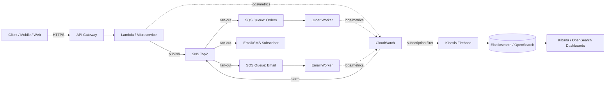
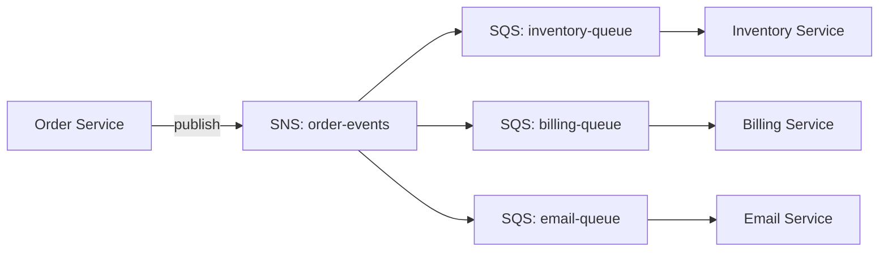
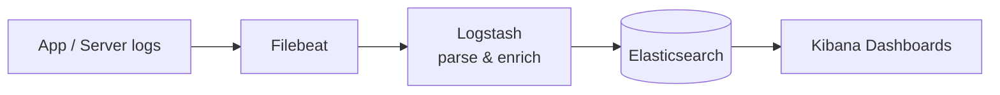
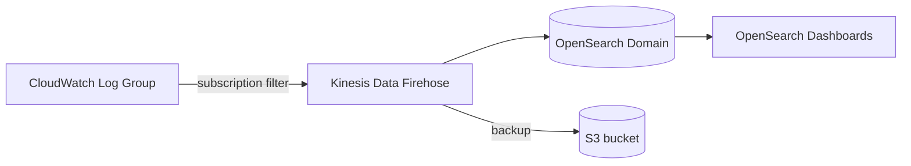
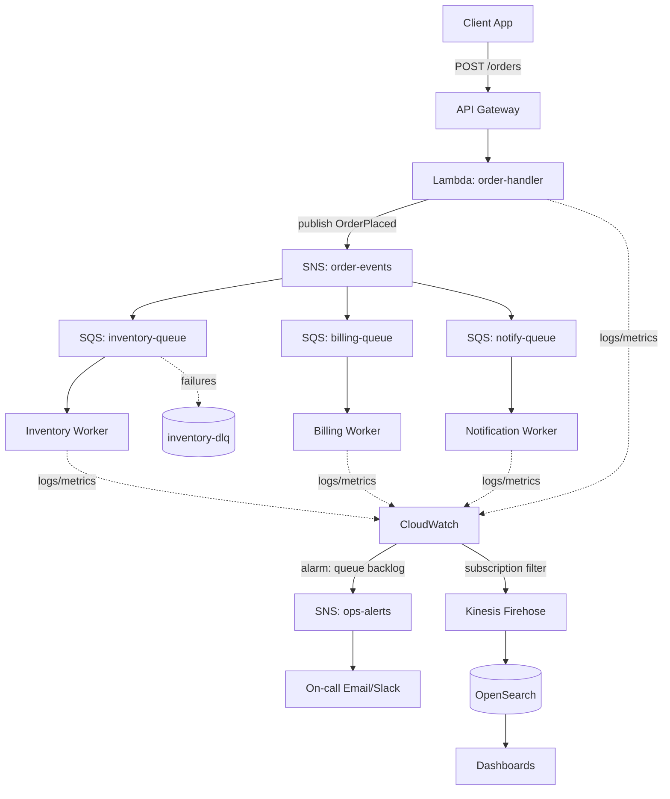

# AWS Messaging, Monitoring & Logging Mastery

### SNS · SQS · API Gateway · CloudWatch · ELK · Centralized Logging

> **Your complete zero-to-production trainer & DevOps mentor guide.**
> Every topic includes **concepts**, **real-world use cases**, **Console (UI) steps**, and **CLI steps**.
> Built for real-time project use. No prior knowledge assumed.

---

## Table of Contents

1. [How to Use This Guide](#1-how-to-use-this-guide)
2. [Prerequisites & Environment Setup](#2-prerequisites--environment-setup)
3. [Core Concepts: The Big Picture](#3-core-concepts-the-big-picture)
4. [IAM Foundations (Security First)](#4-iam-foundations-security-first)
5. [Amazon SNS (Simple Notification Service)](#5-amazon-sns-simple-notification-service)
6. [Amazon SQS (Simple Queue Service)](#6-amazon-sqs-simple-queue-service)
7. [SNS + SQS Fan-Out Pattern](#7-sns--sqs-fan-out-pattern)
8. [Amazon API Gateway](#8-amazon-api-gateway)
9. [Amazon CloudWatch (Metrics, Alarms, Dashboards)](#9-amazon-cloudwatch-metrics-alarms-dashboards)
10. [CloudWatch Logs (Centralized AWS Logging)](#10-cloudwatch-logs-centralized-aws-logging)
11. [CloudWatch Agent (EC2 / On-Prem Logs & Metrics)](#11-cloudwatch-agent-ec2--on-prem-logs--metrics)
12. [The ELK / Elastic Stack](#12-the-elk--elastic-stack)
13. [Shipping AWS Logs into ELK](#13-shipping-aws-logs-into-elk)
14. [End-to-End Real-Time Project Architecture](#14-end-to-end-real-time-project-architecture)
15. [Observability Best Practices & Cost Control](#15-observability-best-practices--cost-control)
16. [Troubleshooting Cheat Sheet](#16-troubleshooting-cheat-sheet)
17. [Interview & Hands-On Practice Questions](#17-interview--hands-on-practice-questions)
18. [Glossary](#18-glossary)

**Appendices (advanced & complete coverage):**

- [A. AWS CloudTrail (API Audit Logging)](#appendix-a--aws-cloudtrail-api-audit-logging)
- [B. Amazon EventBridge (Modern Event Bus)](#appendix-b--amazon-eventbridge-modern-event-bus)
- [C. AWS X-Ray (Distributed Tracing)](#appendix-c--aws-x-ray-distributed-tracing)
- [D. Encryption with KMS (SNS / SQS / Logs / OpenSearch)](#appendix-d--encryption-with-kms-sns--sqs--logs--opensearch)
- [E. API Gateway Advanced (Direct SQS, Cognito, Usage Plans)](#appendix-e--api-gateway-advanced-direct-sqs-cognito-usage-plans)
- [F. CloudWatch Synthetics (Canaries / Uptime)](#appendix-f--cloudwatch-synthetics-canaries--uptime)
- [G. CloudWatch Container Insights (ECS / EKS)](#appendix-g--cloudwatch-container-insights-ecs--eks)
- [H. CloudWatch RUM & Application Signals](#appendix-h--cloudwatch-rum--application-signals)
- [I. VPC Flow Logs](#appendix-i--vpc-flow-logs)
- [J. SNS Advanced (Delivery Retry, Status Logging, Slack, Data Protection)](#appendix-j--sns-advanced-delivery-retry-status-logging-slack-data-protection)
- [K. OpenSearch Operations (Snapshots, ILM, Security)](#appendix-k--opensearch-operations-snapshots-ilm-security)
- [L. Beats & Logstash Deep Dive](#appendix-l--beats--logstash-deep-dive)
- [M. Grafana & Prometheus (Alternative Stack)](#appendix-m--grafana--prometheus-alternative-stack)
- [N. Infrastructure as Code (Terraform & CloudFormation)](#appendix-n--infrastructure-as-code-terraform--cloudformation)
- [O. Cost Estimation & Free Tier Notes](#appendix-o--cost-estimation--free-tier-notes)
- [P. Notifications to Slack / Microsoft Teams](#appendix-p--notifications-to-slack--microsoft-teams)
- [Q. Resource Cleanup (Avoid Charges)](#appendix-q--resource-cleanup-avoid-charges)

---

## 1. How to Use This Guide

You are a complete beginner — that's perfectly fine. Here is the recommended path:

| Day | Focus | Sections |
|-----|-------|----------|
| 1 | Setup + Concepts + IAM | 2, 3, 4 |
| 2 | Messaging | 5, 6, 7 |
| 3 | APIs | 8 |
| 4 | Monitoring | 9, 10, 11 |
| 5 | Logging stack | 12, 13 |
| 6 | Build the full project | 14, 15 |
| 7 | Practice & review | 16, 17, 18 |

**Learning method for each service:**
1. Read the **What / Why** (concept).
2. Do the **Console steps** first (visual understanding).
3. Repeat with **CLI steps** (automation & real DevOps work).
4. Note the **Real-time use case** so you know *when* to use it.

> 💡 **Mentor tip:** In real projects, Console is for *learning and one-off tasks*; **CLI + Infrastructure as Code (IaC)** is how production is actually built. Learn both — interviews and jobs require it.

---

## 2. Prerequisites & Environment Setup

### 2.1 What you need

- An **AWS account** (free tier eligible).
- A user with appropriate permissions (we'll create one in IAM).
- **AWS CLI v2** installed on your machine.
- A terminal (PowerShell on Windows, bash on Linux/Mac).
- Optional but recommended: **VS Code**, **Docker Desktop** (for local ELK).

### 2.2 Install the AWS CLI v2

**Windows (PowerShell):**
```powershell
# Download and install AWS CLI v2
msiexec.exe /i https://awscli.amazonaws.com/AWSCLIV2.msi

# Verify
aws --version
# Expected: aws-cli/2.x.x Python/3.x ...
```

**Linux:**
```bash
curl "https://awscli.amazonaws.com/awscli-exe-linux-x86_64.zip" -o "awscliv2.zip"
unzip awscliv2.zip
sudo ./aws/install
aws --version
```

**macOS:**
```bash
curl "https://awscli.amazonaws.com/AWSCLIV2.pkg" -o "AWSCLIV2.pkg"
sudo installer -pkg AWSCLIV2.pkg -target /
aws --version
```

### 2.3 Configure the CLI

```bash
aws configure
# AWS Access Key ID:     <paste>
# AWS Secret Access Key: <paste>
# Default region name:   us-east-1
# Default output format:  json
```

**Use named profiles** (recommended for multiple accounts):
```bash
aws configure --profile dev
aws s3 ls --profile dev          # use the profile
export AWS_PROFILE=dev           # Linux/Mac default for session
$env:AWS_PROFILE = "dev"         # PowerShell default for session
```

### 2.4 Verify your identity

```bash
aws sts get-caller-identity
# Returns Account, UserId, Arn — confirms CLI works.
```

> 🔐 **Security note:** Never hardcode access keys in code or commit them to Git. Prefer **IAM Roles** on EC2/Lambda/ECS, and **AWS SSO / IAM Identity Center** for humans. We cover IAM in Section 4.

---

## 3. Core Concepts: The Big Picture

Before touching any service, understand *why* these exist and how they fit together.

### 3.1 The problem each service solves

| Service | One-line purpose | Analogy |
|---------|------------------|---------|
| **SNS** | Push notifications to many subscribers instantly (pub/sub) | A radio broadcast — one message, many listeners |
| **SQS** | Buffer/queue work so consumers process at their own pace | A to-do inbox that never loses items |
| **API Gateway** | Front door for your APIs (HTTP/REST/WebSocket) | A receptionist routing visitors |
| **CloudWatch Metrics** | Numbers over time (CPU, latency, queue depth) | A car dashboard |
| **CloudWatch Alarms** | Notify/act when a metric crosses a threshold | A smoke detector |
| **CloudWatch Logs** | Store & search text logs from apps/services | A diary of everything that happened |
| **ELK Stack** | Powerful search, analytics & visualization of logs | A search engine + dashboards for your logs |

### 3.2 How they connect (decoupled architecture)



### 3.3 Key terms you'll keep seeing

- **Decoupling** — components don't call each other directly; they talk through queues/topics so one failing won't crash the others.
- **Pub/Sub (Publish-Subscribe)** — publishers send messages to a *topic*; many subscribers receive copies.
- **Producer / Consumer** — producer puts work on a queue; consumer takes it off.
- **Asynchronous** — "fire and forget"; the caller doesn't wait for the work to finish.
- **Idempotency** — processing the same message twice produces the same result (critical because queues can deliver duplicates).
- **Observability** — the three pillars: **Metrics** (numbers), **Logs** (text events), **Traces** (request journeys).

---

## 4. IAM Foundations (Security First)

You cannot use any service safely without understanding IAM. **Least privilege** is the golden rule: grant only the permissions needed.

### 4.1 Core IAM objects

- **User** — a person or app with long-term credentials.
- **Group** — a collection of users sharing permissions.
- **Role** — temporary credentials assumed by services (EC2, Lambda) or users. **Preferred over keys.**
- **Policy** — a JSON document granting/denying actions on resources.

### 4.2 Create a least-privilege policy (CLI)

Create a file `sns-sqs-publish-policy.json`:
```json
{
  "Version": "2012-10-17",
  "Statement": [
    {
      "Sid": "AllowSNSPublish",
      "Effect": "Allow",
      "Action": ["sns:Publish"],
      "Resource": "arn:aws:sns:us-east-1:123456789012:order-events"
    },
    {
      "Sid": "AllowSQSConsume",
      "Effect": "Allow",
      "Action": [
        "sqs:ReceiveMessage",
        "sqs:DeleteMessage",
        "sqs:GetQueueAttributes"
      ],
      "Resource": "arn:aws:sqs:us-east-1:123456789012:order-queue"
    }
  ]
}
```

```bash
aws iam create-policy \
  --policy-name OrderServicePolicy \
  --policy-document file://sns-sqs-publish-policy.json
```

### 4.3 Create a role for Lambda (CLI)

`trust-policy.json` (who can assume the role):
```json
{
  "Version": "2012-10-17",
  "Statement": [{
    "Effect": "Allow",
    "Principal": { "Service": "lambda.amazonaws.com" },
    "Action": "sts:AssumeRole"
  }]
}
```

```bash
aws iam create-role \
  --role-name OrderServiceRole \
  --assume-role-policy-document file://trust-policy.json

aws iam attach-role-policy \
  --role-name OrderServiceRole \
  --policy-arn arn:aws:iam::123456789012:policy/OrderServicePolicy

# CloudWatch Logs permission for Lambda
aws iam attach-role-policy \
  --role-name OrderServiceRole \
  --policy-arn arn:aws:iam::aws:policy/service-role/AWSLambdaBasicExecutionRole
```

### 4.4 Console steps (IAM user + group)

1. AWS Console → **IAM** → **User groups** → **Create group** → name `developers`.
2. Attach policies (start with managed policies for learning, tighten later).
3. **Users** → **Create user** → add to `developers` group.
4. Enable **MFA** for every human user (Security credentials tab).
5. For programmatic access, create access keys **only if you can't use roles/SSO**.

> 🔐 **Mentor rule:** Replace `123456789012` with your real account ID (`aws sts get-caller-identity --query Account --output text`). Always scope `Resource` ARNs — avoid `"Resource": "*"` in production.

---

## 5. Amazon SNS (Simple Notification Service)

### 5.1 What & Why

**SNS** is a fully managed **pub/sub** messaging service. A **publisher** sends a message to a **topic**, and SNS instantly **pushes** that message to all **subscribers**.

**Real-time use cases:**
- Fan-out an "OrderPlaced" event to multiple systems (inventory, billing, email).
- Send **CloudWatch alarm notifications** to email/SMS/Slack.
- Mobile push notifications.
- Trigger Lambda functions on events.

### 5.2 Key concepts

| Term | Meaning |
|------|---------|
| **Topic** | The named channel you publish to |
| **Subscription** | An endpoint that receives messages (SQS, Lambda, Email, SMS, HTTP/S) |
| **Standard topic** | High throughput, at-least-once delivery, best-effort ordering |
| **FIFO topic** | Strict ordering + exactly-once, must end in `.fifo`, pairs with SQS FIFO |
| **Message filtering** | Subscribers receive only messages matching a filter policy |
| **DLQ (Dead-Letter Queue)** | Where undeliverable messages go for inspection |

### 5.3 Subscription protocols (delivery targets)

`SQS`, `Lambda`, `Email`, `Email-JSON`, `SMS`, `HTTP/HTTPS`, `Application` (mobile push), `Kinesis Data Firehose`.

### 5.4 Console steps — create a topic & subscribe

1. Console → **SNS** → **Topics** → **Create topic**.
2. Type: **Standard** → Name: `order-events` → **Create topic**.
3. On the topic page → **Create subscription**.
4. Protocol: **Email** → Endpoint: `you@example.com` → **Create**.
5. **Check your inbox** and click **Confirm subscription** (required!).
6. **Publish message** → enter Subject + Body → **Publish**. You'll receive the email.

### 5.5 CLI steps — full lifecycle

```bash
# 1. Create a standard topic
aws sns create-topic --name order-events
# Note the returned TopicArn, e.g. arn:aws:sns:us-east-1:123456789012:order-events

TOPIC_ARN=arn:aws:sns:us-east-1:123456789012:order-events

# 2. Subscribe an email endpoint
aws sns subscribe \
  --topic-arn $TOPIC_ARN \
  --protocol email \
  --notification-endpoint you@example.com
# Confirm via the email link.

# 3. Publish a message
aws sns publish \
  --topic-arn $TOPIC_ARN \
  --subject "New Order" \
  --message '{"orderId":"1001","amount":250}'

# 4. List subscriptions
aws sns list-subscriptions-by-topic --topic-arn $TOPIC_ARN

# 5. Delete (cleanup)
aws sns delete-topic --topic-arn $TOPIC_ARN
```

### 5.5.1 Create a FIFO topic (ordered)

```bash
aws sns create-topic \
  --name order-events.fifo \
  --attributes FifoTopic=true,ContentBasedDeduplication=true

aws sns publish \
  --topic-arn arn:aws:sns:us-east-1:123456789012:order-events.fifo \
  --message '{"orderId":"1001"}' \
  --message-group-id "orders" \
  --message-deduplication-id "1001"
```

### 5.6 Message filtering (subscribers get only what they care about)

Filter policy lets the "email" subscriber receive only high-value orders:
```bash
aws sns set-subscription-attributes \
  --subscription-arn <SUBSCRIPTION_ARN> \
  --attribute-name FilterPolicy \
  --attribute-value '{"amount":[{"numeric":[">=",100]}]}'
```
Then publish with **message attributes**:
```bash
aws sns publish \
  --topic-arn $TOPIC_ARN \
  --message "high value order" \
  --message-attributes '{"amount":{"DataType":"Number","StringValue":"250"}}'
```

### 5.7 Real-time approaches

- **Alerting:** CloudWatch Alarm → SNS topic → Email/Slack/PagerDuty (via HTTPS + Lambda).
- **Event fan-out:** App → SNS → multiple SQS queues (Section 7).
- **Cross-account:** Topic policy allows other accounts to subscribe/publish.

> 💡 **Mentor tip:** SNS is **push** (delivers to you). SQS is **pull** (you poll for messages). Combine them for resilient fan-out.

---

## 6. Amazon SQS (Simple Queue Service)

### 6.1 What & Why

**SQS** is a fully managed **message queue**. Producers put messages in; consumers pull them out and process them. It **decouples** systems and absorbs traffic spikes so nothing is lost.

**Real-time use cases:**
- Buffer orders between a fast web layer and slower processing workers.
- Smooth out spikes (Black Friday traffic) so backend isn't overwhelmed.
- Retry failed work safely with DLQs.
- Decouple microservices.

### 6.2 Queue types

| Type | Throughput | Ordering | Duplicates | Name suffix |
|------|------------|----------|------------|-------------|
| **Standard** | Nearly unlimited | Best-effort | At-least-once (possible dupes) | none |
| **FIFO** | 300 msg/s (3000 batched) | Strict, exactly-once | No duplicates | `.fifo` |

### 6.3 Critical settings (must understand)

| Setting | What it does | Typical value |
|---------|--------------|---------------|
| **Visibility Timeout** | How long a received message is hidden from others while processed | 30s (set > your processing time) |
| **Message Retention** | How long unconsumed messages stay | 4 days (max 14) |
| **Delivery Delay** | Delay before a message becomes visible | 0s |
| **Receive Wait Time** | Long polling wait (reduces empty calls & cost) | 20s |
| **Max Message Size** | 256 KB max (use S3 pointer for larger) | 256 KB |
| **Redrive Policy / DLQ** | Send to DLQ after N failed receives | maxReceiveCount: 5 |

### 6.4 Console steps — create & use a queue

1. Console → **SQS** → **Create queue**.
2. Type **Standard** → Name `order-queue`.
3. Set **Visibility timeout** = 30s, **Receive message wait time** = 20s (long polling).
4. (Optional) Configure **Dead-letter queue** → enable redrive → maxReceiveCount 5.
5. **Create queue**.
6. **Send and receive messages** → Send a test message → Poll for messages → see it → Delete it.

### 6.5 CLI steps — full lifecycle

```bash
# 1. Create a standard queue with long polling
aws sqs create-queue \
  --queue-name order-queue \
  --attributes VisibilityTimeout=30,ReceiveMessageWaitTimeSeconds=20,MessageRetentionPeriod=345600

QUEUE_URL=$(aws sqs get-queue-url --queue-name order-queue --query QueueUrl --output text)

# 2. Send a message
aws sqs send-message \
  --queue-url $QUEUE_URL \
  --message-body '{"orderId":"1001","amount":250}'

# 3. Send a batch (up to 10)
aws sqs send-message-batch --queue-url $QUEUE_URL --entries \
  '[{"Id":"1","MessageBody":"order-1"},{"Id":"2","MessageBody":"order-2"}]'

# 4. Receive (poll) messages — long polling
aws sqs receive-message \
  --queue-url $QUEUE_URL \
  --max-number-of-messages 10 \
  --wait-time-seconds 20

# 5. Delete a processed message (use ReceiptHandle from receive output)
aws sqs delete-message \
  --queue-url $QUEUE_URL \
  --receipt-handle "<ReceiptHandle>"

# 6. Inspect queue depth
aws sqs get-queue-attributes \
  --queue-url $QUEUE_URL \
  --attribute-names ApproximateNumberOfMessages

# 7. Purge / delete (cleanup)
aws sqs purge-queue --queue-url $QUEUE_URL
aws sqs delete-queue --queue-url $QUEUE_URL
```

### 6.5.1 FIFO queue

```bash
aws sqs create-queue \
  --queue-name order-queue.fifo \
  --attributes FifoQueue=true,ContentBasedDeduplication=true

aws sqs send-message \
  --queue-url <FIFO_URL> \
  --message-body '{"orderId":"1001"}' \
  --message-group-id "orders" \
  --message-deduplication-id "1001"
```

### 6.6 Dead-Letter Queue (DLQ) setup via CLI

```bash
# Create the DLQ first
aws sqs create-queue --queue-name order-dlq
DLQ_ARN=$(aws sqs get-queue-attributes --queue-url <DLQ_URL> \
  --attribute-names QueueArn --query 'Attributes.QueueArn' --output text)

# Attach redrive policy to the main queue
aws sqs set-queue-attributes \
  --queue-url $QUEUE_URL \
  --attributes "{\"RedrivePolicy\":\"{\\\"deadLetterTargetArn\\\":\\\"$DLQ_ARN\\\",\\\"maxReceiveCount\\\":\\\"5\\\"}\"}"
```

### 6.7 Real-time approaches & best practices

- **Always use long polling** (`ReceiveMessageWaitTimeSeconds=20`) — fewer empty receives, lower cost.
- **Set visibility timeout > processing time**, else messages reappear and get processed twice.
- **Design consumers to be idempotent** (handle duplicates safely).
- **Use DLQs** to capture poison messages instead of infinite retries.
- **Batch** sends/deletes (up to 10) to cut API costs.
- **Trigger Lambda from SQS** (event source mapping) for serverless processing.

> 💡 **SNS vs SQS:** Use **SNS** when many systems need the *same* message instantly (push). Use **SQS** when work must be *queued and processed reliably* at the consumer's pace (pull). Use **both together** for fan-out (next section).

---

## 7. SNS + SQS Fan-Out Pattern

### 7.1 Why this pattern

One event (e.g., `OrderPlaced`) must reach **multiple independent consumers**, each processing at its own speed and surviving outages. SNS pushes the event to **multiple SQS queues**; each microservice owns its queue.



### 7.2 CLI: wire SNS → multiple SQS

```bash
# Assume TOPIC_ARN, and two queues already created (Q1_URL, Q2_URL)
Q1_ARN=$(aws sqs get-queue-attributes --queue-url $Q1_URL --attribute-names QueueArn --query 'Attributes.QueueArn' --output text)
Q2_ARN=$(aws sqs get-queue-attributes --queue-url $Q2_URL --attribute-names QueueArn --query 'Attributes.QueueArn' --output text)

# Subscribe both queues to the topic, enable raw message delivery
aws sns subscribe --topic-arn $TOPIC_ARN --protocol sqs --notification-endpoint $Q1_ARN --attributes '{"RawMessageDelivery":"true"}'
aws sns subscribe --topic-arn $TOPIC_ARN --protocol sqs --notification-endpoint $Q2_ARN --attributes '{"RawMessageDelivery":"true"}'
```

### 7.3 Critical: SQS queue policy to allow SNS to send

SNS can only deliver if the queue's policy permits it. `policy.json`:
```json
{
  "Version": "2012-10-17",
  "Statement": [{
    "Effect": "Allow",
    "Principal": { "Service": "sns.amazonaws.com" },
    "Action": "sqs:SendMessage",
    "Resource": "arn:aws:sqs:us-east-1:123456789012:inventory-queue",
    "Condition": {
      "ArnEquals": { "aws:SourceArn": "arn:aws:sns:us-east-1:123456789012:order-events" }
    }
  }]
}
```
```bash
aws sqs set-queue-attributes --queue-url $Q1_URL \
  --attributes Policy="$(cat policy.json | tr -d '\n')"
```

### 7.4 Console steps

1. Create the SNS topic and the SQS queues.
2. In the SNS topic → **Create subscription** → Protocol **Amazon SQS** → pick the queue ARN.
3. Console offers to **auto-create the access policy** on the queue — accept it.
4. Enable **Raw message delivery** in the subscription if you want the raw payload (no SNS envelope).
5. Publish to the topic → confirm both queues receive the message.

> 💡 **Mentor tip:** Enable **Raw Message Delivery** so consumers get the original JSON instead of SNS's wrapper envelope — simplifies parsing.

---

## 8. Amazon API Gateway

### 8.1 What & Why

**API Gateway** is a fully managed front door that creates, publishes, secures, and monitors APIs at scale. It receives client requests and routes them to backends (Lambda, HTTP endpoints, SQS, Step Functions, etc.).

**Real-time use cases:**
- Public REST/HTTP API for a mobile/web app backed by Lambda.
- Throttling & rate limiting to protect backends.
- Authentication (Cognito, IAM, Lambda authorizers, API keys).
- Directly enqueue requests to SQS without custom code.

### 8.2 API types

| Type | Best for | Notes |
|------|----------|-------|
| **HTTP API** | Simple, low-latency, low-cost Lambda/HTTP proxies | Newer, cheaper, fewer features |
| **REST API** | Full features (API keys, usage plans, request validation, WAF) | More config, higher cost |
| **WebSocket API** | Real-time two-way (chat, notifications) | Persistent connections |

### 8.3 Key concepts

- **Resource** — a URL path (e.g., `/orders`).
- **Method** — HTTP verb on a resource (GET, POST...).
- **Integration** — what the method calls (Lambda, HTTP, AWS service).
- **Stage** — a deployment environment (`dev`, `prod`) with its own URL.
- **Throttling / Usage plans / API keys** — control who calls and how often.
- **Authorizer** — Cognito / IAM / Lambda function that validates requests.

### 8.4 Console steps — HTTP API to Lambda

1. Create a Lambda function (Author from scratch, Node.js/Python) returning a JSON response.
2. Console → **API Gateway** → **Create API** → **HTTP API** → **Build**.
3. **Add integration** → Lambda → select your function.
4. Configure route: `GET /orders` → integration = your Lambda.
5. **Stages**: default `$default` auto-deploys. Note the **Invoke URL**.
6. Test: open `https://<api-id>.execute-api.<region>.amazonaws.com/orders` in a browser.

### 8.5 CLI steps — HTTP API to Lambda

```bash
# 1. Create the HTTP API
API_ID=$(aws apigatewayv2 create-api \
  --name orders-api \
  --protocol-type HTTP \
  --target arn:aws:lambda:us-east-1:123456789012:function:order-handler \
  --query ApiId --output text)

# 2. Grant API Gateway permission to invoke Lambda
aws lambda add-permission \
  --function-name order-handler \
  --statement-id apigw-invoke \
  --action lambda:InvokeFunction \
  --principal apigateway.amazonaws.com \
  --source-arn "arn:aws:execute-api:us-east-1:123456789012:$API_ID/*/*"

# 3. Get the invoke URL
aws apigatewayv2 get-api --api-id $API_ID --query ApiEndpoint --output text

# 4. Test
curl https://$API_ID.execute-api.us-east-1.amazonaws.com/
```

### 8.6 Enable access logging & metrics (ties into CloudWatch)

API Gateway emits **metrics** (Count, Latency, 4XXError, 5XXError) and can write **access logs** to CloudWatch Logs.

```bash
# Create a log group for access logs
aws logs create-log-group --log-group-name /apigw/orders-api

# Configure stage access logging (REST API example)
aws apigateway update-stage \
  --rest-api-id <REST_API_ID> \
  --stage-name prod \
  --patch-operations \
    op=replace,path=/accessLogSettings/destinationArn,value=arn:aws:logs:us-east-1:123456789012:log-group:/apigw/orders-api \
    op=replace,path=/accessLogSettings/format,value='{"requestId":"$context.requestId","ip":"$context.identity.sourceIp","status":"$context.status","latency":"$context.responseLatency"}'
```

### 8.7 Throttling (protect your backend)

```bash
aws apigateway update-stage \
  --rest-api-id <REST_API_ID> \
  --stage-name prod \
  --patch-operations \
    op=replace,path=/throttle/rateLimit,value=100 \
    op=replace,path=/throttle/burstLimit,value=200
```

> 💡 **Mentor tip:** API Gateway → SQS direct integration lets clients enqueue work with **zero backend code** — a powerful pattern for ingestion pipelines.

---

## 9. Amazon CloudWatch (Metrics, Alarms, Dashboards)

### 9.1 What & Why

**CloudWatch** is AWS's monitoring & observability service. It collects **metrics** (numbers over time), lets you set **alarms**, build **dashboards**, and store **logs** (Section 10).

**Real-time use cases:**
- Alert when EC2 CPU > 80% or SQS queue depth > 1000.
- Dashboard showing API latency, error rate, and throughput.
- Auto-scale based on a custom metric.
- Detect anomalies automatically.

### 9.2 Core concepts

| Term | Meaning |
|------|---------|
| **Metric** | A time-ordered set of data points (e.g., `CPUUtilization`) |
| **Namespace** | A container for metrics (e.g., `AWS/EC2`, `AWS/SQS`, custom `MyApp`) |
| **Dimension** | A name/value pair identifying a metric (e.g., `QueueName=order-queue`) |
| **Statistic** | Aggregation: Average, Sum, Min, Max, p90, p99 |
| **Period** | Time window for each data point (e.g., 60s) |
| **Alarm** | Watches a metric and triggers actions (notify, autoscale) |
| **Dashboard** | Visual collection of metric widgets |
| **Composite Alarm** | Combines multiple alarms with AND/OR logic |

### 9.3 Built-in vs custom metrics

- **Built-in:** AWS services publish automatically (`AWS/EC2`, `AWS/SQS`, `AWS/Lambda`, `AWS/ApiGateway`).
- **Custom:** Your app pushes business metrics (orders/min, signups).

### 9.4 Console steps — create an alarm

1. Console → **CloudWatch** → **Alarms** → **Create alarm**.
2. **Select metric** → e.g., `SQS` → `order-queue` → `ApproximateNumberOfMessagesVisible`.
3. Statistic **Maximum**, Period **1 min**.
4. Condition: **Greater than 1000**.
5. **Notification:** select/create an SNS topic (e.g., `ops-alerts`) → confirm email.
6. Name the alarm `OrderQueueBacklog` → **Create alarm**.

### 9.5 CLI steps — alarm + custom metric + dashboard

**Create an alarm that notifies an SNS topic:**
```bash
aws cloudwatch put-metric-alarm \
  --alarm-name OrderQueueBacklog \
  --namespace AWS/SQS \
  --metric-name ApproximateNumberOfMessagesVisible \
  --dimensions Name=QueueName,Value=order-queue \
  --statistic Maximum \
  --period 60 \
  --evaluation-periods 2 \
  --threshold 1000 \
  --comparison-operator GreaterThanThreshold \
  --alarm-actions arn:aws:sns:us-east-1:123456789012:ops-alerts \
  --treat-missing-data notBreaching
```

**Publish a custom metric:**
```bash
aws cloudwatch put-metric-data \
  --namespace "MyApp" \
  --metric-name OrdersProcessed \
  --dimensions Service=order-worker \
  --value 1 \
  --unit Count
```

**Query a metric:**
```bash
aws cloudwatch get-metric-statistics \
  --namespace AWS/SQS \
  --metric-name ApproximateNumberOfMessagesVisible \
  --dimensions Name=QueueName,Value=order-queue \
  --start-time 2026-06-25T00:00:00Z \
  --end-time 2026-06-25T01:00:00Z \
  --period 300 \
  --statistics Maximum
```

**Create a dashboard:**
```bash
aws cloudwatch put-dashboard \
  --dashboard-name OrdersOps \
  --dashboard-body '{
    "widgets": [
      {
        "type": "metric", "x": 0, "y": 0, "width": 12, "height": 6,
        "properties": {
          "title": "Queue Depth",
          "metrics": [["AWS/SQS","ApproximateNumberOfMessagesVisible","QueueName","order-queue"]],
          "period": 60, "stat": "Maximum", "region": "us-east-1"
        }
      }
    ]
  }'
```

### 9.6 Alarm states & anomaly detection

- States: **OK**, **ALARM**, **INSUFFICIENT_DATA**.
- **Anomaly detection** builds a band of expected values; alarm fires when metric leaves the band — great when you don't know a fixed threshold.

> 💡 **Mentor tip:** Pair every critical alarm with an **SNS topic** so humans get paged. Use **composite alarms** to reduce noise (e.g., fire only when latency high AND error rate high).

---

## 10. CloudWatch Logs (Centralized AWS Logging)

### 10.1 What & Why

**CloudWatch Logs** stores, searches, and monitors **log text** from Lambda, EC2, ECS, API Gateway, VPC, and custom apps.

**Real-time use cases:**
- Centralize all Lambda/ECS/EC2 application logs.
- Search errors across services with **Logs Insights**.
- Create **metric filters** that turn log patterns into metrics + alarms (e.g., count "ERROR").
- Stream logs to ELK / OpenSearch (Section 13).

### 10.2 Core concepts

| Term | Meaning |
|------|---------|
| **Log Group** | A named bucket of logs for an app/service (e.g., `/aws/lambda/order-handler`) |
| **Log Stream** | A sequence of log events from one source (e.g., one container/instance) |
| **Log Event** | A single timestamped log line |
| **Retention** | How long logs are kept (default: never expire — set this to control cost!) |
| **Metric Filter** | Pattern that extracts a metric from logs |
| **Subscription Filter** | Streams matching logs to Lambda/Firehose/Kinesis in real time |
| **Logs Insights** | Query language to search & analyze logs |

### 10.3 Console steps

1. Console → **CloudWatch** → **Log groups**.
2. Pick a group (Lambda creates `/aws/lambda/<fn>` automatically) → open a stream to view events.
3. **Logs Insights** → select log group → run a query → **Run**.
4. Set retention: select log group → **Actions** → **Edit retention** → e.g., 30 days.

### 10.4 CLI steps

```bash
# Create a log group and set retention
aws logs create-log-group --log-group-name /myapp/order-service
aws logs put-retention-policy --log-group-name /myapp/order-service --retention-in-days 30

# Create a log stream
aws logs create-log-stream \
  --log-group-name /myapp/order-service \
  --log-stream-name worker-1

# Push a log event (sequence token needed after first put)
aws logs put-log-events \
  --log-group-name /myapp/order-service \
  --log-stream-name worker-1 \
  --log-events timestamp=$(($(date +%s)*1000)),message="Order 1001 processed"

# Tail logs live (CLI v2)
aws logs tail /myapp/order-service --follow

# Filter logs
aws logs filter-log-events \
  --log-group-name /myapp/order-service \
  --filter-pattern "ERROR" \
  --start-time $(($(date +%s)*1000 - 3600000))
```

### 10.5 Logs Insights queries (very useful)

```sql
-- Top 20 most recent error lines
fields @timestamp, @message
| filter @message like /ERROR/
| sort @timestamp desc
| limit 20

-- Count errors per 5 minutes
filter @message like /ERROR/
| stats count(*) as errors by bin(5m)

-- Average Lambda duration
filter @type = "REPORT"
| stats avg(@duration), max(@duration), pct(@duration, 99) by bin(5m)
```

### 10.6 Metric filter → alarm (turn logs into alerts)

```bash
# Count "ERROR" occurrences as a custom metric
aws logs put-metric-filter \
  --log-group-name /myapp/order-service \
  --filter-name ErrorCount \
  --filter-pattern "ERROR" \
  --metric-transformations \
    metricName=AppErrorCount,metricNamespace=MyApp,metricValue=1,defaultValue=0

# Alarm on that metric
aws cloudwatch put-metric-alarm \
  --alarm-name AppErrorsHigh \
  --namespace MyApp \
  --metric-name AppErrorCount \
  --statistic Sum --period 300 --evaluation-periods 1 \
  --threshold 10 --comparison-operator GreaterThanThreshold \
  --alarm-actions arn:aws:sns:us-east-1:123456789012:ops-alerts
```

> 🔐 **Mentor rule:** Always set **retention** on log groups. The default is "never expire," which silently grows your bill forever.

---

## 11. CloudWatch Agent (EC2 / On-Prem Logs & Metrics)

### 11.1 What & Why

EC2 instances do **not** send memory, disk, or application file logs to CloudWatch by default. The **CloudWatch Agent** collects:
- **Custom metrics:** memory, disk usage, swap, processes.
- **Log files:** `/var/log/...`, app logs → CloudWatch Logs.

### 11.2 Prerequisites

- IAM role on the instance with `CloudWatchAgentServerPolicy`.
- Agent installed (often pre-installed on Amazon Linux 2; otherwise install).

### 11.3 Install the agent

**Amazon Linux / RHEL:**
```bash
sudo yum install -y amazon-cloudwatch-agent
```
**Ubuntu/Debian:**
```bash
wget https://amazoncloudwatch-agent.s3.amazonaws.com/ubuntu/amd64/latest/amazon-cloudwatch-agent.deb
sudo dpkg -i -E ./amazon-cloudwatch-agent.deb
```

### 11.4 Configure (interactive wizard)

```bash
sudo /opt/aws/amazon-cloudwatch-agent/bin/amazon-cloudwatch-agent-config-wizard
```
This generates a config at `/opt/aws/amazon-cloudwatch-agent/etc/amazon-cloudwatch-agent.json`.

**Example config (collect a custom app log + memory/disk):**
```json
{
  "metrics": {
    "namespace": "MyApp/EC2",
    "metrics_collected": {
      "mem": { "measurement": ["mem_used_percent"] },
      "disk": { "measurement": ["used_percent"], "resources": ["*"] }
    }
  },
  "logs": {
    "logs_collected": {
      "files": {
        "collect_list": [
          {
            "file_path": "/var/log/myapp/app.log",
            "log_group_name": "/myapp/order-service",
            "log_stream_name": "{instance_id}"
          }
        ]
      }
    }
  }
}
```

### 11.5 Start the agent

```bash
sudo /opt/aws/amazon-cloudwatch-agent/bin/amazon-cloudwatch-agent-ctl \
  -a fetch-config -m ec2 \
  -c file:/opt/aws/amazon-cloudwatch-agent/etc/amazon-cloudwatch-agent.json \
  -s

# Check status
sudo /opt/aws/amazon-cloudwatch-agent/bin/amazon-cloudwatch-agent-ctl -a status
```

### 11.6 Store config in SSM Parameter Store (fleet-wide)

```bash
# Upload config once
aws ssm put-parameter --name "AmazonCloudWatch-linux" \
  --type String --value file://amazon-cloudwatch-agent.json

# Each instance pulls from SSM
sudo /opt/aws/amazon-cloudwatch-agent/bin/amazon-cloudwatch-agent-ctl \
  -a fetch-config -m ec2 -c ssm:AmazonCloudWatch-linux -s
```

> 💡 **Mentor tip:** Use SSM Parameter Store + an SSM Document/State Manager to roll the same agent config to an entire fleet automatically.

---

## 12. The ELK / Elastic Stack

### 12.1 What & Why

**ELK** = **E**lasticsearch + **L**ogstash + **K**ibana (plus **Beats**). It's the most popular open-source stack for **centralized log search, analytics, and dashboards**. On AWS, the managed equivalent is **Amazon OpenSearch Service** (a fork of Elasticsearch/Kibana).

**Why ELK over CloudWatch Logs alone?**
- Far richer **full-text search** and aggregations.
- Beautiful, flexible **dashboards** (Kibana).
- Correlate logs across many systems and clouds.
- Free-text + structured querying at large scale.

### 12.2 Components explained

| Component | Role |
|-----------|------|
| **Beats** (Filebeat, Metricbeat) | Lightweight shippers installed on servers; send logs/metrics |
| **Logstash** | Ingest pipeline: parse, transform, enrich, route data |
| **Elasticsearch** | Search & analytics engine that stores indexed data |
| **Kibana** | Visualization & dashboard UI |



### 12.3 Key concepts

- **Index** — a collection of documents (like a database table). Often time-based: `app-logs-2026.06.25`.
- **Document** — one JSON record (one log line, enriched).
- **Mapping** — schema/field types for an index.
- **Shard / Replica** — how indices are split & duplicated for scale and HA.
- **ILM (Index Lifecycle Management)** — auto roll over & delete old indices (cost control).
- **Grok** — Logstash pattern language to parse unstructured logs.

### 12.4 Approach A — Run ELK locally with Docker (for learning)

`docker-compose.yml`:
```yaml
version: "3.8"
services:
  elasticsearch:
    image: docker.elastic.co/elasticsearch/elasticsearch:8.13.0
    environment:
      - discovery.type=single-node
      - xpack.security.enabled=false
      - ES_JAVA_OPTS=-Xms1g -Xmx1g
    ports: ["9200:9200"]
  kibana:
    image: docker.elastic.co/kibana/kibana:8.13.0
    environment:
      - ELASTICSEARCH_HOSTS=http://elasticsearch:9200
    ports: ["5601:5601"]
    depends_on: [elasticsearch]
  logstash:
    image: docker.elastic.co/logstash/logstash:8.13.0
    ports: ["5044:5044"]
    volumes:
      - ./logstash.conf:/usr/share/logstash/pipeline/logstash.conf
    depends_on: [elasticsearch]
```

```bash
docker compose up -d
# Elasticsearch: http://localhost:9200
# Kibana:        http://localhost:5601
```

**Sample `logstash.conf`:**
```ruby
input {
  beats { port => 5044 }
}
filter {
  grok {
    match => { "message" => "%{TIMESTAMP_ISO8601:ts} %{LOGLEVEL:level} %{GREEDYDATA:msg}" }
  }
  date { match => ["ts", "ISO8601"] }
}
output {
  elasticsearch {
    hosts => ["http://elasticsearch:9200"]
    index => "app-logs-%{+YYYY.MM.dd}"
  }
}
```

**Install Filebeat on a server (ships logs to Logstash):**
```yaml
# filebeat.yml
filebeat.inputs:
  - type: filestream
    paths: ["/var/log/myapp/*.log"]
output.logstash:
  hosts: ["logstash-host:5044"]
```
```bash
sudo filebeat setup
sudo systemctl enable --now filebeat
```

### 12.5 Approach B — Amazon OpenSearch Service (managed, production)

This is the AWS-native, fully managed ELK alternative (no servers to patch).

**CLI: create a domain (small dev sizing):**
```bash
aws opensearch create-domain \
  --domain-name app-logs \
  --engine-version OpenSearch_2.11 \
  --cluster-config InstanceType=t3.small.search,InstanceCount=1 \
  --ebs-options EBSEnabled=true,VolumeType=gp3,VolumeSize=20 \
  --node-to-node-encryption-options Enabled=true \
  --encryption-at-rest-options Enabled=true \
  --domain-endpoint-options EnforceHTTPS=true
```

**Console steps:**
1. Console → **OpenSearch Service** → **Create domain**.
2. Deployment type: **Dev/test** (1 node) for learning, **Production** (multi-AZ) for real use.
3. Configure instance type, storage, **encryption**, and **fine-grained access control** (master user).
4. Set network: **VPC access** (recommended) or public with IP/IAM policy.
5. Create. Once active, open **OpenSearch Dashboards** (Kibana equivalent) URL.

> 🔐 **Mentor rule:** Always enable **encryption at rest**, **node-to-node encryption**, **HTTPS**, and **fine-grained access control**. Prefer **VPC** deployment over public access.

---

## 13. Shipping AWS Logs into ELK

You need to get CloudWatch Logs (Lambda/API GW/ECS) into Elasticsearch/OpenSearch. Three common approaches:

### 13.1 Approach 1 — CloudWatch Logs Subscription → Kinesis Firehose → OpenSearch (recommended, serverless)



**CLI outline:**
```bash
# 1. Create a Firehose delivery stream targeting OpenSearch (console wizard is easiest;
#    Firehose needs an IAM role allowing es:* to the domain and s3 backup).

# 2. Attach a subscription filter on the log group → Firehose
aws logs put-subscription-filter \
  --log-group-name /aws/lambda/order-handler \
  --filter-name to-opensearch \
  --filter-pattern "" \
  --destination-arn arn:aws:firehose:us-east-1:123456789012:deliverystream/cwl-to-os \
  --role-arn arn:aws:iam::123456789012:role/CWLtoFirehoseRole
```

### 13.2 Approach 2 — CloudWatch Logs Subscription → Lambda → OpenSearch

A Lambda receives log batches and bulk-indexes them into OpenSearch. AWS even offers a one-click **"Stream to Amazon OpenSearch"** option in the Log group console:

**Console:** Log group → **Actions** → **Subscription filters** → **Create Elasticsearch/OpenSearch subscription filter** → pick domain → it auto-creates the Lambda + role.

### 13.3 Approach 3 — Filebeat/Logstash directly from EC2/ECS (self-managed ELK)

If you run your own ELK (Section 12.4), install **Filebeat** on each server/container to ship logs straight to Logstash/Elasticsearch — skipping CloudWatch entirely. Common for hybrid/on-prem.

### 13.4 Build a Kibana / OpenSearch dashboard

1. Open **Kibana/OpenSearch Dashboards**.
2. **Stack Management → Index Patterns** → create `app-logs-*` (or `cwl-*`).
3. **Discover** → explore raw logs, filter by `level: ERROR`.
4. **Visualize** → build charts (errors over time, top services).
5. **Dashboard** → combine visualizations → save & share.

### 13.5 Index lifecycle (cost control)

```json
// ILM policy: roll over daily, delete after 30 days
{
  "policy": {
    "phases": {
      "hot":    { "actions": { "rollover": { "max_age": "1d", "max_size": "20gb" } } },
      "delete": { "min_age": "30d", "actions": { "delete": {} } }
    }
  }
}
```

> 💡 **Mentor decision guide:**
> - All-AWS + serverless → **CloudWatch Logs + Firehose → OpenSearch**.
> - Multi-cloud / on-prem / full control → **self-managed ELK + Filebeat**.
> - Simple alerting only → **CloudWatch Logs + metric filters** (you may not need ELK at all).

---

## 14. End-to-End Real-Time Project Architecture

Let's tie everything together into one realistic **Order Processing System**.

### 14.1 Architecture



### 14.2 Build order (checklist)

1. **IAM** roles/policies (Section 4).
2. **SNS** topics: `order-events`, `ops-alerts` (Section 5).
3. **SQS** queues + DLQs: `inventory-queue`, `billing-queue`, `notify-queue` (Section 6).
4. **Fan-out**: subscribe queues to `order-events`, set queue policies (Section 7).
5. **Lambda** `order-handler` + workers; wire SQS event source mappings.
6. **API Gateway** `POST /orders` → `order-handler` (Section 8).
7. **CloudWatch** alarms on queue depth, Lambda errors, API 5XX → `ops-alerts` (Section 9).
8. **CloudWatch Logs** retention + metric filters (Section 10).
9. **OpenSearch** domain + Firehose subscription for dashboards (Sections 12–13).
10. **Dashboards** in CloudWatch + Kibana (Sections 9, 13).

### 14.3 Wire Lambda to consume SQS (event source mapping)

```bash
aws lambda create-event-source-mapping \
  --function-name inventory-worker \
  --batch-size 10 \
  --event-source-arn arn:aws:sqs:us-east-1:123456789012:inventory-queue
```

### 14.4 Minimal Lambda handlers (Python)

`order-handler` (API → SNS):
```python
import json, boto3, os
sns = boto3.client("sns")
TOPIC = os.environ["TOPIC_ARN"]

def handler(event, context):
    body = json.loads(event.get("body") or "{}")
    sns.publish(TopicArn=TOPIC, Message=json.dumps(body), Subject="OrderPlaced")
    print(f"Published order {body.get('orderId')}")  # goes to CloudWatch Logs
    return {"statusCode": 202, "body": json.dumps({"status": "accepted"})}
```

`inventory-worker` (SQS consumer):
```python
import json
def handler(event, context):
    for record in event["Records"]:
        msg = json.loads(record["body"])
        print(f"Reserving stock for order {msg.get('orderId')}")
        # ... business logic; raise to retry/DLQ on failure
    return {"statusCode": 200}
```

> 💡 **Mentor tip:** This decoupled design means if the Billing service is down, orders still flow — billing messages wait safely in SQS and process when it recovers. That's the power of **SNS + SQS + observability**.

---

## 15. Observability Best Practices & Cost Control

### 15.1 The three pillars

- **Metrics** (CloudWatch) — *Is something wrong?* (fast, cheap, numeric).
- **Logs** (CloudWatch Logs / ELK) — *Why is it wrong?* (detailed text).
- **Traces** (AWS X-Ray) — *Where in the request path?* (distributed tracing).

### 15.2 Best practices

- **Structured logging** — log JSON, not free text. Makes ELK/Insights queries trivial.
- **Correlation IDs** — pass a request ID through API GW → Lambda → SNS → SQS → workers to trace one order end-to-end.
- **Alarm on symptoms, not causes** — alert on user-facing impact (latency, error rate), reduce noise.
- **Set log retention** everywhere (30–90 days typical) and ship cold data to S3.
- **Use DLQs + alarms** on DLQ depth so failures never disappear silently.
- **Tag resources** (`env`, `team`, `app`) for cost allocation and filtering.
- **Least privilege IAM** for every component.
- **Infrastructure as Code** (CloudFormation / Terraform / CDK) — never click-build production.
- **Idempotent consumers** — assume duplicate deliveries.
- **Encrypt** everything (SNS/SQS SSE, OpenSearch at-rest + in-transit).

### 15.3 Cost control

| Service | Cost driver | Lever |
|---------|-------------|-------|
| CloudWatch Logs | Ingestion + storage | Set retention, drop noisy DEBUG logs, sample |
| Custom metrics | Per metric | Consolidate dimensions, use EMF |
| OpenSearch | Node hours + storage | Right-size, ILM rollover/delete, UltraWarm |
| SQS/SNS | Per request | Batch (up to 10), long polling |
| API Gateway | Per request + data | Use HTTP API over REST when possible, caching |

### 15.4 Embedded Metric Format (EMF) — logs + metrics in one

Write a special JSON log line and CloudWatch auto-extracts metrics — efficient and cheap:
```json
{
  "_aws": {
    "Timestamp": 1750000000000,
    "CloudWatchMetrics": [{
      "Namespace": "MyApp",
      "Dimensions": [["Service"]],
      "Metrics": [{"Name": "OrdersProcessed", "Unit": "Count"}]
    }]
  },
  "Service": "order-worker",
  "OrdersProcessed": 1
}
```

---

# Appendices — Advanced & Complete Coverage

These appendices add every remaining service, pattern, and integration needed for a truly complete, production-grade real-time setup. Each keeps the same format: **What/Why → Console steps → CLI steps → real-time tips**.

---

## Appendix A — AWS CloudTrail (API Audit Logging)

### A.1 What & Why

**CloudTrail** records **every API call** made in your AWS account — who did what, when, and from where. It is the **audit log** of AWS itself (different from CloudWatch Logs, which is your *application* logs).

**Real-time use cases:**
- Security auditing & compliance (SOC2, PCI, HIPAA).
- Find "who deleted that SQS queue / changed that policy."
- Detect unauthorized or suspicious activity.
- Feed security analytics (Athena, OpenSearch, GuardDuty).

### A.2 Key concepts

| Term | Meaning |
|------|---------|
| **Event history** | Last 90 days of management events, free, always on |
| **Trail** | A configured pipeline that delivers events to S3 (and optionally CloudWatch Logs) |
| **Management events** | Control-plane actions (CreateQueue, PutMetricAlarm) |
| **Data events** | High-volume object-level actions (S3 GetObject, Lambda Invoke) |
| **Insights events** | Automatic detection of unusual API activity |
| **Organization trail** | One trail covering all accounts in AWS Organizations |

### A.3 Console steps

1. Console → **CloudTrail** → **Trails** → **Create trail**.
2. Name `org-audit-trail`; choose/create an **S3 bucket** for storage.
3. Enable **Log file SSE-KMS encryption** and **Log file validation**.
4. (Optional) Enable **CloudWatch Logs** delivery for real-time alerting.
5. Choose event types: **Management events** (Read/Write), optionally **Data events**.
6. **Create**. View activity under **Event history** immediately.

### A.4 CLI steps

```bash
# Create a trail delivering to S3 (bucket must have a CloudTrail policy)
aws cloudtrail create-trail \
  --name org-audit-trail \
  --s3-bucket-name my-cloudtrail-logs-123456789012 \
  --is-multi-region-trail \
  --enable-log-file-validation

# Start logging
aws cloudtrail start-logging --name org-audit-trail

# Turn on Insights (anomaly detection on API rates)
aws cloudtrail put-insight-selectors \
  --trail-name org-audit-trail \
  --insight-selectors '[{"InsightType":"ApiCallRateInsight"}]'

# Look up recent events (e.g., who deleted a queue)
aws cloudtrail lookup-events \
  --lookup-attributes AttributeKey=EventName,AttributeValue=DeleteQueue \
  --max-results 10
```

### A.5 Real-time approaches

- **Alert on dangerous actions:** CloudTrail → CloudWatch Logs → metric filter on `DeleteTrail`/`StopLogging`/root login → SNS alarm.
- **Query at scale:** CloudTrail logs in S3 → **Amazon Athena** SQL, or ship to **OpenSearch** for dashboards.
- **Always enable** a multi-region, org-wide trail with log-file validation in production.

> 🔐 **Mentor rule:** CloudTrail = *audit* (control plane). CloudWatch Logs = *application* logs. VPC Flow Logs = *network* logs. You usually need all three.

---

## Appendix B — Amazon EventBridge (Modern Event Bus)

### B.1 What & Why

**EventBridge** is a serverless **event bus** — a more powerful, modern evolution of SNS for **event-driven architectures**. It routes events from AWS services, your apps, and SaaS partners to targets using **rules** with rich content-based filtering.

**SNS vs EventBridge:**

| | SNS | EventBridge |
|--|-----|-------------|
| Pattern | Pub/sub fan-out | Event bus + routing rules |
| Filtering | Basic attribute filter | Rich JSON pattern matching on whole event |
| Targets | SQS, Lambda, HTTP, email/SMS | 20+ AWS targets, no email/SMS |
| Schedule | No | **Yes (cron/rate scheduler)** |
| SaaS integrations | No | Yes (partner event sources) |
| Throughput/latency | Higher throughput, lower latency | Slightly higher latency |

Use **SNS** for high-throughput fan-out & mobile/SMS/email; use **EventBridge** for complex routing, scheduling, and AWS service events.

### B.2 Key concepts

- **Event bus** — default, custom, or partner bus.
- **Event** — JSON with `source`, `detail-type`, `detail`.
- **Rule** — event pattern (filter) + targets.
- **Scheduler** — run targets on cron/rate schedules (replaces CloudWatch Events scheduling).

### B.3 Console steps

1. Console → **EventBridge** → **Event buses** → use `default` or **Create event bus** `orders-bus`.
2. **Rules** → **Create rule** → name `high-value-orders`.
3. Define **event pattern**:
   ```json
   { "source": ["myapp.orders"], "detail-type": ["OrderPlaced"], "detail": { "amount": [{ "numeric": [">=", 100] }] } }
   ```
4. Select **Target** → Lambda / SQS / SNS / Step Functions.
5. **Create rule**.

### B.4 CLI steps

```bash
# Create a custom bus
aws events create-event-bus --name orders-bus

# Create a rule with an event pattern
aws events put-rule \
  --name high-value-orders \
  --event-bus-name orders-bus \
  --event-pattern '{"source":["myapp.orders"],"detail-type":["OrderPlaced"],"detail":{"amount":[{"numeric":[">=",100]}]}}'

# Add an SQS target
aws events put-targets \
  --rule high-value-orders \
  --event-bus-name orders-bus \
  --targets "Id"="1","Arn"="arn:aws:sqs:us-east-1:123456789012:billing-queue"

# Publish a custom event
aws events put-events --entries '[{
  "Source":"myapp.orders",
  "DetailType":"OrderPlaced",
  "Detail":"{\"orderId\":\"1001\",\"amount\":250}",
  "EventBusName":"orders-bus"
}]'
```

### B.5 Scheduled jobs (cron replacement)

```bash
# Run a Lambda every 5 minutes using EventBridge Scheduler
aws scheduler create-schedule \
  --name nightly-report \
  --schedule-expression "rate(5 minutes)" \
  --flexible-time-window '{"Mode":"OFF"}' \
  --target '{"Arn":"arn:aws:lambda:us-east-1:123456789012:function:report","RoleArn":"arn:aws:iam::123456789012:role/SchedulerRole"}'
```

> 💡 **Mentor tip:** Most AWS services emit events to the **default bus** automatically (EC2 state changes, S3 uploads, ECS task changes). EventBridge is the glue for "when X happens, do Y" automation.

---

## Appendix C — AWS X-Ray (Distributed Tracing)

### C.1 What & Why

**X-Ray** is the **third pillar of observability** (traces). It follows a single request as it travels through API Gateway → Lambda → SNS → SQS → workers, showing where time is spent and where errors occur.

**Real-time use cases:**
- Pinpoint which microservice causes latency.
- Visualize a **service map** of dependencies.
- Debug intermittent failures across distributed systems.

### C.2 Key concepts

- **Trace** — end-to-end journey of one request.
- **Segment** — work done by one service.
- **Subsegment** — a finer unit (e.g., a DB call).
- **Annotations / Metadata** — indexed/unindexed key-values for filtering.
- **Service map** — auto-generated dependency graph.

### C.3 Enable X-Ray

**Lambda (Console):** Function → **Configuration** → **Monitoring and operations tools** → enable **Active tracing**.

**Lambda (CLI):**
```bash
aws lambda update-function-configuration \
  --function-name order-handler \
  --tracing-config Mode=Active
```

**API Gateway stage (CLI):**
```bash
aws apigateway update-stage \
  --rest-api-id <REST_API_ID> --stage-name prod \
  --patch-operations op=replace,path=/tracingEnabled,value=true
```

### C.4 Instrument application code (Python)

```bash
pip install aws-xray-sdk
```
```python
from aws_xray_sdk.core import xray_recorder, patch_all
patch_all()  # auto-instrument boto3, requests, etc.

@xray_recorder.capture("process_order")
def process_order(order):
    xray_recorder.put_annotation("orderId", order["orderId"])
    # ... business logic
```

### C.5 IAM permission

Attach `AWSXRayDaemonWriteAccess` to the role:
```bash
aws iam attach-role-policy \
  --role-name OrderServiceRole \
  --policy-arn arn:aws:iam::aws:policy/AWSXRayDaemonWriteAccess
```

> 💡 **Mentor tip:** Combine **correlation IDs** (in logs) with **X-Ray trace IDs** so a single click jumps from a log line to the full distributed trace.

---

## Appendix D — Encryption with KMS (SNS / SQS / Logs / OpenSearch)

### D.1 What & Why

**AWS KMS (Key Management Service)** manages encryption keys. Enabling **SSE (server-side encryption)** protects messages and logs at rest — required for most compliance regimes.

### D.2 Create a customer-managed key (CMK)

```bash
KEY_ID=$(aws kms create-key --description "messaging-encryption" --query KeyMetadata.KeyId --output text)
aws kms create-alias --alias-name alias/messaging --target-key-id $KEY_ID
```

### D.3 Encrypt SQS

```bash
# At creation
aws sqs create-queue --queue-name secure-queue \
  --attributes KmsMasterKeyId=alias/messaging,KmsDataKeyReusePeriodSeconds=300

# On existing queue
aws sqs set-queue-attributes --queue-url $QUEUE_URL \
  --attributes KmsMasterKeyId=alias/messaging
```

### D.4 Encrypt SNS

```bash
aws sns set-topic-attributes \
  --topic-arn $TOPIC_ARN \
  --attribute-name KmsMasterKeyId \
  --attribute-value alias/messaging
```

### D.5 Encrypt CloudWatch Logs

```bash
aws logs associate-kms-key \
  --log-group-name /myapp/order-service \
  --kms-key-id arn:aws:kms:us-east-1:123456789012:key/$KEY_ID
```

### D.6 Key policy must allow the service

For SNS→SQS with encryption, the **KMS key policy** must allow `sns.amazonaws.com` / `cloudwatch.amazonaws.com` to `kms:GenerateDataKey*` and `kms:Decrypt`. Example statement:
```json
{
  "Effect": "Allow",
  "Principal": { "Service": ["sns.amazonaws.com", "cloudwatch.amazonaws.com"] },
  "Action": ["kms:GenerateDataKey*", "kms:Decrypt"],
  "Resource": "*"
}
```

> 🔐 **Mentor rule:** If an encrypted SNS topic can't deliver to a subscriber, 90% of the time it's a **missing KMS key policy** statement for the source service.

---

## Appendix E — API Gateway Advanced (Direct SQS, Cognito, Usage Plans)

### E.1 API Gateway → SQS direct integration (no Lambda)

A high-throughput ingestion pattern: clients POST, API Gateway puts the message straight into SQS.

**CLI outline (REST API service integration):**
```bash
# The integration uses AWS service type 'sqs' with action SendMessage.
# Method request -> Integration request maps body to MessageBody.
# Requires an IAM role API Gateway assumes with sqs:SendMessage.
aws apigateway put-integration \
  --rest-api-id <REST_API_ID> \
  --resource-id <RESOURCE_ID> \
  --http-method POST \
  --type AWS \
  --integration-http-method POST \
  --uri "arn:aws:apigateway:us-east-1:sqs:path/123456789012/order-queue" \
  --credentials arn:aws:iam::123456789012:role/ApiGwToSqsRole \
  --request-parameters '{"integration.request.header.Content-Type":"'\''application/x-www-form-urlencoded'\''"}' \
  --request-templates '{"application/json":"Action=SendMessage&MessageBody=$input.body"}'
```

### E.2 Cognito authentication (protect the API)

```bash
# Create a user pool
POOL_ID=$(aws cognito-idp create-user-pool --pool-name orders-pool --query UserPool.Id --output text)

# Create an app client
aws cognito-idp create-user-pool-client \
  --user-pool-id $POOL_ID --client-name web --no-generate-secret

# Attach a Cognito authorizer to the HTTP API (clients send a JWT in Authorization header)
aws apigatewayv2 create-authorizer \
  --api-id <API_ID> \
  --authorizer-type JWT \
  --name cognito-auth \
  --identity-source '$request.header.Authorization' \
  --jwt-configuration Audience=<APP_CLIENT_ID>,Issuer=https://cognito-idp.us-east-1.amazonaws.com/$POOL_ID
```

### E.3 API keys + usage plans (rate limiting per customer)

```bash
# Create an API key
KEY_ID=$(aws apigateway create-api-key --name customer-a --enabled --query id --output text)

# Create a usage plan with quota + throttle
PLAN_ID=$(aws apigateway create-usage-plan \
  --name basic-tier \
  --throttle rateLimit=50,burstLimit=100 \
  --quota limit=10000,period=MONTH \
  --query id --output text)

# Link the key to the plan
aws apigateway create-usage-plan-key \
  --usage-plan-id $PLAN_ID --key-id $KEY_ID --key-type API_KEY
```

### E.4 Request validation & WAF

- **Request validation:** reject malformed requests before they hit the backend (define a model schema and enable validators).
- **AWS WAF:** attach a Web ACL to block SQL injection, XSS, and apply rate-based rules.

```bash
aws wafv2 associate-web-acl \
  --web-acl-arn <WEB_ACL_ARN> \
  --resource-arn arn:aws:apigateway:us-east-1::/restapis/<REST_API_ID>/stages/prod
```

> 💡 **Mentor tip:** Layer security: **WAF** (block bad traffic) → **Authorizer** (authenticate) → **Usage plan** (rate limit) → **Request validation** (reject junk) → backend.

---

## Appendix F — CloudWatch Synthetics (Canaries / Uptime)

### F.1 What & Why

**Synthetics canaries** are scripts that run on a schedule to test your endpoints from the outside — like a robot user checking "is the site up and fast?" 24/7.

**Real-time use cases:**
- Uptime monitoring of your API/website.
- Catch broken checkout flows before customers do.
- Measure latency from a user's perspective.

### F.2 Console steps

1. Console → **CloudWatch** → **Application Signals** → **Synthetics Canaries** → **Create canary**.
2. Use a **blueprint** (Heartbeat / API canary / Broken link checker).
3. Set the URL, **schedule** (e.g., every 5 min), and data retention.
4. Configure an **alarm** on `Failed` / `Duration`.
5. **Create**. View screenshots, HAR files, and logs per run.

### F.3 CLI step

```bash
aws synthetics create-canary \
  --name homepage-heartbeat \
  --artifact-s3-location s3://my-canary-artifacts/ \
  --execution-role-arn arn:aws:iam::123456789012:role/CanaryRole \
  --runtime-version syn-nodejs-puppeteer-9.0 \
  --schedule Expression="rate(5 minutes)" \
  --code Handler=heartbeat.handler,S3Bucket=my-canary-code,S3Key=heartbeat.zip
```

> 💡 **Mentor tip:** Canaries catch "it's down" before real users complain. Always alarm on canary failures → SNS → on-call.

---

## Appendix G — CloudWatch Container Insights (ECS / EKS)

### G.1 What & Why

**Container Insights** collects metrics and logs from **ECS, EKS, and Fargate** — CPU, memory, network, and per-pod/task performance — with curated dashboards.

### G.2 Enable on ECS (CLI)

```bash
# Account-wide default
aws ecs put-account-setting --name containerInsights --value enabled

# Per cluster
aws ecs update-cluster-settings \
  --cluster prod-cluster \
  --settings name=containerInsights,value=enabled
```

### G.3 Enable on EKS

Deploy the **CloudWatch Agent + Fluent Bit** as a DaemonSet:
```bash
ClusterName=prod-eks
RegionName=us-east-1
FluentBitHttpPort='2020'

curl -s https://raw.githubusercontent.com/aws-samples/amazon-cloudwatch-container-insights/latest/k8s-deployment-manifest-templates/deployment-mode/daemonset/container-insights-monitoring/quickstart/cwagent-fluent-bit-quickstart.yaml \
  | sed "s/{{cluster_name}}/$ClusterName/;s/{{region_name}}/$RegionName/;s/{{http_server_toggle}}/On/;s/{{http_server_port}}/$FluentBitHttpPort/" \
  | kubectl apply -f -
```

### G.4 View

Console → **CloudWatch** → **Insights** → **Container Insights** → choose cluster → see map, performance, and container logs.

> 💡 **Mentor tip:** **Fluent Bit** (lighter than Fluentd) is the standard log router for Kubernetes → CloudWatch Logs or directly to OpenSearch/ELK.

---

## Appendix H — CloudWatch RUM & Application Signals

### H.1 CloudWatch RUM (Real User Monitoring)

Captures **real browser performance** from actual users: page load times, JS errors, and user journeys.

**Setup (Console):** CloudWatch → **RUM** → **Add app monitor** → enter domain → it generates a JS snippet to embed in your web app → data flows into CloudWatch.

### H.2 Application Signals (APM)

Auto-instruments apps to produce standardized **service-level metrics** (latency, errors, request volume), **SLOs**, and a **service map** — AWS's managed APM, built on OpenTelemetry.

**Enable (Console):** CloudWatch → **Application Signals** → **Enable** → follow language/runtime instructions (Java, Python, Node on EKS/ECS/EC2/Lambda) → define **SLOs** (e.g., 99.9% of requests < 300ms).

> 💡 **Mentor tip:** RUM = front-end (browser) experience. Application Signals = back-end service health + SLOs. Together they cover the full user-to-service picture.

---

## Appendix I — VPC Flow Logs

### I.1 What & Why

**VPC Flow Logs** capture **network traffic metadata** (source/dest IP, ports, bytes, ACCEPT/REJECT) for a VPC, subnet, or ENI. Essential for **network logging** and security forensics.

### I.2 CLI steps

```bash
# To CloudWatch Logs
aws ec2 create-flow-logs \
  --resource-type VPC \
  --resource-ids vpc-0abc123 \
  --traffic-type ALL \
  --log-destination-type cloud-watch-logs \
  --log-group-name /vpc/flowlogs \
  --deliver-logs-permission-arn arn:aws:iam::123456789012:role/FlowLogsRole

# To S3 (cheaper for high volume, query with Athena)
aws ec2 create-flow-logs \
  --resource-type VPC \
  --resource-ids vpc-0abc123 \
  --traffic-type REJECT \
  --log-destination-type s3 \
  --log-destination arn:aws:s3:::my-flowlogs-bucket
```

### I.3 Console steps

1. **VPC** → select a VPC/subnet → **Flow logs** tab → **Create flow log**.
2. Filter: **All / Accept / Reject**; Destination: **CloudWatch Logs** or **S3**.
3. Pick/attach the IAM role → **Create**.

> 💡 **Mentor tip:** Send **REJECT** traffic to spot port scans and misconfigured security groups. Query S3-stored flow logs with **Athena** for cost-effective analysis.

---

## Appendix J — SNS Advanced (Delivery Retry, Status Logging, Slack, Data Protection)

### J.1 Delivery status logging

See success/failure of each delivery to SQS/Lambda/HTTP in CloudWatch Logs:
```bash
aws sns set-topic-attributes --topic-arn $TOPIC_ARN \
  --attribute-name SQSSuccessFeedbackRoleArn \
  --attribute-value arn:aws:iam::123456789012:role/SNSFeedbackRole

aws sns set-topic-attributes --topic-arn $TOPIC_ARN \
  --attribute-name SQSFailureFeedbackRoleArn \
  --attribute-value arn:aws:iam::123456789012:role/SNSFeedbackRole
```

### J.2 Delivery retry policy (HTTP/S subscriptions)

```bash
aws sns set-subscription-attributes \
  --subscription-arn <SUB_ARN> \
  --attribute-name DeliveryPolicy \
  --attribute-value '{"healthyRetryPolicy":{"numRetries":5,"minDelayTarget":5,"maxDelayTarget":60,"backoffFunction":"exponential"}}'
```

### J.3 Subscription DLQ (redrive)

```bash
aws sns set-subscription-attributes \
  --subscription-arn <SUB_ARN> \
  --attribute-name RedrivePolicy \
  --attribute-value '{"deadLetterTargetArn":"arn:aws:sqs:us-east-1:123456789012:sns-dlq"}'
```

### J.4 Message Data Protection (mask PII)

SNS can **detect and mask sensitive data** (emails, credit cards) in messages via data protection policies — important for compliance.

### J.5 Notify Slack/Teams

Two common approaches:
1. **AWS Chatbot** (easiest): SNS topic → AWS Chatbot → Slack/Teams channel. Configure in the **AWS Chatbot** console.
2. **Lambda subscriber:** SNS → Lambda → POST to a Slack/Teams incoming webhook (full formatting control). See Appendix P.

> 💡 **Mentor tip:** For ops alerts to chat, **AWS Chatbot** is the no-code path; a **Lambda webhook** gives you rich, custom message cards.

---

## Appendix K — OpenSearch Operations (Snapshots, ILM, Security)

### K.1 Index State Management (ISM) — auto rollover & delete

OpenSearch's equivalent of ILM. Create an ISM policy via the Dashboards UI or API:
```json
PUT _plugins/_ism/policies/logs-policy
{
  "policy": {
    "description": "Rollover daily, delete after 30 days",
    "default_state": "hot",
    "states": [
      { "name": "hot", "actions": [{ "rollover": { "min_index_age": "1d" } }], "transitions": [{ "state_name": "delete", "conditions": { "min_index_age": "30d" } }] },
      { "name": "delete", "actions": [{ "delete": {} }] }
    ]
  }
}
```

### K.2 Snapshots (backup)

```bash
# Register an S3 snapshot repository (requires IAM role passed to the domain)
PUT _snapshot/my-backup
{ "type": "s3", "settings": { "bucket": "my-os-snapshots", "region": "us-east-1", "role_arn": "arn:aws:iam::123456789012:role/OpenSearchSnapshotRole" } }

# Take a snapshot
PUT _snapshot/my-backup/snapshot-2026-06-25
```

### K.3 Fine-grained access control & security

- Enable **fine-grained access control** with an internal master user or IAM.
- Map **backend roles** (IAM ARNs) to OpenSearch roles in **Security → Roles**.
- Restrict the domain to a **VPC** and use **security groups**.
- Use **SAML / Cognito** for Dashboards login.

### K.4 Right-sizing & cost tiers

- **Hot** (fast SSD) → **UltraWarm** (cheaper, S3-backed) → **Cold** (archival).
- Move old indices to UltraWarm/Cold via ISM to slash storage cost.

```bash
aws opensearch update-domain-config \
  --domain-name app-logs \
  --cluster-config WarmEnabled=true,WarmType=ultrawarm1.medium.search,WarmCount=2
```

> 🔐 **Mentor rule:** Always take **snapshots** before upgrades, enable **fine-grained access control**, and keep the domain in a **VPC**.

---

## Appendix L — Beats & Logstash Deep Dive

### L.1 The Beats family

| Beat | Ships |
|------|-------|
| **Filebeat** | Log files |
| **Metricbeat** | System & service metrics (CPU, Docker, Nginx, MySQL) |
| **Packetbeat** | Network packets |
| **Heartbeat** | Uptime checks |
| **Winlogbeat** | Windows event logs |
| **Auditbeat** | Audit/security data |

### L.2 Filebeat with modules (auto-parse common logs)

```bash
# Enable the nginx module — auto-parses access/error logs
sudo filebeat modules enable nginx
sudo filebeat setup   # loads dashboards + index templates into Kibana
sudo systemctl restart filebeat
```

`filebeat.yml` shipping straight to Elasticsearch with ILM:
```yaml
filebeat.inputs:
  - type: filestream
    paths: ["/var/log/myapp/*.log"]
    parsers:
      - ndjson: { target: "", overwrite_keys: true }   # parse JSON logs
output.elasticsearch:
  hosts: ["https://es:9200"]
  username: "filebeat_writer"
  password: "${ES_PWD}"
setup.ilm.enabled: true
```

### L.3 Metricbeat

```bash
sudo metricbeat modules enable system docker
sudo metricbeat setup
sudo systemctl enable --now metricbeat
```

### L.4 Logstash pipeline anatomy

```ruby
input {
  beats { port => 5044 }
}
filter {
  if [type] == "json" {
    json { source => "message" }
  } else {
    grok { match => { "message" => "%{COMBINEDAPACHELOG}" } }
  }
  date    { match => ["timestamp", "dd/MMM/yyyy:HH:mm:ss Z"] }
  geoip   { source => "clientip" }            # enrich with geo data
  mutate  { remove_field => ["message"] }
}
output {
  elasticsearch {
    hosts => ["https://es:9200"]
    user => "logstash_writer"
    password => "${ES_PWD}"
    index => "app-logs-%{+YYYY.MM.dd}"
  }
}
```

### L.5 Grok testing

Use Kibana → **Dev Tools → Grok Debugger** to build/verify patterns before deploying. Common patterns: `%{IP}`, `%{TIMESTAMP_ISO8601}`, `%{LOGLEVEL}`, `%{GREEDYDATA}`, `%{NUMBER}`.

> 💡 **Mentor tip:** Prefer **structured JSON logs** at the source — then you barely need grok, and parsing is bulletproof. Use **Filebeat modules** for off-the-shelf parsing of nginx/apache/mysql/system logs.

---

## Appendix M — Grafana & Prometheus (Alternative Stack)

### M.1 Why mention them

Many real-time projects use **Prometheus** (metrics) + **Grafana** (dashboards) alongside or instead of CloudWatch/Kibana — especially in **Kubernetes**.

| Tool | Role | AWS managed option |
|------|------|--------------------|
| **Prometheus** | Pull-based metrics & alerting | **Amazon Managed Service for Prometheus (AMP)** |
| **Grafana** | Unified dashboards (CloudWatch, Prometheus, OpenSearch, Loki) | **Amazon Managed Grafana (AMG)** |
| **Loki** | Log aggregation (Grafana's "ELK-lite") | self-managed |

### M.2 Grafana with a CloudWatch data source

Grafana can visualize **CloudWatch metrics** directly — one dashboard across CloudWatch + Prometheus + OpenSearch.

1. Grafana → **Connections → Data sources → Add → CloudWatch**.
2. Auth via IAM role/keys; pick region.
3. Build panels using CloudWatch namespaces/metrics.

### M.3 Amazon Managed Prometheus (CLI)

```bash
aws amp create-workspace --alias prod-metrics
# Scrape with the AWS Distro for OpenTelemetry (ADOT) collector or Prometheus remote_write.
```

> 💡 **Mentor tip:** A common production combo: **Prometheus/AMP** for metrics, **Loki or OpenSearch** for logs, **Grafana/AMG** as the single pane of glass.

---

## Appendix N — Infrastructure as Code (Terraform & CloudFormation)

> Production is **never** click-built. Here is the same SNS+SQS fan-out as code.

### N.1 Terraform

```hcl
# main.tf
provider "aws" { region = "us-east-1" }

resource "aws_sns_topic" "order_events" {
  name = "order-events"
}

resource "aws_sqs_queue" "inventory_dlq" {
  name = "inventory-dlq"
}

resource "aws_sqs_queue" "inventory" {
  name                       = "inventory-queue"
  visibility_timeout_seconds = 30
  receive_wait_time_seconds  = 20
  message_retention_seconds  = 345600
  redrive_policy = jsonencode({
    deadLetterTargetArn = aws_sqs_queue.inventory_dlq.arn
    maxReceiveCount     = 5
  })
}

resource "aws_sns_topic_subscription" "inv_sub" {
  topic_arn            = aws_sns_topic.order_events.arn
  protocol             = "sqs"
  endpoint             = aws_sqs_queue.inventory.arn
  raw_message_delivery = true
}

resource "aws_sqs_queue_policy" "inv_policy" {
  queue_url = aws_sqs_queue.inventory.id
  policy = jsonencode({
    Version = "2012-10-17"
    Statement = [{
      Effect    = "Allow"
      Principal = { Service = "sns.amazonaws.com" }
      Action    = "sqs:SendMessage"
      Resource  = aws_sqs_queue.inventory.arn
      Condition = { ArnEquals = { "aws:SourceArn" = aws_sns_topic.order_events.arn } }
    }]
  })
}

resource "aws_cloudwatch_metric_alarm" "backlog" {
  alarm_name          = "OrderQueueBacklog"
  namespace           = "AWS/SQS"
  metric_name         = "ApproximateNumberOfMessagesVisible"
  dimensions          = { QueueName = aws_sqs_queue.inventory.name }
  statistic           = "Maximum"
  period              = 60
  evaluation_periods  = 2
  threshold           = 1000
  comparison_operator = "GreaterThanThreshold"
  alarm_actions       = [aws_sns_topic.order_events.arn]
}
```

```bash
terraform init
terraform plan
terraform apply
```

### N.2 CloudFormation

```yaml
# fanout.yaml
AWSTemplateFormatVersion: "2010-09-09"
Resources:
  OrderEvents:
    Type: AWS::SNS::Topic
    Properties: { TopicName: order-events }

  InventoryDLQ:
    Type: AWS::SQS::Queue
    Properties: { QueueName: inventory-dlq }

  InventoryQueue:
    Type: AWS::SQS::Queue
    Properties:
      QueueName: inventory-queue
      VisibilityTimeout: 30
      ReceiveMessageWaitTimeSeconds: 20
      MessageRetentionPeriod: 345600
      RedrivePolicy:
        deadLetterTargetArn: !GetAtt InventoryDLQ.Arn
        maxReceiveCount: 5

  InvSubscription:
    Type: AWS::SNS::Subscription
    Properties:
      TopicArn: !Ref OrderEvents
      Protocol: sqs
      Endpoint: !GetAtt InventoryQueue.Arn
      RawMessageDelivery: true

  InvQueuePolicy:
    Type: AWS::SQS::QueuePolicy
    Properties:
      Queues: [ !Ref InventoryQueue ]
      PolicyDocument:
        Version: "2012-10-17"
        Statement:
          - Effect: Allow
            Principal: { Service: sns.amazonaws.com }
            Action: sqs:SendMessage
            Resource: !GetAtt InventoryQueue.Arn
            Condition:
              ArnEquals: { aws:SourceArn: !Ref OrderEvents }
```

```bash
aws cloudformation deploy --template-file fanout.yaml --stack-name order-fanout \
  --capabilities CAPABILITY_NAMED_IAM
```

> 💡 **Mentor tip:** Pick **one** IaC tool per team. Terraform is multi-cloud; CloudFormation/CDK are AWS-native. Store state remotely (S3 + DynamoDB lock for Terraform) and run through CI/CD.

---

## Appendix O — Cost Estimation & Free Tier Notes

> Prices are approximate (us-east-1) and change — always check the AWS Pricing Calculator. Use this to reason about cost drivers, not for billing.

| Service | Free tier | Typical cost driver |
|---------|-----------|---------------------|
| **SNS** | 1M publishes/mo | $0.50 per 1M requests; SMS/email extra |
| **SQS** | 1M requests/mo | $0.40 per 1M requests (standard) |
| **API Gateway** | 1M HTTP API calls/mo (12 mo) | HTTP ~$1.00/M, REST ~$3.50/M |
| **CloudWatch** | 10 metrics, 10 alarms, 5GB logs | Custom metrics ~$0.30 each; logs ~$0.50/GB ingest |
| **CloudWatch Logs storage** | — | ~$0.03/GB-month |
| **CloudTrail** | Management events free (1 copy) | Data events & extra trails billed |
| **X-Ray** | 100k traces/mo | $5 per 1M traces recorded |
| **OpenSearch** | 750 hrs t2/t3.small (12 mo) | Node-hours + EBS storage |
| **Kinesis Firehose** | — | ~$0.029/GB ingested |

**Cost-control checklist:**
- Set **log retention** on every log group.
- Use **HTTP API** over REST when features allow.
- **Batch** SNS/SQS calls; use **long polling**.
- Use **EMF** instead of many custom metrics.
- Right-size OpenSearch; use **UltraWarm/Cold** + ISM delete.
- Send high-volume logs (VPC/CloudTrail) to **S3 + Athena**, not just CloudWatch.
- Set a **Budgets** alert: `aws budgets create-budget ...`.

---

## Appendix P — Notifications to Slack / Microsoft Teams

### P.1 Option 1 — AWS Chatbot (no code)

1. Console → **AWS Chatbot** → configure **Slack** or **Teams** workspace.
2. Add a channel configuration → select the **SNS topic** (e.g., `ops-alerts`).
3. CloudWatch alarms → SNS → Chatbot → posts formatted alerts in chat.

### P.2 Option 2 — Lambda → Slack webhook (full control)

SNS subscribes a Lambda that posts a rich message:
```python
import json, os, urllib.request

WEBHOOK = os.environ["SLACK_WEBHOOK_URL"]  # store in env/Secrets Manager

def handler(event, context):
    for record in event["Records"]:
        msg = record["Sns"]["Message"]
        payload = {"text": f":rotating_light: *Alert*\n```{msg}```"}
        req = urllib.request.Request(
            WEBHOOK, data=json.dumps(payload).encode(),
            headers={"Content-Type": "application/json"})
        urllib.request.urlopen(req)
    return {"statusCode": 200}
```
Subscribe it:
```bash
aws sns subscribe --topic-arn arn:aws:sns:us-east-1:123456789012:ops-alerts \
  --protocol lambda \
  --notification-endpoint arn:aws:lambda:us-east-1:123456789012:function:slack-notifier

aws lambda add-permission --function-name slack-notifier \
  --statement-id sns-invoke --action lambda:InvokeFunction \
  --principal sns.amazonaws.com \
  --source-arn arn:aws:sns:us-east-1:123456789012:ops-alerts
```

> 🔐 **Mentor rule:** Store the Slack webhook URL in **Secrets Manager / SSM Parameter Store**, never hardcoded.

---

## Appendix Q — Resource Cleanup (Avoid Charges)

Run after labs to avoid surprise bills. Adjust names/ARNs to yours.

```bash
# SNS
aws sns delete-topic --topic-arn arn:aws:sns:us-east-1:123456789012:order-events
aws sns delete-topic --topic-arn arn:aws:sns:us-east-1:123456789012:ops-alerts

# SQS
for q in order-queue inventory-queue billing-queue notify-queue order-dlq inventory-dlq; do
  url=$(aws sqs get-queue-url --queue-name $q --query QueueUrl --output text 2>$null)
  if ($url) { aws sqs delete-queue --queue-url $url }
done

# CloudWatch alarms & dashboards
aws cloudwatch delete-alarms --alarm-names OrderQueueBacklog AppErrorsHigh
aws cloudwatch delete-dashboards --dashboard-names OrdersOps

# Log groups
aws logs delete-log-group --log-group-name /myapp/order-service
aws logs delete-log-group --log-group-name /apigw/orders-api

# Lambda & API
aws lambda delete-function --function-name order-handler
aws apigatewayv2 delete-api --api-id <API_ID>

# OpenSearch (careful — deletes all data)
aws opensearch delete-domain --domain-name app-logs

# EventBridge
aws events remove-targets --rule high-value-orders --event-bus-name orders-bus --ids 1
aws events delete-rule --name high-value-orders --event-bus-name orders-bus
aws events delete-event-bus --name orders-bus

# CloudTrail
aws cloudtrail stop-logging --name org-audit-trail
aws cloudtrail delete-trail --name org-audit-trail

# Local Docker ELK
docker compose down -v
```

> The above SQS loop uses PowerShell-style `$null`/`if`. On Linux/macOS bash, replace with:
> ```bash
> for q in order-queue inventory-queue billing-queue; do
>   url=$(aws sqs get-queue-url --queue-name $q --query QueueUrl --output text 2>/dev/null) && \
>   aws sqs delete-queue --queue-url "$url"
> done
> ```

> 🔐 **Mentor rule:** Always destroy lab resources (or `terraform destroy` / delete the CloudFormation stack). Set an **AWS Budget alert** so nothing runs up a bill unnoticed.

---

## 16. Troubleshooting Cheat Sheet

| Symptom | Likely cause | Fix |
|---------|--------------|-----|
| SNS email never arrives | Subscription not confirmed | Click confirm link; check spam |
| SNS → SQS delivers nothing | Missing SQS queue policy for SNS | Add `sqs:SendMessage` policy with SourceArn condition |
| SQS messages processed twice | Visibility timeout < processing time | Increase timeout; make consumer idempotent |
| Messages vanish silently | No DLQ; exceeded retention | Add DLQ + alarm; raise retention |
| Lambda not triggered by SQS | No event source mapping / IAM | Create mapping; grant `sqs:ReceiveMessage/DeleteMessage` |
| API Gateway 403 | Missing Lambda invoke permission | `lambda add-permission` for apigateway principal |
| No EC2 memory/disk metrics | Default EC2 metrics don't include them | Install + configure CloudWatch Agent |
| CloudWatch bill rising | Logs never expire | Set retention on all log groups |
| Alarm stuck INSUFFICIENT_DATA | No data points / wrong dimensions | Fix metric name/dimensions; `--treat-missing-data` |
| OpenSearch refuses connection | VPC/security group/access policy | Open SG, fix access policy, use VPC endpoint |
| Logstash drops events | Grok pattern mismatch | Test patterns in Grok Debugger; add fallback |

### Quick diagnostic commands
```bash
# Who am I / permissions
aws sts get-caller-identity

# SQS depth
aws sqs get-queue-attributes --queue-url $QUEUE_URL --attribute-names All

# Tail Lambda logs live
aws logs tail /aws/lambda/order-handler --follow

# Recent alarm state
aws cloudwatch describe-alarms --alarm-names OrderQueueBacklog \
  --query 'MetricAlarms[0].StateValue'

# OpenSearch health
curl -s https://<endpoint>/_cluster/health?pretty
```

---

## 17. Interview & Hands-On Practice Questions

### Conceptual
1. SNS vs SQS — when do you use each, and when both together?
2. Standard vs FIFO — trade-offs?
3. What is visibility timeout and why must it exceed processing time?
4. How do DLQs improve reliability?
5. Metrics vs Logs vs Traces — give a real example of each.
6. Why ship CloudWatch Logs to OpenSearch instead of just using CloudWatch?
7. What is idempotency and why is it critical with queues?
8. How does message filtering reduce consumer load in SNS?

### Hands-on labs (build these)
1. Create `order-events` topic + email subscription; publish a message.
2. Create `order-queue` with a DLQ (maxReceiveCount 5); send/receive/delete.
3. Wire SNS → two SQS queues (fan-out) with correct queue policies.
4. Build an HTTP API → Lambda → SNS publish; test with `curl`.
5. Create an alarm on queue depth that emails you via SNS.
6. Add a metric filter that alarms when "ERROR" appears 10×/5min.
7. Install CloudWatch Agent on EC2; ship `/var/log/myapp/app.log`.
8. Stand up local ELK via Docker; ship a log via Filebeat; build a Kibana dashboard.
9. Stream a Lambda log group to OpenSearch via Firehose subscription.
10. Add correlation IDs and trace one order end-to-end through the system.

---

## 18. Glossary

| Term | Definition |
|------|------------|
| **ARN** | Amazon Resource Name — unique ID for any AWS resource |
| **Pub/Sub** | Publish-Subscribe messaging pattern |
| **Fan-out** | One message delivered to many consumers |
| **DLQ** | Dead-Letter Queue for failed/undeliverable messages |
| **Visibility Timeout** | Period an SQS message is hidden after receipt |
| **Long Polling** | Waiting up to N seconds for messages to reduce empty polls |
| **Idempotency** | Same operation repeated yields same result |
| **Namespace** | Logical grouping of CloudWatch metrics |
| **Dimension** | Key/value identifying a specific metric |
| **Log Group / Stream** | Container / sequence of CloudWatch log events |
| **Metric Filter** | Rule turning log patterns into metrics |
| **Subscription Filter** | Streams matching logs to another service in real time |
| **ELK** | Elasticsearch, Logstash, Kibana stack |
| **Beats** | Lightweight data shippers (Filebeat, Metricbeat) |
| **Index / Document** | Elasticsearch table / row equivalents |
| **Shard / Replica** | Index partition / its copy |
| **ILM** | Index Lifecycle Management (auto rollover/delete) |
| **Grok** | Logstash pattern-matching for parsing logs |
| **EMF** | Embedded Metric Format — metrics embedded in logs |
| **IaC** | Infrastructure as Code (CloudFormation/Terraform/CDK) |
| **Least Privilege** | Granting only the minimum permissions needed |

---

### Final mentor note

Master the **flow**: *event in → decouple with SNS/SQS → process → observe with CloudWatch → analyze with ELK*. Do every hands-on lab in Section 17 with **both Console and CLI**. Once comfortable, convert it all to **Infrastructure as Code** — that's the leap from learner to professional DevOps engineer.

> Replace all `123456789012`, ARNs, regions, and endpoints with your real values. Start in a **sandbox/dev account**, and always clean up resources to avoid charges.

**Happy building! 🚀**
