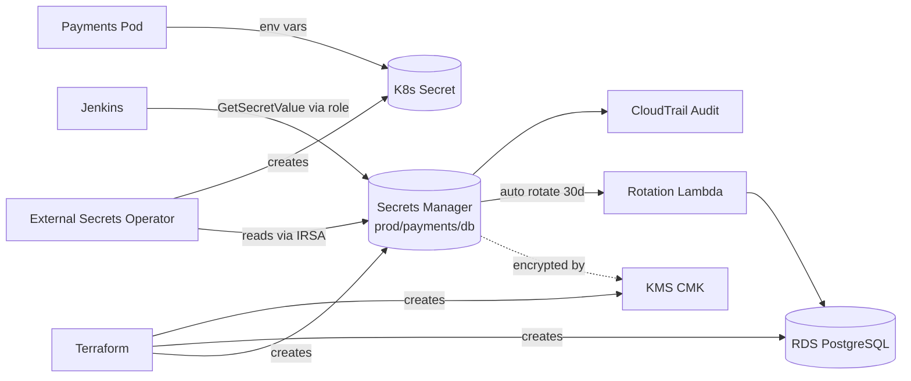

# AWS Secrets Manager — Complete Mastery Guide (Zero to Real-Time Projects)

> A beginner-friendly, end-to-end mentor guide. Every topic includes **what it is**, **why it matters**, **Console steps (click-by-click)**, and **CLI steps (copy-paste)**. Plus real-time integration with **Kubernetes**, **Terraform**, and **Jenkins**.

---

## Table of Contents

1. [Foundations: What & Why](#1-foundations-what--why)
2. [Core Concepts & Terminology](#2-core-concepts--terminology)
3. [AWS Services You'll Use Alongside Secrets Manager](#3-aws-services-youll-use-alongside-secrets-manager)
4. [Prerequisites & Setup (Account, IAM, CLI)](#4-prerequisites--setup-account-iam-cli)
5. [Creating Secrets (Console + CLI)](#5-creating-secrets-console--cli)
6. [Retrieving Secrets (Console + CLI)](#6-retrieving-secrets-console--cli)
7. [Updating, Versioning & Staging Labels](#7-updating-versioning--staging-labels)
8. [Deleting & Restoring Secrets](#8-deleting--restoring-secrets)
9. [Encryption with KMS](#9-encryption-with-kms)
10. [IAM Permissions & Resource Policies](#10-iam-permissions--resource-policies)
11. [Automatic Rotation](#11-automatic-rotation)
12. [Cross-Account & Cross-Region Secrets](#12-cross-account--cross-region-secrets)
13. [Secrets Manager vs Parameter Store](#13-secrets-manager-vs-parameter-store)
14. [Application Integration Patterns](#14-application-integration-patterns)
15. [Kubernetes (EKS) Integration](#15-kubernetes-eks-integration)
16. [Terraform Integration](#16-terraform-integration)
17. [Jenkins Pipeline Integration](#17-jenkins-pipeline-integration)
18. [Monitoring, Auditing & Cost](#18-monitoring-auditing--cost)
19. [Security Best Practices](#19-security-best-practices)
20. [Real-Time Project Blueprint](#20-real-time-project-blueprint)
21. [Troubleshooting & FAQ](#21-troubleshooting--faq)
22. [Quick Command Cheat Sheet](#22-quick-command-cheat-sheet)

**Part II — Extended & Advanced Topics**

23. [ECS / Fargate Integration](#23-ecs--fargate-integration)
24. [AWS Lambda Integration & Secrets Extension](#24-aws-lambda-integration--secrets-extension)
25. [CloudFormation & AWS CDK Integration](#25-cloudformation--aws-cdk-integration)
26. [More CI/CD: GitHub Actions, GitLab, Ansible](#26-more-cicd-github-actions-gitlab-ansible)
27. [Application Frameworks (Spring Boot, Django, .NET)](#27-application-frameworks-spring-boot-django-net)
28. [RDS Managed Master Password (No Lambda)](#28-rds-managed-master-password-no-lambda)
29. [Generating Passwords & Policy Validation APIs](#29-generating-passwords--policy-validation-apis)
30. [ABAC: Tag-Based Access Control](#30-abac-tag-based-access-control)
31. [Compliance, Governance & AWS Config](#31-compliance-governance--aws-config)
32. [Backup, Disaster Recovery & Failover](#32-backup-disaster-recovery--failover)
33. [Secrets Manager vs HashiCorp Vault](#33-secrets-manager-vs-hashicorp-vault)
34. [Local Development & Docker Compose](#34-local-development--docker-compose)
35. [Complete API Reference & Glossary](#35-complete-api-reference--glossary)

---

## 1. Foundations: What & Why

### What is a "secret"?
A **secret** is any sensitive piece of data your application needs but must never be hard-coded or committed to Git:
- Database usernames & passwords
- API keys / tokens (Stripe, GitHub, Datadog, etc.)
- OAuth client secrets
- TLS private keys / certificates
- SSH keys
- Encryption keys

### What is AWS Secrets Manager?
**AWS Secrets Manager** is a fully-managed service that lets you **store, retrieve, rotate, and audit** secrets centrally — without putting them in code, config files, or environment variables baked into images.

### Why use it (the problems it solves)
| Problem without it | How Secrets Manager helps |
|---|---|
| Passwords hard-coded in code/Git | Stored encrypted, fetched at runtime |
| Manual password rotation (risky, forgotten) | Automatic rotation on a schedule |
| No central place for credentials | One secure store across services |
| No audit trail of who read a secret | Integrated with CloudTrail |
| Sharing secrets via Slack/email | Fine-grained IAM access control |
| Same secret copy-pasted everywhere | Single source of truth, update once |

### When to use it (real-time)
- Microservices needing DB credentials at startup
- CI/CD pipelines (Jenkins) needing deploy tokens
- Kubernetes pods needing app secrets
- Rotating RDS/Aurora DB passwords automatically
- Third-party API keys for Lambda functions

---

## 2. Core Concepts & Terminology

| Term | Meaning |
|---|---|
| **Secret** | The logical container (has a name + ARN) that holds secret values. |
| **Secret value** | The actual sensitive data, stored as `SecretString` (text/JSON) or `SecretBinary`. |
| **ARN** | Amazon Resource Name — unique ID, e.g. `arn:aws:secretsmanager:us-east-1:123456789012:secret:prod/db-AbCdEf`. |
| **Version** | Each change creates a new immutable version (`VersionId`, a UUID). |
| **Staging label** | A pointer to a version. `AWSCURRENT` = active, `AWSPREVIOUS` = last, `AWSPENDING` = during rotation. |
| **KMS key** | The encryption key (AWS-managed `aws/secretsmanager` or your own Customer Managed Key). |
| **Rotation** | Automatically changing the secret value on a schedule via a Lambda function. |
| **Resource policy** | A policy attached directly to the secret (used for cross-account access). |
| **Recovery window** | Grace period (7–30 days) before a deleted secret is permanently gone. |

### How values are structured
Secrets Manager stores `SecretString`. Best practice = store **JSON**:
```json
{
  "username": "app_user",
  "password": "S3cr3t!Pass",
  "host": "mydb.xxxx.us-east-1.rds.amazonaws.com",
  "port": 5432,
  "dbname": "appdb"
}
```
You can then fetch the whole JSON and parse individual keys.

---

## 3. AWS Services You'll Use Alongside Secrets Manager

These are the services we will touch throughout this guide:

| Service | Role in this setup |
|---|---|
| **AWS Secrets Manager** | The core — store/retrieve/rotate secrets. |
| **AWS IAM** | Controls *who/what* can read or manage secrets (users, roles, policies). |
| **AWS KMS (Key Management Service)** | Encrypts the secret at rest. Default or custom key. |
| **AWS CloudTrail** | Records every API call (who accessed which secret, when). |
| **AWS CloudWatch** | Logs, metrics, and alarms (e.g., rotation failures). |
| **AWS Lambda** | Runs rotation logic (auto-created for RDS, custom for others). |
| **Amazon RDS / Aurora** | Common target for managed DB credential rotation. |
| **Amazon EKS** | Kubernetes — pods consume secrets via CSI driver or External Secrets Operator. |
| **AWS STS** | Issues temporary credentials for IAM roles (IRSA, assume-role). |
| **AWS EventBridge** | Can trigger workflows on secret rotation events. |

---

## 4. Prerequisites & Setup (Account, IAM, CLI)

### 4.1 What you need
- An AWS account (free tier eligible; Secrets Manager itself is **not** free — see [cost](#18-monitoring-auditing--cost)).
- An IAM user or SSO login with admin (for learning) or scoped permissions.
- AWS CLI v2 installed.

### 4.2 Install AWS CLI v2

**Windows (PowerShell):**
```powershell
msiexec.exe /i https://awscli.amazonaws.com/AWSCLIV2.msi
aws --version
```

**macOS:**
```bash
curl "https://awscli.amazonaws.com/AWSCLIV2.pkg" -o "AWSCLIV2.pkg"
sudo installer -pkg AWSCLIV2.pkg -target /
aws --version
```

**Linux:**
```bash
curl "https://awscli.amazonaws.com/awscli-exe-linux-x86_64.zip" -o "awscliv2.zip"
unzip awscliv2.zip
sudo ./aws/install
aws --version
```

### 4.3 Configure credentials (CLI)
```bash
aws configure
# AWS Access Key ID:     AKIA....
# AWS Secret Access Key: ....
# Default region name:   us-east-1
# Default output format:  json
```

**Better (recommended): use SSO / named profiles**
```bash
aws configure sso
aws sts get-caller-identity --profile my-sso-profile
```

### 4.4 Verify access
```bash
aws sts get-caller-identity
aws secretsmanager list-secrets
```

### 4.5 Minimum IAM permission to start (learning)
Attach `SecretsManagerReadWrite` (AWS-managed) for hands-on practice. In production, use least-privilege custom policies (covered in [section 10](#10-iam-permissions--resource-policies)).

---

## 5. Creating Secrets (Console + CLI)

### 5.1 Console — Step by step
1. Sign in to the **AWS Management Console**.
2. Search for **Secrets Manager** → open it.
3. Click **Store a new secret**.
4. **Choose secret type:**
   - **Credentials for Amazon RDS database** — auto-fills host/port from your RDS.
   - **Credentials for other database** (Redshift, DocumentDB, etc.).
   - **Other type of secret** — for API keys, generic JSON. *(choose this for most app secrets)*
5. For **Other type of secret**, enter key/value pairs:
   - Key `username` → Value `app_user`
   - Key `password` → Value `S3cr3t!Pass`
   - (Toggle **Plaintext** tab to paste full JSON.)
6. **Encryption key:** leave `aws/secretsmanager` (default) or pick your KMS key.
7. Click **Next**.
8. **Secret name:** use a path-style name, e.g. `prod/myapp/db`.
9. Add **Description** and optional **Tags** (`Environment=prod`, `Team=payments`).
10. Click **Next**.
11. **Automatic rotation:** leave **disabled** for now (configure later).
12. Click **Next** → review → **Store**.

> **Naming convention tip:** `<env>/<app>/<purpose>` → `prod/payments/db`, `dev/auth/api-key`. Makes IAM wildcard policies easy.

### 5.2 CLI — Create a secret

**Simple string secret:**
```bash
aws secretsmanager create-secret \
  --name "prod/myapp/api-key" \
  --description "Third-party API key for MyApp" \
  --secret-string "sk_live_abc123xyz" \
  --tags Key=Environment,Value=prod Key=Team,Value=payments
```

**JSON secret (recommended for DB creds):**
```bash
aws secretsmanager create-secret \
  --name "prod/myapp/db" \
  --description "Production DB credentials" \
  --secret-string '{"username":"app_user","password":"S3cr3t!Pass","host":"mydb.xxxx.rds.amazonaws.com","port":5432,"dbname":"appdb"}'
```

**From a file (avoids shell history leaks):**
```bash
# secret.json contains the JSON above
aws secretsmanager create-secret \
  --name "prod/myapp/db" \
  --secret-string file://secret.json
```

**With a custom KMS key:**
```bash
aws secretsmanager create-secret \
  --name "prod/myapp/db" \
  --kms-key-id "arn:aws:kms:us-east-1:123456789012:key/abcd-1234" \
  --secret-string file://secret.json
```

**Binary secret (e.g., a cert file):**
```bash
aws secretsmanager create-secret \
  --name "prod/myapp/tls-cert" \
  --secret-binary fileb://certificate.p12
```

---

## 6. Retrieving Secrets (Console + CLI)

### 6.1 Console
1. Open **Secrets Manager** → click the secret name.
2. Scroll to **Secret value** → click **Retrieve secret value**.
3. View as **Key/value** or **Plaintext**.

### 6.2 CLI — Get the value

**Get full output:**
```bash
aws secretsmanager get-secret-value --secret-id "prod/myapp/db"
```

**Get only the secret string:**
```bash
aws secretsmanager get-secret-value \
  --secret-id "prod/myapp/db" \
  --query SecretString --output text
```

**Parse a single JSON field (needs `jq`):**
```bash
aws secretsmanager get-secret-value \
  --secret-id "prod/myapp/db" \
  --query SecretString --output text | jq -r '.password'
```

**Get a specific version by staging label:**
```bash
aws secretsmanager get-secret-value \
  --secret-id "prod/myapp/db" \
  --version-stage AWSPREVIOUS
```

**Get a specific version by ID:**
```bash
aws secretsmanager get-secret-value \
  --secret-id "prod/myapp/db" \
  --version-id "uuid-version-id"
```

**Batch get multiple secrets (newer API):**
```bash
aws secretsmanager batch-get-secret-value \
  --secret-id-list "prod/myapp/db" "prod/myapp/api-key"
```

### 6.3 Describe metadata (no secret value exposed)
```bash
aws secretsmanager describe-secret --secret-id "prod/myapp/db"
```

### 6.4 List all secrets
```bash
aws secretsmanager list-secrets
aws secretsmanager list-secrets --query "SecretList[].Name"
# Filter by tag
aws secretsmanager list-secrets --filters Key=tag-key,Values=Environment
```

---

## 7. Updating, Versioning & Staging Labels

### How versioning works
Every change creates a new **version** with a unique `VersionId`. Staging labels point to versions:
- `AWSCURRENT` → the value apps get by default.
- `AWSPREVIOUS` → the value before the latest change (for rollback).
- `AWSPENDING` → temporary, used during rotation.

```
Version A (AWSPREVIOUS) ← old value
Version B (AWSCURRENT)  ← active value
```

### 7.1 Console — Update value
1. Open the secret → **Retrieve secret value** → **Edit**.
2. Change keys/values → **Save**. (Creates a new version; old becomes `AWSPREVIOUS`.)

### 7.2 CLI — Update value (`put-secret-value`)
```bash
aws secretsmanager put-secret-value \
  --secret-id "prod/myapp/db" \
  --secret-string '{"username":"app_user","password":"NEW_PASS","host":"mydb.xxxx.rds.amazonaws.com","port":5432,"dbname":"appdb"}'
```

### 7.3 CLI — Update metadata (`update-secret`)
```bash
aws secretsmanager update-secret \
  --secret-id "prod/myapp/db" \
  --description "Updated description" \
  --kms-key-id "arn:aws:kms:...:key/new-key"
```

### 7.4 Roll back to previous version (move staging labels)
```bash
# Find version IDs
aws secretsmanager list-secret-version-ids --secret-id "prod/myapp/db"

# Move AWSCURRENT back to the previous version
aws secretsmanager update-secret-version-stage \
  --secret-id "prod/myapp/db" \
  --version-stage AWSCURRENT \
  --move-to-version-id "OLD_VERSION_ID" \
  --remove-from-version-id "NEW_VERSION_ID"
```

### 7.5 Tagging
```bash
aws secretsmanager tag-resource \
  --secret-id "prod/myapp/db" \
  --tags Key=CostCenter,Value=1234

aws secretsmanager untag-resource \
  --secret-id "prod/myapp/db" \
  --tag-keys CostCenter
```

---

## 8. Deleting & Restoring Secrets

> Secrets are **not** deleted instantly — there's a recovery window (7–30 days) to prevent accidental loss.

### 8.1 Console
1. Open secret → **Actions** → **Delete secret**.
2. Set the **waiting period** (7–30 days) → **Schedule deletion**.

### 8.2 CLI — Schedule deletion (default 30 days)
```bash
aws secretsmanager delete-secret \
  --secret-id "prod/myapp/db" \
  --recovery-window-in-days 7
```

### 8.3 CLI — Force immediate delete (irreversible! ⚠️)
```bash
aws secretsmanager delete-secret \
  --secret-id "prod/myapp/db" \
  --force-delete-without-recovery
```

### 8.4 CLI — Restore during recovery window
```bash
aws secretsmanager restore-secret --secret-id "prod/myapp/db"
```

---

## 9. Encryption with KMS

### How it works
- Every secret is encrypted **at rest** using **AWS KMS**.
- Default key: `aws/secretsmanager` (AWS-managed, free).
- **Customer Managed Key (CMK):** gives you control over key policy, rotation, and cross-account sharing. **Required for cross-account access.**

### 9.1 Create a CMK (CLI)
```bash
aws kms create-key --description "CMK for Secrets Manager"
# note the KeyId from output

aws kms create-alias \
  --alias-name "alias/secrets-cmk" \
  --target-key-id "KEY_ID"
```

### 9.2 Use the CMK when creating a secret
```bash
aws secretsmanager create-secret \
  --name "prod/myapp/db" \
  --kms-key-id "alias/secrets-cmk" \
  --secret-string file://secret.json
```

### 9.3 Console
- When storing/editing a secret, under **Encryption key**, select your CMK from the dropdown.

> **Tip:** Use a CMK per environment or per team for blast-radius isolation and granular key policies.

---

## 10. IAM Permissions & Resource Policies

There are **two** layers of access control:
1. **Identity policy** — attached to a user/role (the *caller*).
2. **Resource policy** — attached to the secret (the *resource*) — used mainly for cross-account.

### 10.1 Key Secrets Manager IAM actions
| Action | Purpose |
|---|---|
| `secretsmanager:GetSecretValue` | Read the secret value (most common for apps). |
| `secretsmanager:DescribeSecret` | Read metadata only. |
| `secretsmanager:CreateSecret` | Create new secrets. |
| `secretsmanager:PutSecretValue` | Update value / add version. |
| `secretsmanager:UpdateSecret` | Update metadata. |
| `secretsmanager:DeleteSecret` | Schedule deletion. |
| `secretsmanager:ListSecrets` | List secrets. |
| `secretsmanager:RotateSecret` | Trigger rotation. |

### 10.2 Least-privilege read policy (app role)
Only allows reading secrets under `prod/myapp/*`:
```json
{
  "Version": "2012-10-17",
  "Statement": [
    {
      "Sid": "ReadAppSecrets",
      "Effect": "Allow",
      "Action": [
        "secretsmanager:GetSecretValue",
        "secretsmanager:DescribeSecret"
      ],
      "Resource": "arn:aws:secretsmanager:us-east-1:123456789012:secret:prod/myapp/*"
    },
    {
      "Sid": "DecryptWithCMK",
      "Effect": "Allow",
      "Action": "kms:Decrypt",
      "Resource": "arn:aws:kms:us-east-1:123456789012:key/abcd-1234"
    }
  ]
}
```

> ⚠️ If you use a **CMK**, the caller also needs `kms:Decrypt` on that key (as shown above).

### 10.3 Attach the policy (CLI)
```bash
# Create the policy
aws iam create-policy \
  --policy-name MyAppReadSecrets \
  --policy-document file://read-policy.json

# Attach to a role
aws iam attach-role-policy \
  --role-name MyAppRole \
  --policy-arn arn:aws:iam::123456789012:policy/MyAppReadSecrets
```

### 10.4 Resource policy (attach to secret) — for cross-account
```bash
aws secretsmanager put-resource-policy \
  --secret-id "prod/myapp/db" \
  --resource-policy file://resource-policy.json
```
`resource-policy.json` granting account `222222222222` read access:
```json
{
  "Version": "2012-10-17",
  "Statement": [
    {
      "Effect": "Allow",
      "Principal": { "AWS": "arn:aws:iam::222222222222:root" },
      "Action": "secretsmanager:GetSecretValue",
      "Resource": "*"
    }
  ]
}
```

---

## 11. Automatic Rotation

### What is rotation?
Automatically changing a secret's value on a schedule (e.g., every 30 days) using a **Lambda rotation function**. The classic case: RDS database passwords.

### The 4-step rotation lifecycle (Lambda steps)
1. **createSecret** — generate a new password → store as `AWSPENDING`.
2. **setSecret** — change the password in the database/service.
3. **testSecret** — verify the new password works.
4. **finishSecret** — move `AWSCURRENT` to the new version.

### 11.1 Console — Rotate an RDS secret (managed, easiest)
1. Open the secret → **Rotation** tab → **Edit rotation**.
2. Enable **Automatic rotation**.
3. Schedule: e.g., **30 days**.
4. **Rotation function:** choose **Create a new Lambda function** (AWS provides RDS rotation templates) — Secrets Manager auto-creates it.
5. Select the database / connection details.
6. Save. Secrets Manager runs rotation immediately to validate.

### 11.2 CLI — Enable rotation
```bash
aws secretsmanager rotate-secret \
  --secret-id "prod/myapp/db" \
  --rotation-lambda-arn "arn:aws:lambda:us-east-1:123456789012:function:SecretsManagerRDSRotation" \
  --rotation-rules '{"AutomaticallyAfterDays":30}'
```

**Rotate immediately (one-off):**
```bash
aws secretsmanager rotate-secret --secret-id "prod/myapp/db"
```

**Cancel rotation:**
```bash
aws secretsmanager cancel-rotate-secret --secret-id "prod/myapp/db"
```

### 11.3 Rotation strategies
| Strategy | Description | Use case |
|---|---|---|
| **Single user** | Same user, password changes in place. Brief blip possible. | Simple apps. |
| **Alternating users** | Two users (clone), alternate each rotation. Zero downtime. | Production DBs. |

### 11.4 Custom rotation (non-RDS, e.g., API keys)
- Write your own Lambda implementing the 4 steps using the [AWS rotation templates](https://github.com/aws-samples/aws-secrets-manager-rotation-lambdas) as a starting point.
- Grant the Lambda `secretsmanager:*` on the secret + access to the target system.

---

## 12. Cross-Account & Cross-Region Secrets

### 12.1 Cross-account access
**Requirements:**
1. Secret must use a **CMK** (not the default key).
2. Attach a **resource policy** on the secret allowing the other account ([section 10.4](#104-resource-policy-attach-to-secret--for-cross-account)).
3. The **CMK key policy** must allow the other account `kms:Decrypt`.
4. The caller role in the other account needs `GetSecretValue` + `kms:Decrypt`.

**Other account reads:**
```bash
aws secretsmanager get-secret-value \
  --secret-id "arn:aws:secretsmanager:us-east-1:111111111111:secret:prod/myapp/db-AbCdEf"
```

### 12.2 Cross-region replication
Replicate a secret to another region for DR or multi-region apps.

**Console:** Secret → **Replicate secret** → choose region(s) + KMS key.

**CLI — replicate:**
```bash
aws secretsmanager replicate-secret-to-regions \
  --secret-id "prod/myapp/db" \
  --add-replica-regions Region=us-west-2,KmsKeyId=alias/secrets-cmk
```

**CLI — stop replication / promote:**
```bash
aws secretsmanager remove-regions-from-replication \
  --secret-id "prod/myapp/db" \
  --remove-replica-regions us-west-2

# Promote a replica to standalone (e.g., during regional failover)
aws secretsmanager stop-replication-to-replica \
  --secret-id "arn:aws:secretsmanager:us-west-2:111111111111:secret:prod/myapp/db-AbCdEf"
```

---

## 13. Secrets Manager vs Parameter Store

| Feature | Secrets Manager | SSM Parameter Store (SecureString) |
|---|---|---|
| Cost | ~$0.40/secret/month + API calls | Standard params **free**; Advanced ~$0.05 |
| Automatic rotation | ✅ Built-in (Lambda) | ❌ (manual / custom) |
| Cross-account resource policy | ✅ | ❌ (only via RAM, limited) |
| Cross-region replication | ✅ Native | ❌ (manual) |
| Max value size | 64 KB | 4 KB (std) / 8 KB (advanced) |
| Versioning + staging labels | ✅ | ✅ (versions, no staging labels) |
| Best for | Passwords, rotating creds, DB | Config values, feature flags, non-secret params |

**Rule of thumb:** Use **Secrets Manager** for rotating credentials/passwords; use **Parameter Store** for plain config and to save cost on non-rotating values.

---

## 14. Application Integration Patterns

### 14.1 Direct SDK fetch at runtime (recommended)
The app calls Secrets Manager on startup using its IAM role.

**Python (boto3):**
```python
import boto3, json

def get_secret(secret_name, region="us-east-1"):
    client = boto3.client("secretsmanager", region_name=region)
    resp = client.get_secret_value(SecretId=secret_name)
    return json.loads(resp["SecretString"])

creds = get_secret("prod/myapp/db")
db_password = creds["password"]
```

**Node.js (AWS SDK v3):**
```javascript
import { SecretsManagerClient, GetSecretValueCommand } from "@aws-sdk/client-secrets-manager";

const client = new SecretsManagerClient({ region: "us-east-1" });

async function getSecret(secretName) {
  const resp = await client.send(new GetSecretValueCommand({ SecretId: secretName }));
  return JSON.parse(resp.SecretString);
}

const creds = await getSecret("prod/myapp/db");
```

### 14.2 Caching (reduce API calls & cost)
Use the official caching libraries so you don't call the API on every request:
- Python: `aws-secretsmanager-caching`
- Java: `aws-secretsmanager-caching-java`

```python
from aws_secretsmanager_caching import SecretCache
import boto3

cache = SecretCache(client=boto3.client("secretsmanager"))
secret = cache.get_secret_string("prod/myapp/db")
```

### 14.3 Lambda extension (no SDK code)
Use the **AWS Parameters and Secrets Lambda Extension** — fetch via a local HTTP endpoint with built-in caching:
```bash
curl "http://localhost:2773/secretsmanager/get?secretId=prod/myapp/db" \
  -H "X-Aws-Parameters-Secrets-Token: $AWS_SESSION_TOKEN"
```

### 14.4 Anti-pattern to avoid ❌
Do **not** bake secrets into Docker images or commit them to `.env` in Git. Always fetch at runtime via IAM identity.

---

## 15. Kubernetes (EKS) Integration

Three production-grade approaches. Pick based on your needs.

### Approach A: Secrets Store CSI Driver + AWS Provider (mount as files/volumes)

**Concept:** Secrets are mounted into the pod as files (and optionally synced to native K8s Secrets). Uses **IRSA** (IAM Roles for Service Accounts) for auth.

**Step 1 — Enable IAM OIDC provider for the cluster:**
```bash
eksctl utils associate-iam-oidc-provider \
  --cluster my-cluster --approve
```

**Step 2 — Install the CSI driver + AWS provider (Helm):**
```bash
helm repo add secrets-store-csi-driver \
  https://kubernetes-sigs.github.io/secrets-store-csi-driver/charts
helm install csi-secrets-store secrets-store-csi-driver/secrets-store-csi-driver \
  --namespace kube-system

# AWS provider
kubectl apply -f https://raw.githubusercontent.com/aws/secrets-store-csi-driver-provider-aws/main/deployment/aws-provider-installer.yaml
```

**Step 3 — Create an IAM policy + IRSA service account:**
```bash
cat > policy.json <<'EOF'
{
  "Version": "2012-10-17",
  "Statement": [{
    "Effect": "Allow",
    "Action": ["secretsmanager:GetSecretValue","secretsmanager:DescribeSecret"],
    "Resource": "arn:aws:secretsmanager:us-east-1:123456789012:secret:prod/myapp/*"
  }]
}
EOF

aws iam create-policy --policy-name EKSReadAppSecrets --policy-document file://policy.json

eksctl create iamserviceaccount \
  --name myapp-sa \
  --namespace default \
  --cluster my-cluster \
  --attach-policy-arn arn:aws:iam::123456789012:policy/EKSReadAppSecrets \
  --approve
```

**Step 4 — Define a `SecretProviderClass`:**
```yaml
apiVersion: secrets-store.csi.x-k8s.io/v1
kind: SecretProviderClass
metadata:
  name: myapp-secrets
spec:
  provider: aws
  parameters:
    objects: |
      - objectName: "prod/myapp/db"
        objectType: "secretsmanager"
        jmesPath:
          - path: username
            objectAlias: db-username
          - path: password
            objectAlias: db-password
  # Optional: sync into a native Kubernetes Secret
  secretObjects:
    - secretName: myapp-db-secret
      type: Opaque
      data:
        - objectName: db-username
          key: username
        - objectName: db-password
          key: password
```

**Step 5 — Mount in a Pod/Deployment:**
```yaml
apiVersion: v1
kind: Pod
metadata:
  name: myapp
spec:
  serviceAccountName: myapp-sa
  containers:
    - name: app
      image: myapp:latest
      env:
        - name: DB_PASSWORD          # consume synced K8s secret as env var
          valueFrom:
            secretKeyRef:
              name: myapp-db-secret
              key: password
      volumeMounts:
        - name: secrets-store
          mountPath: "/mnt/secrets"
          readOnly: true
  volumes:
    - name: secrets-store
      csi:
        driver: secrets-store.csi.k8s.io
        readOnly: true
        volumeAttributes:
          secretProviderClass: "myapp-secrets"
```

### Approach B: External Secrets Operator (ESO) — sync to native K8s Secrets

**Concept:** ESO continuously syncs AWS Secrets Manager → native Kubernetes `Secret` objects. Very popular in GitOps.

**Step 1 — Install ESO:**
```bash
helm repo add external-secrets https://charts.external-secrets.io
helm install external-secrets external-secrets/external-secrets \
  -n external-secrets --create-namespace
```

**Step 2 — Create a `SecretStore` (uses IRSA service account):**
```yaml
apiVersion: external-secrets.io/v1beta1
kind: SecretStore
metadata:
  name: aws-secretsmanager
  namespace: default
spec:
  provider:
    aws:
      service: SecretsManager
      region: us-east-1
      auth:
        jwt:
          serviceAccountRef:
            name: myapp-sa
```

**Step 3 — Create an `ExternalSecret`:**
```yaml
apiVersion: external-secrets.io/v1beta1
kind: ExternalSecret
metadata:
  name: myapp-db
  namespace: default
spec:
  refreshInterval: 1h
  secretStoreRef:
    name: aws-secretsmanager
    kind: SecretStore
  target:
    name: myapp-db-secret      # the K8s Secret that gets created
    creationPolicy: Owner
  data:
    - secretKey: username
      remoteRef:
        key: prod/myapp/db
        property: username
    - secretKey: password
      remoteRef:
        key: prod/myapp/db
        property: password
```

ESO creates/updates `myapp-db-secret` automatically and re-syncs every `refreshInterval`.

### Approach C: Init container / entrypoint script (simple)
A startup script in the container runs `aws secretsmanager get-secret-value` (pod uses IRSA role) and exports env vars. Simple but less declarative — fine for small setups.

> **Recommendation:** Use **External Secrets Operator (B)** for GitOps/declarative workflows; use **CSI Driver (A)** when you want secrets mounted as files and avoid storing them as native K8s Secrets at rest.

---

## 16. Terraform Integration

### 16.1 Provider setup
```hcl
terraform {
  required_providers {
    aws = { source = "hashicorp/aws", version = "~> 5.0" }
  }
}

provider "aws" {
  region = "us-east-1"
}
```

### 16.2 Create a secret + version
```hcl
resource "aws_secretsmanager_secret" "db" {
  name        = "prod/myapp/db"
  description = "Production DB credentials"
  kms_key_id  = aws_kms_key.secrets.arn

  tags = {
    Environment = "prod"
    Team        = "payments"
  }
}

resource "aws_secretsmanager_secret_version" "db" {
  secret_id = aws_secretsmanager_secret.db.id
  secret_string = jsonencode({
    username = "app_user"
    password = var.db_password   # pass via TF_VAR / not hard-coded
    host     = aws_db_instance.main.address
    port     = 5432
    dbname   = "appdb"
  })
}

variable "db_password" {
  type      = string
  sensitive = true
}
```

> ⚠️ **State file warning:** The secret value is stored in Terraform **state**. Always use an **encrypted remote backend** (e.g., S3 + KMS) and restrict state access.

### 16.3 Let AWS generate the password (avoid putting it in state)
```hcl
resource "random_password" "db" {
  length  = 24
  special = true
}

resource "aws_secretsmanager_secret_version" "db" {
  secret_id     = aws_secretsmanager_secret.db.id
  secret_string = jsonencode({
    username = "app_user"
    password = random_password.db.result
  })
}
```

### 16.4 Reference an existing secret (read at apply time)
```hcl
data "aws_secretsmanager_secret" "db" {
  name = "prod/myapp/db"
}

data "aws_secretsmanager_secret_version" "db" {
  secret_id = data.aws_secretsmanager_secret.db.id
}

locals {
  db_creds = jsondecode(data.aws_secretsmanager_secret_version.db.secret_string)
}

# Use it, e.g., for an RDS instance
resource "aws_db_instance" "main" {
  # ...
  username = local.db_creds.username
  password = local.db_creds.password
}
```

### 16.5 Enable rotation via Terraform
```hcl
resource "aws_secretsmanager_secret_rotation" "db" {
  secret_id           = aws_secretsmanager_secret.db.id
  rotation_lambda_arn = aws_lambda_function.rotation.arn

  rotation_rules {
    automatically_after_days = 30
  }
}
```

### 16.6 Resource policy via Terraform
```hcl
resource "aws_secretsmanager_secret_policy" "db" {
  secret_arn = aws_secretsmanager_secret.db.arn
  policy     = data.aws_iam_policy_document.cross_account.json
}
```

---

## 17. Jenkins Pipeline Integration

Three ways to consume Secrets Manager in Jenkins. Choose based on plugins/permissions.

### 17.1 Auth approaches for Jenkins
- **EC2/EKS instance role (IRSA):** Jenkins agent runs with an IAM role that has `GetSecretValue`. Best — no static keys.
- **Jenkins AWS credentials:** Store an AWS access key in Jenkins Credentials, used by the AWS CLI/plugin.

### 17.2 Approach A: AWS CLI in a pipeline stage (Declarative)
```groovy
pipeline {
  agent any
  environment {
    AWS_DEFAULT_REGION = 'us-east-1'
  }
  stages {
    stage('Fetch Secrets') {
      steps {
        script {
          // Requires jq + aws cli on the agent; agent uses IAM role
          def secretJson = sh(
            script: "aws secretsmanager get-secret-value --secret-id prod/myapp/db --query SecretString --output text",
            returnStdout: true
          ).trim()
          def creds = readJSON text: secretJson
          env.DB_USER = creds.username
          env.DB_PASS = creds.password
        }
      }
    }
    stage('Deploy') {
      steps {
        sh 'echo "Deploying with DB_USER=$DB_USER"'  // DB_PASS used internally, not echoed
      }
    }
  }
}
```

### 17.3 Approach B: AWS Secrets Manager Credentials Provider plugin
Install the **"AWS Secrets Manager Credentials Provider"** plugin. It exposes Secrets Manager secrets as native Jenkins credentials.

1. **Manage Jenkins → Plugins** → install *AWS Secrets Manager Credentials Provider*.
2. Configure region under **Manage Jenkins → System → AWS Secrets Manager**.
3. Tag/format secrets so the plugin recognizes them (e.g., username/password secrets).
4. Use in pipeline like any credential:
```groovy
pipeline {
  agent any
  stages {
    stage('Use Secret') {
      steps {
        withCredentials([usernamePassword(
          credentialsId: 'prod/myapp/db',   // = the secret name
          usernameVariable: 'DB_USER',
          passwordVariable: 'DB_PASS'
        )]) {
          sh 'echo "Connecting as $DB_USER"'  // $DB_PASS is masked in logs
        }
      }
    }
  }
}
```

### 17.4 Approach C: withAWS (Pipeline: AWS Steps plugin)
```groovy
pipeline {
  agent any
  stages {
    stage('Fetch') {
      steps {
        withAWS(region: 'us-east-1', role: 'arn:aws:iam::123456789012:role/JenkinsDeployRole') {
          script {
            def secret = sh(
              script: "aws secretsmanager get-secret-value --secret-id prod/myapp/api-key --query SecretString --output text",
              returnStdout: true
            ).trim()
            env.API_KEY = secret
          }
        }
      }
    }
  }
}
```

### 17.5 Jenkins security tips
- Never `echo` secret values — Jenkins masks credentials only when bound via `withCredentials`.
- Prefer IAM role on the agent over static keys.
- Restrict the Jenkins role to the exact secret ARNs needed.
- Use `set +x` in shell steps that handle secrets to avoid command echo.

---

## 18. Monitoring, Auditing & Cost

### 18.1 CloudTrail (audit — who accessed what)
Every Secrets Manager API call is logged. Find who read a secret:
```bash
aws cloudtrail lookup-events \
  --lookup-attributes AttributeKey=EventName,AttributeValue=GetSecretValue \
  --max-results 20
```

### 18.2 CloudWatch alarm on rotation failure
- Secrets Manager emits metrics/events; create an EventBridge rule on rotation failure → SNS alert.

**EventBridge rule (rotation failed):**
```json
{
  "source": ["aws.secretsmanager"],
  "detail-type": ["AWS API Call via CloudTrail"],
  "detail": { "eventName": ["RotationFailed"] }
}
```

### 18.3 Cost (important!)
| Item | Approx. price |
|---|---|
| Per secret stored | ~$0.40 / secret / month |
| API calls | ~$0.05 / 10,000 calls |
| Replicated secret | Billed as a secret per region |

**Cost-saving tips:**
- **Cache** secrets in the app — don't fetch per request.
- Use **one JSON secret** for related values instead of many secrets.
- Use **Parameter Store (free std tier)** for non-rotating config.
- Delete unused secrets (mind the recovery window).

---

## 19. Security Best Practices

1. **Least privilege:** Scope IAM to specific secret ARNs (`prod/myapp/*`), never `*`.
2. **Use IAM roles, not access keys** — IRSA for EKS, instance roles for EC2.
3. **CMK for sensitive/cross-account secrets** + restrict `kms:Decrypt`.
4. **Enable rotation** for all database/long-lived credentials.
5. **Never log secret values** (mask in CI, avoid `echo`).
6. **Never commit secrets** to Git; scan with tools like `git-secrets` / `trufflehog`.
7. **Audit with CloudTrail**; alert on unusual `GetSecretValue` volume.
8. **Use VPC endpoints** (`com.amazonaws.<region>.secretsmanager`) so traffic stays private.
9. **Tag** secrets for ownership, cost, and ABAC (attribute-based access control).
10. **Separate by environment/account** (dev/stage/prod) for blast-radius isolation.
11. **Encrypt Terraform state** (S3 + KMS) since values land in state.
12. **Set short recovery windows** in non-prod, longer in prod.

### VPC Endpoint (PrivateLink) setup
```bash
aws ec2 create-vpc-endpoint \
  --vpc-id vpc-xxxx \
  --service-name com.amazonaws.us-east-1.secretsmanager \
  --vpc-endpoint-type Interface \
  --subnet-ids subnet-aaa subnet-bbb \
  --security-group-ids sg-xxxx \
  --private-dns-enabled
```

---

## 20. Real-Time Project Blueprint

**Scenario:** A payments microservice on **EKS**, DB on **RDS PostgreSQL**, infra via **Terraform**, CI/CD via **Jenkins**.

### Architecture flow


### End-to-end steps
1. **Terraform** provisions: KMS CMK, RDS, the secret (`prod/payments/db`) with generated password, IAM policies, IRSA role, rotation Lambda + schedule.
2. **Rotation** enabled (30-day, alternating-users strategy) — zero-downtime password changes.
3. **EKS** runs **External Secrets Operator**; an `ExternalSecret` syncs `prod/payments/db` → native K8s Secret `payments-db`.
4. **Pod** consumes the K8s Secret as env vars via IRSA (no static creds).
5. **Jenkins** pipeline (agent with IAM role) fetches deploy tokens from `prod/payments/ci` for deployments.
6. **CloudTrail + EventBridge** audit access and alert on rotation failures.
7. **VPC endpoint** keeps all Secrets Manager traffic private.

### Secret naming used
```
prod/payments/db          # DB credentials (rotated)
prod/payments/api-key     # 3rd-party payment gateway key
prod/payments/ci          # Jenkins deploy token
prod/payments/tls         # service TLS cert (binary)
```

---

## 21. Troubleshooting & FAQ

| Symptom | Likely cause | Fix |
|---|---|---|
| `AccessDeniedException` on GetSecretValue | Missing IAM permission or wrong ARN | Add `secretsmanager:GetSecretValue` for the exact ARN. |
| `AccessDeniedException ... kms:Decrypt` | Secret uses CMK; caller lacks KMS decrypt | Add `kms:Decrypt` on the CMK to the caller's policy + key policy. |
| Pod can't read secret (EKS) | IRSA misconfigured | Verify OIDC provider, service account annotation, and role trust policy. |
| Rotation fails | Lambda can't reach DB / wrong VPC/SG | Put rotation Lambda in DB's VPC, allow SG, check Lambda logs in CloudWatch. |
| `ResourceExistsException` on create | Secret name already exists (or scheduled for deletion) | Use a new name or `restore-secret` then update. |
| Old password still used | App caching stale value | Reduce cache TTL or invalidate cache after rotation. |
| Can't delete immediately | Recovery window | Use `--force-delete-without-recovery` (irreversible). |
| Cross-account read denied | No resource policy / CMK not shared | Add resource policy + share CMK with the other account. |

**FAQ**
- *Q: Are secrets free?* No — ~$0.40/secret/month + API calls.
- *Q: Max secret size?* 64 KB.
- *Q: Can I store binary?* Yes, via `SecretBinary` (`--secret-binary fileb://`).
- *Q: How many staging labels per version?* Up to 20; a label points to exactly one version.
- *Q: Does deleting a secret delete it instantly?* No, unless you force it; default recovery window applies.

---

## 22. Quick Command Cheat Sheet

```bash
# CREATE
aws secretsmanager create-secret --name "prod/app/db" --secret-string file://secret.json

# READ (value only)
aws secretsmanager get-secret-value --secret-id "prod/app/db" --query SecretString --output text

# READ one JSON field
aws secretsmanager get-secret-value --secret-id "prod/app/db" --query SecretString --output text | jq -r '.password'

# UPDATE value (new version)
aws secretsmanager put-secret-value --secret-id "prod/app/db" --secret-string file://new.json

# UPDATE metadata
aws secretsmanager update-secret --secret-id "prod/app/db" --description "new desc"

# LIST
aws secretsmanager list-secrets --query "SecretList[].Name"

# DESCRIBE (metadata, no value)
aws secretsmanager describe-secret --secret-id "prod/app/db"

# VERSIONS
aws secretsmanager list-secret-version-ids --secret-id "prod/app/db"

# ROTATE now / configure
aws secretsmanager rotate-secret --secret-id "prod/app/db"
aws secretsmanager rotate-secret --secret-id "prod/app/db" \
  --rotation-lambda-arn arn:... --rotation-rules '{"AutomaticallyAfterDays":30}'

# TAG
aws secretsmanager tag-resource --secret-id "prod/app/db" --tags Key=Env,Value=prod

# RESOURCE POLICY (cross-account)
aws secretsmanager put-resource-policy --secret-id "prod/app/db" --resource-policy file://rp.json

# REPLICATE cross-region
aws secretsmanager replicate-secret-to-regions --secret-id "prod/app/db" \
  --add-replica-regions Region=us-west-2,KmsKeyId=alias/secrets-cmk

# DELETE (7-day window) / RESTORE
aws secretsmanager delete-secret --secret-id "prod/app/db" --recovery-window-in-days 7
aws secretsmanager restore-secret --secret-id "prod/app/db"

# FORCE DELETE (irreversible)
aws secretsmanager delete-secret --secret-id "prod/app/db" --force-delete-without-recovery
```

---

### You're ready 🎯
Start with [section 4](#4-prerequisites--setup-account-iam-cli) (setup) → [section 5](#5-creating-secrets-console--cli) (create your first secret) → practice retrieval/rotation → then layer in [Kubernetes](#15-kubernetes-eks-integration), [Terraform](#16-terraform-integration), and [Jenkins](#17-jenkins-pipeline-integration). Use the [Real-Time Project Blueprint](#20-real-time-project-blueprint) as your target architecture.

---
---

# Part II — Extended & Advanced Topics

> These sections complete the picture with the other compute platforms, CI/CD tools, app frameworks, and governance topics you'll meet in real projects.

---

## 23. ECS / Fargate Integration

**Concept:** Amazon ECS can inject secrets **directly into container environment variables** at task startup — no SDK code needed. The **task execution role** must be allowed to read the secret (and decrypt with KMS).

### 23.1 Grant the ECS task execution role access
Attach this policy to your `ecsTaskExecutionRole`:
```json
{
  "Version": "2012-10-17",
  "Statement": [
    {
      "Effect": "Allow",
      "Action": ["secretsmanager:GetSecretValue"],
      "Resource": "arn:aws:secretsmanager:us-east-1:123456789012:secret:prod/myapp/*"
    },
    {
      "Effect": "Allow",
      "Action": ["kms:Decrypt"],
      "Resource": "arn:aws:kms:us-east-1:123456789012:key/abcd-1234"
    }
  ]
}
```

### 23.2 Console — Inject secret into a task definition
1. **ECS → Task definitions → Create new revision**.
2. Edit the container → **Environment variables** section.
3. Add a variable → choose **ValueFrom** → paste the secret ARN.
4. To inject **one JSON key**, append `:key::` to the ARN (see below).
5. Save → deploy a new service revision.

### 23.3 Task definition JSON — whole value vs single JSON key
```json
{
  "containerDefinitions": [
    {
      "name": "myapp",
      "image": "123456789012.dkr.ecr.us-east-1.amazonaws.com/myapp:latest",
      "secrets": [
        {
          "name": "DB_CREDS_JSON",
          "valueFrom": "arn:aws:secretsmanager:us-east-1:123456789012:secret:prod/myapp/db-AbCdEf"
        },
        {
          "name": "DB_PASSWORD",
          "valueFrom": "arn:aws:secretsmanager:us-east-1:123456789012:secret:prod/myapp/db-AbCdEf:password::"
        }
      ]
    }
  ],
  "executionRoleArn": "arn:aws:iam::123456789012:role/ecsTaskExecutionRole"
}
```
> Format to pull a single JSON field: `secret-arn:json-key:version-stage:version-id`. Leave stage/id empty for the current version → `...:password::`.

### 23.4 CLI — register the task definition
```bash
aws ecs register-task-definition --cli-input-json file://taskdef.json
```

---

## 24. AWS Lambda Integration & Secrets Extension

### 24.1 Option 1 — SDK call inside the function (with caching)
```python
import boto3, json, os
_cache = {}

def get_secret(name):
    if name not in _cache:
        client = boto3.client("secretsmanager")
        _cache[name] = json.loads(client.get_secret_value(SecretId=name)["SecretString"])
    return _cache[name]

def handler(event, context):
    creds = get_secret(os.environ["DB_SECRET"])
    # use creds["password"]
```
Grant the Lambda **execution role** `secretsmanager:GetSecretValue` (+ `kms:Decrypt` if CMK).

### 24.2 Option 2 — Parameters & Secrets Lambda Extension (recommended, built-in cache)
Add the AWS-managed layer, then fetch from a local HTTP endpoint — the extension caches automatically.

**Add the layer (ARN is region-specific; example us-east-1):**
```bash
aws lambda update-function-configuration \
  --function-name myFunction \
  --layers arn:aws:lambda:us-east-1:177933569100:layer:AWS-Parameters-and-Secrets-Lambda-Extension:11
```
> Find the correct ARN/version for your region in the AWS docs ("AWS Parameters and Secrets Lambda Extension").

**Fetch inside the function:**
```python
import urllib.request, os, json

def get_secret(secret_id):
    port = os.getenv("PARAMETERS_SECRETS_EXTENSION_HTTP_PORT", "2773")
    url = f"http://localhost:{port}/secretsmanager/get?secretId={secret_id}"
    req = urllib.request.Request(url)
    req.add_header("X-Aws-Parameters-Secrets-Token", os.environ["AWS_SESSION_TOKEN"])
    return json.loads(urllib.request.urlopen(req).read())["SecretString"]
```

**Tunable env vars:** `SECRETS_MANAGER_TTL` (cache seconds), `SECRETS_MANAGER_TIMEOUT_MILLIS`.

---

## 25. CloudFormation & AWS CDK Integration

### 25.1 CloudFormation — create + generate password
```yaml
Resources:
  DBSecret:
    Type: AWS::SecretsManager::Secret
    Properties:
      Name: prod/myapp/db
      Description: Production DB credentials
      KmsKeyId: alias/secrets-cmk
      GenerateSecretString:
        SecretStringTemplate: '{"username":"app_user"}'
        GenerateStringKey: password
        PasswordLength: 24
        ExcludeCharacters: '"@/\'
      Tags:
        - Key: Environment
          Value: prod

  # Attach the secret to an RDS instance and enable rotation
  SecretAttachment:
    Type: AWS::SecretsManager::SecretTargetAttachment
    Properties:
      SecretId: !Ref DBSecret
      TargetId: !Ref MyDBInstance
      TargetType: AWS::RDS::DBInstance

  SecretRotation:
    Type: AWS::SecretsManager::RotationSchedule
    Properties:
      SecretId: !Ref DBSecret
      HostedRotationLambda:
        RotationType: PostgreSQLSingleUser
      RotationRules:
        AutomaticallyAfterDays: 30
```
> `GenerateSecretString` means the password is **never** written in your template/state in plaintext — CloudFormation generates it in-service.

### 25.2 AWS CDK (TypeScript)
```typescript
import * as cdk from 'aws-cdk-lib';
import { Secret } from 'aws-cdk-lib/aws-secretsmanager';

const dbSecret = new Secret(this, 'DbSecret', {
  secretName: 'prod/myapp/db',
  generateSecretString: {
    secretStringTemplate: JSON.stringify({ username: 'app_user' }),
    generateStringKey: 'password',
    excludeCharacters: '"@/\\',
    passwordLength: 24,
  },
});

// Grant read to a role/function
dbSecret.grantRead(myLambda);

// Enable rotation for an RDS instance
dbSecret.addRotationSchedule('Rotation', {
  automaticallyAfter: cdk.Duration.days(30),
});
```

### 25.3 AWS CDK (Python)
```python
from aws_cdk import Duration
from aws_cdk.aws_secretsmanager import Secret, SecretStringGenerator

db_secret = Secret(self, "DbSecret",
    secret_name="prod/myapp/db",
    generate_secret_string=SecretStringGenerator(
        secret_string_template='{"username":"app_user"}',
        generate_string_key="password",
        exclude_characters='"@/\\',
        password_length=24,
    ),
)
db_secret.grant_read(my_lambda)
```

---

## 26. More CI/CD: GitHub Actions, GitLab, Ansible

### 26.1 GitHub Actions (OIDC — no static keys)
Use OIDC to assume an IAM role, then read secrets:
```yaml
name: deploy
on: [push]
permissions:
  id-token: write   # required for OIDC
  contents: read
jobs:
  deploy:
    runs-on: ubuntu-latest
    steps:
      - uses: aws-actions/configure-aws-credentials@v4
        with:
          role-to-assume: arn:aws:iam::123456789012:role/GitHubDeployRole
          aws-region: us-east-1

      # Option A: official action that maps secrets -> env vars (masked)
      - uses: aws-actions/aws-secretsmanager-get-secrets@v2
        with:
          secret-ids: |
            prod/myapp/db
            API_KEY,prod/myapp/api-key
          parse-json-secrets: true

      - run: echo "DB host is $PROD_MYAPP_DB_HOST"   # value masked in logs
```

### 26.2 GitLab CI
```yaml
deploy:
  image: amazon/aws-cli:latest
  id_tokens:
    AWS_TOKEN:
      aud: https://gitlab.com
  script:
    - export DB_PASS=$(aws secretsmanager get-secret-value
        --secret-id prod/myapp/db --query SecretString --output text | jq -r .password)
    - ./deploy.sh
```

### 26.3 Ansible
```yaml
- name: Fetch DB secret
  set_fact:
    db_creds: "{{ lookup('amazon.aws.aws_secret', 'prod/myapp/db') | from_json }}"

- name: Use it
  debug:
    msg: "Connecting as {{ db_creds.username }}"   # never debug the password
```
> Requires the `amazon.aws` collection: `ansible-galaxy collection install amazon.aws`.

---

## 27. Application Frameworks (Spring Boot, Django, .NET)

### 27.1 Spring Boot (Spring Cloud AWS)
Add the dependency, then reference secrets as property sources:
```xml
<dependency>
  <groupId>io.awspring.cloud</groupId>
  <artifactId>spring-cloud-aws-starter-secrets-manager</artifactId>
</dependency>
```
```properties
# application.properties
spring.config.import=aws-secretsmanager:prod/myapp/db
# Then keys map directly:
spring.datasource.username=${username}
spring.datasource.password=${password}
```

### 27.2 Django (Python)
```python
# settings.py
import boto3, json

def get_secret(name, region="us-east-1"):
    client = boto3.client("secretsmanager", region_name=region)
    return json.loads(client.get_secret_value(SecretId=name)["SecretString"])

_db = get_secret("prod/myapp/db")
DATABASES = {
    "default": {
        "ENGINE": "django.db.backends.postgresql",
        "NAME": _db["dbname"],
        "USER": _db["username"],
        "PASSWORD": _db["password"],
        "HOST": _db["host"],
        "PORT": _db["port"],
    }
}
```

### 27.3 .NET (C#)
```csharp
using Amazon.SecretsManager;
using Amazon.SecretsManager.Model;

var client = new AmazonSecretsManagerClient();
var resp = await client.GetSecretValueAsync(
    new GetSecretValueRequest { SecretId = "prod/myapp/db" });
var creds = System.Text.Json.JsonSerializer
    .Deserialize<Dictionary<string,string>>(resp.SecretString);
var password = creds["password"];
```

---

## 28. RDS Managed Master Password (No Lambda)

Newer RDS/Aurora feature: AWS **fully manages** the master password in Secrets Manager — it creates the secret, encrypts it with KMS, and **rotates it automatically** without you writing or deploying a rotation Lambda.

### 28.1 Console
- When **creating/modifying** an RDS or Aurora database, under **Credentials Settings**, check **Manage master credentials in AWS Secrets Manager**. Pick a KMS key (or default).

### 28.2 CLI — create RDS with managed password
```bash
aws rds create-db-instance \
  --db-instance-identifier myapp-db \
  --engine postgres \
  --master-username admin \
  --manage-master-user-password \
  --master-user-secret-kms-key-id alias/secrets-cmk \
  --db-instance-class db.t3.micro \
  --allocated-storage 20
```

### 28.3 Find & use the managed secret
```bash
# RDS reports the secret ARN it created
aws rds describe-db-instances \
  --db-instance-identifier myapp-db \
  --query "DBInstances[0].MasterUserSecret"

# Then read it like any secret
aws secretsmanager get-secret-value \
  --secret-id "arn-from-above" --query SecretString --output text
```
> **When to use:** simplest path for DB master credentials. Use a **custom rotation Lambda** only when you need application/non-master users or non-RDS targets.

---

## 29. Generating Passwords & Policy Validation APIs

### 29.1 Generate a random password (server-side)
```bash
aws secretsmanager get-random-password \
  --password-length 24 \
  --exclude-punctuation \
  --require-each-included-type
```
Useful options: `--exclude-characters '"@/\'`, `--exclude-numbers`, `--exclude-uppercase`, `--include-space`.

### 29.2 Validate a resource policy before applying
```bash
aws secretsmanager validate-resource-policy \
  --resource-policy file://resource-policy.json
```
Returns whether the policy is syntactically valid and flags overly-broad (public) access.

### 29.3 Get / delete a resource policy
```bash
aws secretsmanager get-resource-policy --secret-id "prod/myapp/db"
aws secretsmanager delete-resource-policy --secret-id "prod/myapp/db"
```

### 29.4 Block broad (public) resource policies
Add `--block-public-policy` when putting a resource policy to reject any policy that would grant public access:
```bash
aws secretsmanager put-resource-policy \
  --secret-id "prod/myapp/db" \
  --resource-policy file://resource-policy.json \
  --block-public-policy
```

---

## 30. ABAC: Tag-Based Access Control

**ABAC** (Attribute-Based Access Control) lets you grant access based on **tags** instead of listing every ARN — scales much better for large teams.

### 30.1 Tag secrets consistently
```bash
aws secretsmanager tag-resource --secret-id "prod/payments/db" \
  --tags Key=Team,Value=payments Key=Environment,Value=prod
```

### 30.2 Policy that allows access only to matching tags
This lets a principal read **only** secrets tagged with the same `Team` as the principal's `Team` tag:
```json
{
  "Version": "2012-10-17",
  "Statement": [
    {
      "Effect": "Allow",
      "Action": ["secretsmanager:GetSecretValue", "secretsmanager:DescribeSecret"],
      "Resource": "*",
      "Condition": {
        "StringEquals": {
          "secretsmanager:ResourceTag/Team": "${aws:PrincipalTag/Team}"
        }
      }
    }
  ]
}
```

### 30.3 Restrict who can create secrets without required tags
```json
{
  "Effect": "Deny",
  "Action": "secretsmanager:CreateSecret",
  "Resource": "*",
  "Condition": {
    "Null": { "aws:RequestTag/Environment": "true" }
  }
}
```
> ABAC benefit: add a new secret with the right tags and access "just works" — no policy edits.

---

## 31. Compliance, Governance & AWS Config

### 31.1 Built-in AWS Config rules
Enable these managed rules to continuously check compliance:
| Config rule | Checks |
|---|---|
| `secretsmanager-rotation-enabled-check` | Rotation is enabled on secrets. |
| `secretsmanager-scheduled-rotation-success-check` | Rotation succeeded within the schedule. |
| `secretsmanager-secret-unused` | Flags secrets not accessed in N days. |
| `secretsmanager-secret-periodic-rotation` | Rotated within a max period. |
| `secretsmanager-using-cmk` | Secrets use a customer-managed KMS key. |

**Enable a rule (CLI):**
```bash
aws configservice put-config-rule --config-rule '{
  "ConfigRuleName": "secretsmanager-rotation-enabled-check",
  "Source": { "Owner": "AWS", "SourceIdentifier": "SECRETSMANAGER_ROTATION_ENABLED_CHECK" }
}'
```

### 31.2 Compliance notes
- Secrets Manager is **HIPAA, PCI-DSS, SOC, FedRAMP, ISO** eligible.
- Use **CloudTrail** (immutable log) for audit evidence of access.
- Use **CMK with key rotation** + restrictive key policy for strong separation of duties.
- Enforce **encryption in transit** (TLS) — it's always on; pair with **VPC endpoints**.

---

## 32. Backup, Disaster Recovery & Failover

### 32.1 Strategy options
| Need | Approach |
|---|---|
| Regional resilience | **Cross-region replication** of secrets ([section 12.2](#122-cross-region-replication)). |
| Accidental deletion | **Recovery window** (7–30 days) + `restore-secret`. |
| Full backup/export | Script `get-secret-value` to an **encrypted** store (rarely needed; prefer replication). |
| Account-level DR | Replicate to a secondary account/region + IaC to recreate definitions. |

### 32.2 Regional failover flow
```bash
# 1. Replica already exists in us-west-2 (from replicate-secret-to-regions)
# 2. On primary-region outage, promote the replica to standalone:
aws secretsmanager stop-replication-to-replica \
  --secret-id "arn:aws:secretsmanager:us-west-2:123456789012:secret:prod/myapp/db-AbCdEf"
# 3. Point apps (via DNS/region config) to us-west-2; the secret is now writable there.
```

### 32.3 Backup script (encrypted, for audit/export)
```bash
for name in $(aws secretsmanager list-secrets --query "SecretList[].Name" --output text); do
  aws secretsmanager get-secret-value --secret-id "$name" \
    --query SecretString --output text > "backup/${name//\//_}.json"
done
# Then encrypt the backup/ dir with KMS/GPG and store in a locked-down S3 bucket.
```
> ⚠️ Treat exported backups as **highly sensitive** — encrypt, restrict, and delete promptly.

---

## 33. Secrets Manager vs HashiCorp Vault

| Dimension | AWS Secrets Manager | HashiCorp Vault |
|---|---|---|
| Hosting | Fully managed (AWS) | Self-managed (or HCP Vault SaaS) |
| Setup effort | Minimal | Significant (HA, storage, unseal) |
| Multi-cloud | AWS-centric | Cloud-agnostic |
| Dynamic secrets | Limited (rotation) | Strong (on-demand DB creds, leases) |
| Secret engines | Secrets + rotation | Many engines (PKI, SSH, transit, DB) |
| Cost model | Per secret + API calls | Infra + license (Enterprise) |
| Best when | All-in on AWS, want zero ops | Multi-cloud, need dynamic/short-lived creds |

**Rule of thumb:** Pure AWS shop → **Secrets Manager**. Multi-cloud or need advanced dynamic secrets/PKI → **Vault** (some teams use both: Vault for dynamic, Secrets Manager for AWS-native rotation).

---

## 34. Local Development & Docker Compose

> Goal: developers use the **same secret source** without baking secrets into images.

### 34.1 Fetch at container start (entrypoint)
```bash
#!/bin/sh
# entrypoint.sh — runs with the dev's AWS creds/role mounted
export DB_PASSWORD=$(aws secretsmanager get-secret-value \
  --secret-id dev/myapp/db --query SecretString --output text | jq -r .password)
exec "$@"
```

### 34.2 docker-compose passing AWS profile (not the secret)
```yaml
services:
  app:
    build: .
    environment:
      - AWS_PROFILE=dev          # uses ~/.aws creds, NOT the secret itself
      - AWS_REGION=us-east-1
    volumes:
      - ~/.aws:/root/.aws:ro     # mount creds read-only for local dev
```

### 34.3 Tips
- Use a **separate `dev/*` secret** path with non-prod values.
- For offline/CI without AWS, consider **LocalStack** (emulates Secrets Manager) — point the SDK at `http://localhost:4566`.
- Never commit `~/.aws` or `.env` files; add them to `.gitignore`.

---

## 35. Complete API Reference & Glossary

### 35.1 Full CLI command reference
| Command | Purpose |
|---|---|
| `create-secret` | Create a new secret. |
| `get-secret-value` | Read a secret value. |
| `batch-get-secret-value` | Read multiple secrets in one call. |
| `put-secret-value` | Add a new version (update value). |
| `update-secret` | Update metadata (description, KMS key). |
| `describe-secret` | Read metadata (no value). |
| `list-secrets` | List secrets (supports filters). |
| `list-secret-version-ids` | List versions of a secret. |
| `update-secret-version-stage` | Move staging labels (rollback). |
| `delete-secret` | Schedule deletion (recovery window). |
| `restore-secret` | Cancel a scheduled deletion. |
| `rotate-secret` | Trigger/configure rotation. |
| `cancel-rotate-secret` | Stop rotation. |
| `tag-resource` / `untag-resource` | Add/remove tags. |
| `put-resource-policy` | Attach a resource policy. |
| `get-resource-policy` | Read the resource policy. |
| `delete-resource-policy` | Remove the resource policy. |
| `validate-resource-policy` | Validate a policy before applying. |
| `get-random-password` | Generate a random password. |
| `replicate-secret-to-regions` | Add cross-region replicas. |
| `remove-regions-from-replication` | Remove replicas. |
| `stop-replication-to-replica` | Promote a replica to standalone. |

### 35.2 Glossary
| Term | Definition |
|---|---|
| **IRSA** | IAM Roles for Service Accounts — maps a K8s service account to an IAM role via OIDC. |
| **CMK** | Customer Managed Key — a KMS key you own and control. |
| **ABAC** | Attribute-Based Access Control — permissions driven by tags. |
| **Staging label** | Named pointer to a secret version (`AWSCURRENT`, `AWSPREVIOUS`, `AWSPENDING`). |
| **Recovery window** | Grace period before a deleted secret is permanently removed. |
| **Rotation** | Automatic periodic change of a secret value via Lambda. |
| **Resource policy** | Policy attached to the secret itself (mainly cross-account). |
| **VPC endpoint** | PrivateLink interface so Secrets Manager traffic stays inside your VPC. |
| **ESO** | External Secrets Operator — syncs external secret stores into K8s Secrets. |
| **Task execution role** | The IAM role ECS uses to pull images and inject secrets. |

---

### Final word
You now have **every layer** covered: fundamentals → console/CLI operations → encryption/IAM/rotation → all major compute platforms (EC2, ECS/Fargate, Lambda, EKS) → IaC (Terraform, CloudFormation, CDK) → all common CI/CD tools (Jenkins, GitHub Actions, GitLab, Ansible) → app frameworks → governance, compliance, and DR. Use [section 20](#20-real-time-project-blueprint) as your reference architecture and the cheat sheets in [section 22](#22-quick-command-cheat-sheet) and [section 35](#35-complete-api-reference--glossary) for day-to-day work.
